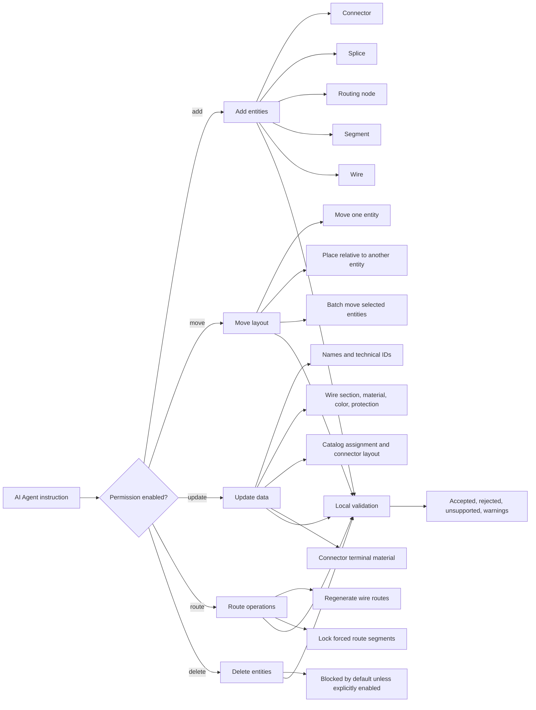

# e-Plan Editor

A local-first electrical network editor for modeling, validating, and documenting electrical networks.

The app treats connectors, splices, nodes, segments, and wires as a graph, computes routes deterministically, and keeps canvas preferences and export outputs aligned with the current workspace state.

[](https://github.com/AlexAgo83/electrical-plan-editor/actions/workflows/ci.yml) [](LICENSE)
[](https://e-plan-editor.onrender.com) 


## Table of Contents

- [Live Demo & Status](#live-demo--status)
- [Product](#product)
- [Technical Overview](#technical-overview)
- [AI Agent Workspace](#ai-agent-workspace)
- [Getting Started](#getting-started)
- [Available Scripts](#available-scripts)
- [Deployment](#deployment)
- [Project Structure](#project-structure)
- [Quality and CI](#quality-and-ci)
- [Contributing](#contributing)
- [License](#license)

## Live Demo & Status

- Production: [https://e-plan-editor.onrender.com](https://e-plan-editor.onrender.com)
- Hosting: Render Static Site (Blueprint via `render.yaml`)
- Current version: `1.16.3`
- CI status: see the GitHub Actions badge above

## Product

- Electrical modeling for connectors, splices, nodes, segments, and wires, with occupancy rules and wire-side connection / seal references.
- Automatic route computation, forced-route locking, and live wire-length recomputation after segment edits.
- Interactive 2D workspace with drag-and-drop nodes, zoom/pan controls, selectable segments, sub-network filtering, configurable callouts, wire-linked pin highlighting, and quick navigation between `Modeling`, `Analysis`, `Statistics`, `Harness`, and `Settings`.
- Connector and splice callouts with tabular wire details, optional wire-name columns, draggable positions, and catalog connector drawings when a physical layout was edited.
- Catalog-backed connector physical layout editor with reusable way geometry, keying features, shell shape controls, and physical connector analysis views.
- Harness assembly workflows for multi-network grouping, master connector references, inter-harness connector links, saved assembly graphs, current-network functional graphs, and contextual assembly help.
- Analysis workflows with targeted `Go to` actions, including navigation from `Node analysis` to `Segment analysis`, from `Segment analysis` to `Wire analysis`, and from connector analysis into physical views.
- Statistics workspace for active-network KPIs, manual multi-network comparison, wire-length metrics, section/color distributions, and utilization tables.
- Network-scoped catalog management with catalog-first connector flows, optional splice linkage, seeded starter items, usage analysis, and pricing context settings.
- Home workspace hub with Quick start actions, active-network context, changelog feed, and rich recent-change rows that can navigate back to changed objects when possible.
- Themed toast notifications for important workspace actions, including undo/redo and connector/splice occupancy changes.
- Export tooling for operational handoff:
  - `SVG` / `PNG` network-plan export with optional frame and metadata cartouche
  - `BOM CSV` export with pricing context and a dedicated `Wire terminations` section
  - wire CSV export with explicit begin/end connection and seal reference columns
- Network metadata authoring for export identity: creation date, author, project code, logo URL, and export notes.
- Local-first persistence so workspace state, settings, and export preferences survive reloads.
- Validation center with grouped issues, issue navigation, and catalog integrity checks.
- Built-in onboarding flow plus contextual help entry points to guide first-time usage.
- Accessibility-oriented interactions across dialogs, tables, keyboard navigation, and assistive-technology semantics.
- Theme, language, canvas, export, and onboarding preferences persisted per workspace.
- PWA support with install prompt, offline shell, and update readiness in production.

## Technical Overview

- React 19 + TypeScript in strict mode.
- Vite for dev, preview, and production builds.
- Domain/state split:
  - `src/core` holds graph, routing, layout, and domain primitives.
  - `src/store` holds reducers, selectors, and action orchestration.
  - `src/app` holds screen composition, controller wiring, and UI modules.
- Persistence and portability:
  - local storage uses versioned schema migrations
  - import/export payloads are normalized and guarded against unsupported future versions
  - storage failures surface visible runtime warnings instead of silently corrupting state
- Test and quality stack:
  - Vitest + Testing Library for unit and integration coverage
  - Playwright for E2E smoke coverage
  - ESLint for linting
  - explicit quality gates for UI modularization, timeout governance, store modularization, segmented test ownership, and PWA artifacts
- Delivery workflow:
  - Logics-backed request/backlog/task tracking under `logics/`
  - CI runs the same blocking validation pipeline locally and in GitHub Actions

## AI Agent Workspace

The Modeling `AI Agent` workspace supports controlled, reversible AI-assisted plan edits. The agent is not allowed to patch raw application state. It receives scoped electrical-plan context, asks the configured provider for a structured plan change, then lets the app derive, validate, preview, and apply bounded operations through the same domain rules as manual Modeling.



## Getting Started

### Prerequisites

- Node.js 20+
- npm
- Python 3 with `logics-manager` available as `python3 -m logics_manager`

### Install

```bash
npm ci
python3 -m pip install logics-manager
```

### Run locally

Create local env values from the tracked template:

```bash
cp .env.example .env
```

Supported variables and defaults:

- `APP_HOST=127.0.0.1`
- `APP_PORT=5284`
- `PREVIEW_PORT=5285`
- `E2E_BASE_URL=http://127.0.0.1:5284`
- `VITE_STORAGE_KEY=electrical-plan-editor.state`
- optional local maintenance credentials: `RENDER_API_KEY`, `RENDER_SERVICE_ID`, `OPENAI_API_KEY`, `GEMINI_API_KEY`

Env fallback behavior:

- Invalid/empty `APP_PORT` or `PREVIEW_PORT` falls back to documented defaults.
- Invalid/empty `E2E_BASE_URL` falls back to `http://{APP_HOST}:{APP_PORT}`.
- Invalid/empty `VITE_STORAGE_KEY` falls back to `electrical-plan-editor.state`.
- Keep secrets out of `VITE_*` variables (they are client-visible at build/runtime).
- Non-`VITE_*` variables are for local tooling only and are not bundled into the client app.

```bash
npm run dev
```

Then open `http://127.0.0.1:5284` (unless overridden).

## Available Scripts

- `npm run dev`: start local dev server
- `npm run build`: typecheck + production build
- `npm run preview`: preview production build
- `npm run lint`: run ESLint
- `npm run typecheck`: run TypeScript checks
- `npm run test`: run Vitest in watch mode
- `npm run test:ci`: run Vitest with coverage
- `npm run test:ci:segmentation:check`: validate explicit segmented-lane contract (`scripts/quality/run-vitest-segmented.mjs`)
- `npm run test:ci:fast`: run non-UI lane via explicit segmented contract (complementary to `test:ci`; keeps `pwa.*` in fast lane)
- `npm run test:ci:ui`: run UI lane via explicit segmented contract
- `npm run test:ci:slow-top`: print top-10 slowest tests from a Vitest run (informational)
- `npm run test:ci:ui:slow-top`: print top-10 slowest UI-lane tests from explicit segmented contract (informational)
- `npm run coverage:ui:report`: emit `src/app/**` coverage report (informational, non-blocking)
- `npm run bundle:metrics:report`: report main JS chunk + total JS gzip with non-blocking warning budgets
- `npm run build:bundle:report`: run production build then bundle metrics report
- `npm run ci:blocking`: run the canonical blocking CI pipeline shared with GitHub Actions
- `npm run ci:local`: alias of `npm run ci:blocking`
- `npm run test:e2e`: run Playwright E2E smoke tests
- `npm run quality:dependency-audit`: run the npm audit allowlist gate
- `npm run quality:ui-modularization`: enforce UI modularization line-budget gate
- `npm run quality:ui-timeout-governance`: enforce UI test timeout-override governance (no explicit per-test timeout override unless allowlisted)
- `npm run quality:store-modularization`: enforce store modularization line-budget gate
- `npm run quality:exceljs-boundary`: enforce that ExcelJS stays behind the tabular-export boundary
- `npm run quality:pwa`: validate generated PWA build artifacts (`manifest`, `sw.js`, `workbox-*`)

## Deployment

### Render (Blueprint)

This repository includes a ready-to-use [`render.yaml`](render.yaml) for static hosting on Render.

1. Push your latest changes to GitHub.
2. In Render, create a new service with **Blueprint** from this repository.
3. Render will build with `npm ci && npm run build` and publish `dist/`.

### Any static server

The app is a SPA and can be hosted from `dist/` on any static server/CDN.

- Build: `npm run build`
- Serve over HTTPS in production (required for full PWA behavior).
- Configure SPA fallback rewrite to `/index.html`.

## Project Structure

```text
src/
  app/                    # React app shell, UI, controller wiring, PWA integration
  app/pwa/                # PWA registration and update/install UX helpers
  config/                 # Runtime env resolution and defaults
  core/                   # Domain entities, graph and pathfinding
  store/                  # State management, reducer, selectors, actions
  store/reducer/          # Reducer handlers split by domain concern
  adapters/persistence/   # Local storage persistence + migrations
  adapters/portability/   # Network import/export payload adapters
  tests/                  # Unit + integration tests

tests/e2e/                # Playwright end-to-end smoke
logics/                   # Product requests, backlog, tasks, architecture
```

## Logics Workflow

This repository uses the standalone `logics-manager` CLI for Logics workflow operations.

- `python3 -m logics_manager flow ...` creates, promotes, and finishes workflow docs.
- `python3 -m logics_manager lint --require-status` validates Logics document structure.
- `python3 -m logics_manager audit ...` checks workflow consistency.

## Persistence Versioning

The app uses explicit versioned payload contracts for both local storage and network export files.

- Current schema versions:
  - local persistence: `3`
  - network import/export file: `3`

- Local workspace persistence:
  - primary key: configured `VITE_STORAGE_KEY` (default `electrical-plan-editor.state`)
  - backup key: `<storage-key>.backup` (written before destructive migration replacement or unsupported/failed payload fallback)
  - payload includes:
    - `payloadKind`
    - `schemaVersion`
    - `appVersion`
    - `appSchemaVersion`
    - timestamps + serialized `state`
- Network export/import files:
  - include explicit file `schemaVersion` + source metadata (`appVersion`, `appSchemaVersion`)
  - legacy file payloads are normalized on import
  - unsupported future file versions are rejected safely (no workspace mutation)

Migration authoring workflow (future schema evolution):

1. Add/adjust payload shape support in `src/adapters/persistence/migrations.ts` (local storage) and/or `src/adapters/portability/networkFile.ts` (file import/export).
2. Keep migration steps incremental and deterministic (`vN -> vN+1`), with a single entry point for runtime hydration/import.
3. Add regression fixtures/tests for:
   - legacy/unversioned payload
   - current payload
   - unsupported future version
   - malformed payload
4. Run the full validation pipeline (`npm run ci:local`).

## Quality and CI

Primary validation commands:

```bash
npm run ci:blocking
```

Equivalent expanded command list:

```bash
python3 -m logics_manager lint --require-status
python3 -m logics_manager sync close-eligible-requests
git diff --exit-code -- logics/request
python3 -m logics_manager audit --legacy-cutoff-version 1.1.0 --group-by-doc --skip-ac-traceability
npm run lint
npm run typecheck
npm run quality:dependency-audit
npm run test:ci:segmentation:check
npm run quality:ui-modularization
npm run quality:ui-timeout-governance
npm run quality:store-modularization
npm run quality:exceljs-boundary
npm run test:ci:fast -- --coverage
npm run test:ci:ui
npm run test:e2e
npm run build
npm run quality:pwa
```

CI runs the same main blocking pipeline in `.github/workflows/ci.yml` on `push` and `pull_request`.

Additional non-blocking CI observability:

- `coverage:ui:report` for `src/app/**` coverage visibility
- `test:ci:ui:slow-top` for top-N slow UI test reporting
- `bundle:metrics:report` for main-chunk and total-gzip size visibility
- these signals are informational and do not replace blocking CI gates
- in CI, `coverage:ui:report` and `test:ci:ui:slow-top` are configured with `if: success()` so they run only when prior blocking steps pass
- in CI, `bundle:metrics:report` stays informational and runs only when the production build step succeeds

Segmented test contract:

- explicit lane ownership is defined in `scripts/quality/run-vitest-segmented.mjs`
- `test:ci:segmentation:check` verifies the lane contract and fails on drift
- CI uses `test:ci:fast` + `test:ci:ui` as required lanes; `test:ci` remains available as a full-suite local command

Form validation doctrine (current targeted scope):

- native HTML validation guards simple required/number constraints first (`catalog`, `wire`)
- inline custom errors remain for business and cross-field rules (catalog URL policy, uniqueness, endpoint/business integrity)

UI reliability note:

- explicit per-test UI timeout overrides are disallowed by default and enforced by `npm run quality:ui-timeout-governance`
- temporary exceptions, if strictly necessary, must be explicitly allowlisted in `scripts/quality/check-ui-timeout-governance.mjs` with rationale and retirement plan

Local E2E note:

- `npm run test:e2e` requires a Playwright browser install first (CI runs `npx playwright install --with-deps chromium`).

PWA caveats:

- Service worker registration is production-only (`build/preview`) and remains disabled during normal `npm run dev`.
- Install prompt availability depends on browser capability and secure context (`https` or `localhost`).
- Offline behavior is guaranteed after the first successful online load of production assets.

## Contributing

Contribution guidelines are available in [`CONTRIBUTING.md`](CONTRIBUTING.md).

## License

This project is licensed under the MIT License. See [`LICENSE`](LICENSE).
