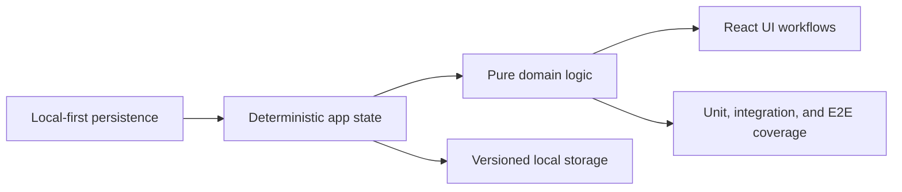

## adr_000_v1_frontend_local_first_reference_architecture - V1 Frontend Local-First Reference Architecture
> Date: 2026-03-15
> Status: Proposed
> Drivers: Establish a deterministic V1 frontend baseline, keep persistence local-only, and provide a stable implementation frame for request/backlog/task generation.
> Related request: `req_000_kickoff_v1_electrical_plan_editor`
> Related backlog: `item_000_v1_foundation_domain_model_and_store`
> Related task: `task_000_v1_backlog_orchestration_and_delivery_control`
> Reminder: Update status, linked refs, decision rationale, consequences, migration plan, and follow-up work when you edit this doc.

# Overview
This document defines the target technical baseline used to kick off V1 of the electrical plan editor.
It is the reference architecture for implementation decisions and backlog/task generation.

# Context
- Scope: frontend application for logical electrical network modeling and wire routing.
- Persistence: local-only storage for V1.
- Excluded for V1: backend API, cloud sync, multi-user auth, server database.
- Runtime baseline: Node.js 20+, TypeScript strict mode, React 19, Vite, and custom CSS.
- Quality baseline: ESLint, TypeScript typecheck, Vitest, Testing Library, Playwright, and CI coverage gates.

# Decision
Adopt a local-first frontend architecture with a single normalized app state, pure TypeScript domain modules, React UI composition, and a versioned browser persistence adapter.

The main implementation rules are:
- Domain-first: routing and electrical rules live in pure TypeScript modules without DOM coupling.
- Deterministic behavior: identical input state must produce identical route and length results.
- Explicit versioning: saved state is schema-versioned and migrations are required for schema changes.
- Incremental delivery: feature slices map cleanly to request, backlog, and task docs.

The layered architecture is:
- `src/core`: network graph model, wire model, pathfinding, route locking, length computation, and validation rules.
- `src/store`: actions, reducer orchestration, selectors, persistence bridge, and subscriptions.
- `src/app`: React UI for network, connector, splice, form, and selection workflows.
- `src/adapters/persistence`: local storage serialization, deserialization, migration, and schema checks.
- `src/tests` and `tests/e2e`: domain, integration, UI, and smoke validation.

The core domain model for V1 includes:
- `Connector`: `id`, `name`, `cavityCount`, indexed cavities, and single occupancy per cavity.
- `Splice`: `id`, `name`, indexed ports, and single occupancy per port.
- `NetworkNode`: union of connector node, splice node, and intermediate node.
- `Segment`: `id`, `nodeA`, `nodeB`, `lengthMm`, and optional subgroup tag.
- `WireEndpoint`: connector plus cavity or splice plus port.
- `Wire`: `id`, `name`, endpoint A/B, computed route, computed length, and optional forced route lock.

Routing and length rules are:
- Pathfinding uses Dijkstra with `lengthMm` as edge weight.
- Default route is the shortest path between endpoint nodes.
- On equal total length, prefer the route with fewer segments.
- If still tied, choose stable order by sorted segment IDs.
- Forced routes are user-lockable until explicitly reset.
- Wire length equals the sum of traversed segment lengths only.

State and persistence rules are:
- Store a single normalized state tree for connectors, splices, nodes, segments, and wires.
- Persist `schemaVersion`, timestamps, entities, and optional UI selection snapshot.
- Recompute impacted wires before state commit when a segment changes.

UI and validation baseline are:
- Global network view with selectable nodes, segments, sub-network grouping, and wire highlighting.
- Connector and splice views with occupancy visibility, connected wire tables, destinations, and lengths.
- Unit coverage for pathfinding, tie-break behavior, forced-route validation, and occupancy constraints.
- Integration coverage for segment-length propagation to wire lengths.
- UI and E2E coverage for occupancy visibility, route highlighting, route forcing, and displayed lengths.

# Alternatives considered
- Introduce a backend or cloud sync in V1. Rejected because it expands delivery scope before the local modeling workflow is stable.
- Couple routing and validation directly into React components. Rejected because it weakens determinism and testability.

# Consequences
- The architecture is simple to run locally and well aligned with offline-first V1 delivery.
- Schema versioning and deterministic routing become non-optional implementation constraints.
- Future backend or sync work will require explicit extension rather than being assumed by default.

# Migration and rollout
- Freeze the V1 module skeleton for `core`, `store`, `app`, and `adapters/persistence`.
- Freeze the initial entity and save schemas before broader feature expansion.
- Implement deterministic pathfinding first, then persistence, then UI slices that consume the stable contracts.

# References
- Kickoff request: `req_000_kickoff_v1_electrical_plan_editor`
- Foundational backlog: `item_000_v1_foundation_domain_model_and_store`
- Delivery task: `task_000_v1_backlog_orchestration_and_delivery_control`

# Follow-up work
- Confirm whether the ADR should remain `Proposed` or be promoted to `Accepted`.
- Update downstream request and backlog docs to reference `adr_000_v1_frontend_local_first_reference_architecture`.
