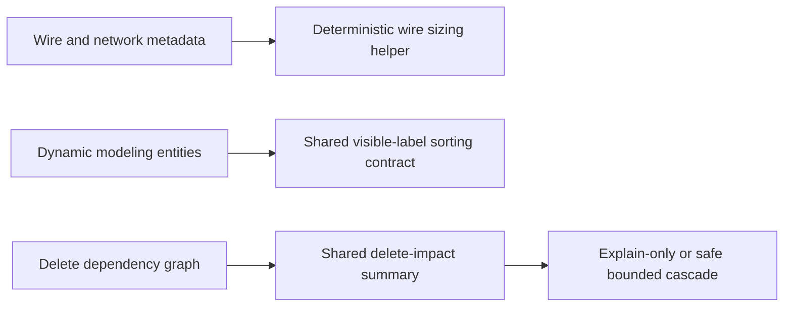

## adr_001_modeling_assisted_sizing_and_guarded_delete_contracts - Modeling assisted sizing and guarded delete contracts
> Date: 2026-03-27
> Status: Accepted
> Drivers: Keep assisted wire sizing, modeling dropdown ordering, and guarded delete feedback deterministic across UI, store, and persistence layers while limiting V1 destructive scope.
> Related request: `req_110_automatic_recommended_wire_section_from_current_material_network_voltage_and_wire_length.md`, `req_111_alphabetically_sorted_dropdown_menus_in_modeling_screens.md`, `req_112_explicit_blocked_delete_feedback_and_dependency_aware_cascade_delete_confirmation.md`
> Related backlog: `item_542_wire_sizing_metadata_and_recommendation_core_contract`, `item_544_wire_sizing_persistence_compatibility_and_standard_section_normalization`, `item_546_shared_alphabetical_sorting_contract_for_modeling_dynamic_dropdown_options`, `item_550_delete_dependency_summary_contract_and_representative_impacted_reference_visibility`, `item_551_safe_connector_and_splice_cascade_delete_confirmation_and_execution_contract`
> Related task: `task_090_super_orchestration_delivery_execution_for_req_110_to_req_112_with_validation_gates_and_staged_checkpoints`
> Reminder: Update status, linked refs, decision rationale, consequences, migration plan, and follow-up work when you edit this doc.

# Overview
This ADR records the architectural rules used to deliver the `req_110` to `req_112` bundle.
It freezes three reusable contracts:
- assisted wire sizing remains a deterministic recommendation layer over existing wire and network metadata;
- dynamic modeling dropdown ordering is centralized in one reusable sorting helper;
- blocked delete and cascade delete flows use precomputed impact summaries and conservative destructive scope.

# Context
- `req_110` extends the model with optional sizing inputs that touch core entities, reducer contracts, persistence, and import/export.
- `req_111` affects multiple `Modeling` forms and would drift quickly if each panel owned its own comparison logic.
- `req_112` adds destructive-flow UX and must not allow broad or ambiguous recursive deletion.
- The application already relies on deterministic state transitions, explicit schema compatibility, and conservative graph integrity rules.

# Decision
Adopt a shared deterministic-contract approach for this feature bundle instead of screen-local or reducer-string-only implementations.

The decision is split into three rulesets.

Assisted wire sizing:
- Recommendation logic lives in shared core code, not in form components.
- The sizing contract consumes `Wire.currentA`, `Wire.material`, `Wire.lengthMm`, and `Network.voltageV`.
- Missing or invalid required inputs yield `null` rather than guessed values.
- Missing wire material resolves to `copper` in V1.
- Supported section values come from one locked shared standard-section list.
- Persistence and portability preserve sizing metadata without inventing a default `voltageV` for legacy payloads.

Dynamic modeling dropdown ordering:
- Dynamic `Modeling` dropdowns are sorted by trimmed visible label with case-insensitive comparison.
- Stable tie-breaks use technical ID and then entity ID.
- A selected compatibility fallback option that no longer exists in the current entity set stays visible and is pinned above normal sorted options.
- Static semantic selects keep their deliberate product order and are excluded from the shared alphabetical helper.

Guarded delete and cascade behavior:
- Delete-impact analysis is precomputed in shared logic before presenting blocked-delete or cascade confirmation UI.
- Explanation modals receive structured categories, counts, and representative references instead of reducer-only text.
- V1 cascade delete is limited to `connector` and `splice` flows whose exact impact set is known and bounded.
- Unsupported or ambiguous cases fall back to explanation-only blocking.
- Supported cascades execute as one logical store operation so undo/redo remains coherent.

# Alternatives considered
- Put sizing, sorting, and delete-impact rules directly inside React form/dialog components.
  Rejected because behavior would drift across screens and become harder to test.
- Allow reducer-specific delete messages without a shared typed summary contract.
  Rejected because it would not support reusable confirmation UX or reliable representative reference display.
- Offer cascade delete for any blocked entity once some dependencies are known.
  Rejected because incomplete impact sets would make destructive actions unsafe.

# Consequences
- Feature behavior is deterministic and easier to validate with focused unit and UI tests.
- The repo gains one shared place to evolve sizing, sorting, and delete-impact policies.
- Future expansions of cascade delete or sizing formulas require explicit ADR or backlog updates instead of silent scope creep.
- Legacy data remains compatible because the new metadata is optional and normalized conservatively.

# Migration and rollout
- Keep the current V1 contracts in shared modules under `src/core`, `src/app/lib`, and `src/store`.
- Reuse the same contracts in UI, persistence, and tests rather than re-encoding policy in new slices.
- If future work broadens cascade eligibility or changes sizing inputs materially, write a follow-up ADR before widening scope.

# References
- Requests: `req_110_automatic_recommended_wire_section_from_current_material_network_voltage_and_wire_length`, `req_111_alphabetically_sorted_dropdown_menus_in_modeling_screens`, `req_112_explicit_blocked_delete_feedback_and_dependency_aware_cascade_delete_confirmation`
- Backlog: `item_542_wire_sizing_metadata_and_recommendation_core_contract`, `item_544_wire_sizing_persistence_compatibility_and_standard_section_normalization`, `item_546_shared_alphabetical_sorting_contract_for_modeling_dynamic_dropdown_options`, `item_550_delete_dependency_summary_contract_and_representative_impacted_reference_visibility`, `item_551_safe_connector_and_splice_cascade_delete_confirmation_and_execution_contract`
- Delivery task: `task_090_super_orchestration_delivery_execution_for_req_110_to_req_112_with_validation_gates_and_staged_checkpoints`

# Follow-up work
- Revisit the ADR if assisted sizing moves from recommendation to normative electrical calculation with additional environmental inputs.
- Revisit the ADR if cascade delete expands beyond bounded `connector` and `splice` cases.
