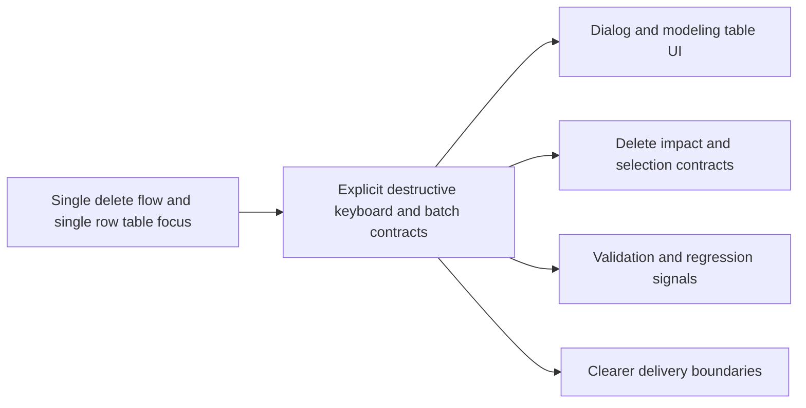

## adr_002_destructive_interaction_contracts_for_keyboard_confirmation_and_modeling_batch_delete - Destructive interaction contracts for keyboard confirmation and modeling batch delete
> Date: 2026-04-02
> Status: Proposed
> Drivers: destructive-action safety, explicit mode separation, undoable batch mutation, localized keyboard acceleration, reuse of existing delete-impact contracts
> Related request: `req_115_keyboard_confirmation_shortcut_for_delete_modals_with_explicit_safety_policy`, `req_116_batch_delete_mode_for_modeling_tables_with_explicit_multi_selection_and_mixed_impact_handling`
> Related backlog: `item_568_delete_and_cascade_delete_dialog_enter_shortcut_contract_with_cancel_focused_safety`, `item_569_keyboard_enter_confirmation_wiring_scoped_to_destructive_delete_dialogs_only`, `item_570_regression_coverage_and_closure_for_destructive_dialog_enter_confirmation_behavior`, `item_571_modeling_table_batch_mode_state_selection_contract_and_explicit_entry_exit_behavior`, `item_572_modeling_table_checkbox_ui_and_batch_context_panel_wiring`, `item_573_batch_delete_preflight_confirmation_and_one_operation_execution_for_modeling_tables`, `item_574_regression_coverage_and_closure_for_modeling_table_batch_delete_flows`
> Related task: `task_092_super_orchestration_delivery_execution_for_req_114_to_req_117_with_validation_gates_and_staged_checkpoints`
> Reminder: Update status, linked refs, decision rationale, consequences, migration plan, and follow-up work when you edit this doc.

# Overview
The chosen direction keeps destructive interactions explicit and locally scoped while reducing unnecessary confirmation friction.
Delete dialogs gain a dialog-level `Enter` confirmation path only for destructive delete and cascade-delete cases, while visible initial focus remains on `Cancel`.
Modeling table batch delete becomes an explicit mode with checkbox selection, batch-context UI, and all-or-nothing preflight against existing delete-impact rules.
The main impacted areas are confirmation dialog handling, modeling table state, delete-impact orchestration, and undo/redo grouping.

# Context
The app already has:
- styled delete confirmation dialogs from `req_074`;
- richer blocked-delete and safe cascade-delete handling from `req_112`;
- single-row focused modeling tables where the right-side panel assumes one active edit target.

The new work adds two pressures on the architecture:
- a destructive keyboard acceleration that must not leak into unrelated dialogs;
- a batch delete mode that must not weaken current delete guards or confuse single-item edit context.

The architecture must therefore preserve:
- existing delete-impact semantics;
- one logical undoable operation for a successful batch delete;
- clear separation between default single-edit mode and explicit batch-destructive mode.

# Decision
Adopt an explicit destructive interaction contract with the following rules:
- keep delete and cascade-delete confirmation flows on the shared dialog foundation;
- preserve visible initial focus on `Cancel`;
- add explicit dialog-level `Enter` handling only for destructive delete and cascade-delete dialogs;
- introduce an explicit modeling-table batch mode rather than permanent checkboxes;
- repurpose the right-side panel into batch context while batch mode is active;
- perform batch delete through a preflight classification against the existing delete-impact model;
- refuse mixed blocked/safe sets in V1 rather than partially mutating only the safe subset;
- record a successful batch delete as one logical history operation.

This direction minimizes surprise, reuses current delete-impact infrastructure, and makes the destructive-mode boundary obvious to both users and implementers.

# Alternatives considered
- Focus the primary destructive button and rely on native focused-button `Enter` behavior.
  Rejected because it weakens the current safety-first visual cue without adding much clarity.
- Show permanent row checkboxes in modeling tables.
  Rejected because it collides with the current click-to-edit table pattern.
- Allow partial batch deletion of only safe rows.
  Rejected in V1 because it creates ambiguous destructive outcomes and harder-to-explain summaries.

# Consequences
- Confirmation dialog handling becomes more explicit and slightly more specialized, but only within destructive delete scope.
- Modeling tables gain a second interaction context that must be tracked clearly in UI state.
- Delete-impact orchestration becomes reusable for batch preflight, which improves consistency across one-by-one and batch destructive flows.
- Validation burden increases because keyboard-confirm, blocked-summary, and grouped-history behaviors must all stay coherent.

# Migration and rollout
- Deliver destructive keyboard confirmation and modeling batch delete in waves under `task_092`.
- Keep single-row delete flows intact while batch mode is introduced behind explicit entry points only.
- Validate keyboard behavior, blocked summaries, safe batch confirmation, and undo/redo grouping before closure.

# References
- `logics/request/req_115_keyboard_confirmation_shortcut_for_delete_modals_with_explicit_safety_policy.md`
- `logics/request/req_116_batch_delete_mode_for_modeling_tables_with_explicit_multi_selection_and_mixed_impact_handling.md`
- `logics/backlog/item_568_delete_and_cascade_delete_dialog_enter_shortcut_contract_with_cancel_focused_safety.md`
- `logics/backlog/item_569_keyboard_enter_confirmation_wiring_scoped_to_destructive_delete_dialogs_only.md`
- `logics/backlog/item_570_regression_coverage_and_closure_for_destructive_dialog_enter_confirmation_behavior.md`
- `logics/backlog/item_571_modeling_table_batch_mode_state_selection_contract_and_explicit_entry_exit_behavior.md`
- `logics/backlog/item_572_modeling_table_checkbox_ui_and_batch_context_panel_wiring.md`
- `logics/backlog/item_573_batch_delete_preflight_confirmation_and_one_operation_execution_for_modeling_tables.md`
- `logics/backlog/item_574_regression_coverage_and_closure_for_modeling_table_batch_delete_flows.md`
- `logics/tasks/task_092_super_orchestration_delivery_execution_for_req_114_to_req_117_with_validation_gates_and_staged_checkpoints.md`
- `src/app/components/dialogs/ConfirmDialog.tsx`
- `src/store/deleteImpact.ts`

# Follow-up work
- Implement the destructive keyboard confirm contract in shared dialog handling and delete flows.
- Introduce explicit batch mode state and batch-context panel behavior in modeling tables.
- Extend delete-impact orchestration and regression coverage for blocked/safe batch flows.
