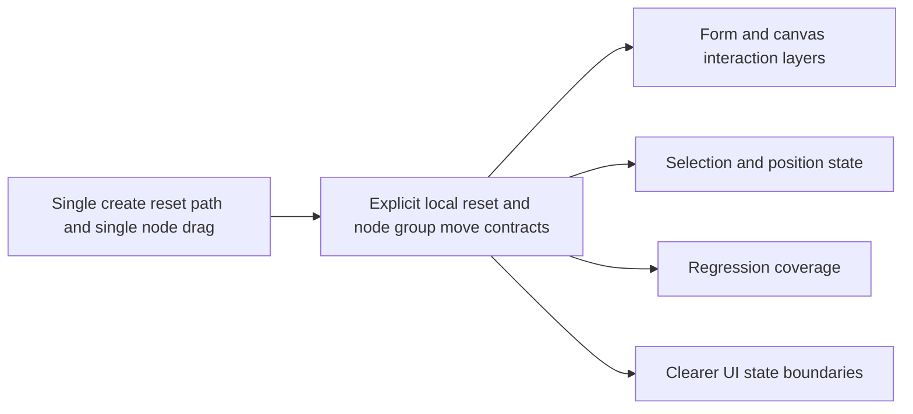

## adr_003_modeling_create_flow_reset_and_canvas_group_movement_interaction_contracts - Modeling create flow reset and canvas group movement interaction contracts
> Date: 2026-04-02
> Status: Settled
> Drivers: repeated create-flow speed, predictable local reset semantics, canvas gesture compatibility, grouped movement persistence, single-selection fallback clarity
> Related request: `req_114_connector_and_splice_catalog_labels_show_names_and_create_forms_support_chained_new_action`, `req_117_shift_click_multi_selection_and_grouped_move_on_the_2d_modeling_canvas`
> Related backlog: `item_565_connector_and_splice_catalog_selector_labels_include_catalog_names_and_safe_fallback_formatting`, `item_566_bottom_new_action_across_modeling_create_forms_with_silent_draft_reset`, `item_567_regression_coverage_and_closure_for_modeling_create_form_chained_new_and_catalog_label_ergonomics`, `item_575_canvas_shift_click_multi_selection_state_and_node_only_selection_contract`, `item_576_grouped_node_drag_and_persisted_multi_move_behavior_on_the_2d_modeling_canvas`, `item_577_canvas_multi_selection_inspector_summary_and_single_selection_compatibility_wiring`, `item_578_regression_coverage_and_closure_for_canvas_multi_selection_and_grouped_move_behavior`
> Related task: `task_092_super_orchestration_delivery_execution_for_req_114_to_req_117_with_validation_gates_and_staged_checkpoints`
> Reminder: Update status, linked refs, decision rationale, consequences, migration plan, and follow-up work when you edit this doc.

# Overview
The chosen direction treats create-form acceleration and canvas group movement as explicit local interaction contracts rather than global mode shifts.
Modeling create forms gain a silent bottom `New` reset path only in create mode, preserving current defaults and edit semantics.
The 2D modeling canvas gains `Shift+click` node multi-selection and grouped node drag, while empty-canvas `Shift+drag` panning remains intact.
The main impacted areas are form reset orchestration, modeling form state defaults, canvas selection state, and grouped node position persistence.

# Context
The current app already supports:
- create-form defaults and suggested IDs;
- explicit list-side `New` and `Edit` scrolling from `req_109`;
- single-node selection and drag on the 2D canvas;
- `Shift+drag` on empty canvas to pan.

The new requests introduce two interaction upgrades that must stay coherent with those existing contracts:
- a bottom `New` action on Modeling create forms that should reset locally without becoming a second submit path;
- canvas multi-selection and grouped movement that should reuse the current node-position model without colliding with pan and single-selection behavior.

The architecture needs a clear contract for when state resets locally, when selection is single vs multi, and which entity types actually participate in grouped movement.

# Decision
Adopt the following interaction contract:
- add bottom `New` only to Modeling create forms;
- keep it create-only and silent-reset based rather than confirmation- or toast-based;
- preserve create-mode defaults, prefills, and suggested IDs through the reset path;
- define canvas multi-selection around nodes only in V1;
- use `Shift+click` to add or remove nodes from the canvas selection set;
- keep simple click as the single-selection fallback;
- let grouped drag move the currently selected node set while preserving relative offsets;
- persist grouped movement through the same node-position persistence model used for single-node movement;
- keep segments and wires visually reactive to moved nodes but outside first-class grouped-drag membership.

This keeps the implementation grounded in existing form-state and node-position primitives instead of introducing a broader, harder-to-control generic multi-entity move system.

# Alternatives considered
- Add bottom `New` to all form surfaces including Catalog.
  Rejected for V1 because the user need is centered on Modeling and broader rollout can be evaluated later.
- Add marquee or lasso selection on the canvas first.
  Rejected because `Shift+click` is a smaller coherent slice that fits the current gesture model better.
- Let segments participate directly in grouped movement.
  Rejected because the current movement model is node-based and segment-level drag semantics would add ambiguity.

# Consequences
- Modeling create flows gain a second local action path that must stay synchronized with existing create defaults and edit guards.
- Canvas selection state becomes richer and must coexist with inspector/form synchronization rules.
- Grouped move becomes conceptually simple for users because it stays node-based, but implementation must update more than one position coherently in one drag.
- Future extension to box selection or broader grouped-move entities remains possible but intentionally deferred.

# Migration and rollout
- Deliver create-form reset and canvas group movement in waves under `task_092`.
- Validate create resets, create-mode defaults, canvas selection transitions, grouped drag persistence, and pan compatibility before closure.
- Keep non-modeling create surfaces and non-node grouped movement out of scope during this rollout.

# References
- `logics/request/req_114_connector_and_splice_catalog_labels_show_names_and_create_forms_support_chained_new_action.md`
- `logics/request/req_117_shift_click_multi_selection_and_grouped_move_on_the_2d_modeling_canvas.md`
- `logics/backlog/item_565_connector_and_splice_catalog_selector_labels_include_catalog_names_and_safe_fallback_formatting.md`
- `logics/backlog/item_566_bottom_new_action_across_modeling_create_forms_with_silent_draft_reset.md`
- `logics/backlog/item_567_regression_coverage_and_closure_for_modeling_create_form_chained_new_and_catalog_label_ergonomics.md`
- `logics/backlog/item_575_canvas_shift_click_multi_selection_state_and_node_only_selection_contract.md`
- `logics/backlog/item_576_grouped_node_drag_and_persisted_multi_move_behavior_on_the_2d_modeling_canvas.md`
- `logics/backlog/item_577_canvas_multi_selection_inspector_summary_and_single_selection_compatibility_wiring.md`
- `logics/backlog/item_578_regression_coverage_and_closure_for_canvas_multi_selection_and_grouped_move_behavior.md`
- `logics/tasks/task_092_super_orchestration_delivery_execution_for_req_114_to_req_117_with_validation_gates_and_staged_checkpoints.md`
- `src/app/hooks/useCanvasInteractionHandlers.ts`
- `src/app/lib/modelingSelectOptions.ts`

# Follow-up work
- Implement local silent reset behavior for Modeling create forms and keep defaults stable.
- Implement node-only canvas multi-selection and grouped drag on top of existing node-position persistence.
- Add inspector/context feedback and targeted regression coverage for the new interaction contracts.
