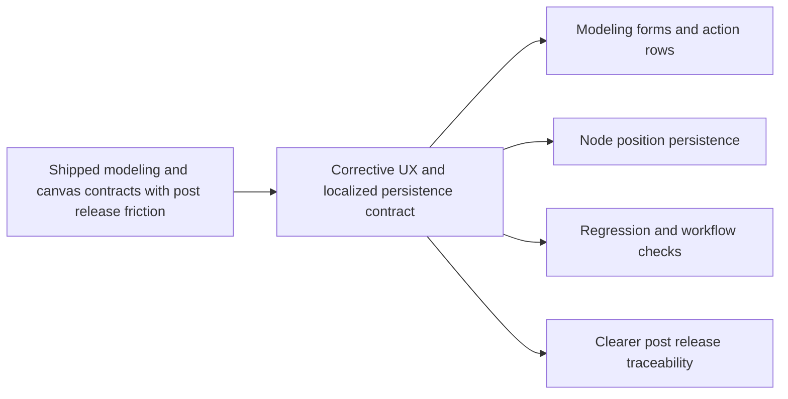

## adr_004_post_release_modeling_ux_corrections_and_localized_canvas_group_drag_persistence - Post-release modeling UX corrections and localized canvas group-drag persistence
> Date: 2026-04-02
> Status: Proposed
> Drivers: post-release correction traceability, modeling action-row consistency, post-create reset clarity, localized grouped-drag persistence, no unintended regenerate side effects
> Related request: `req_118_post_release_ux_and_grouped_move_corrections_after_req_114_to_req_117`
> Related backlog: `item_579_post_release_ux_and_grouped_move_corrections_after_req_114_to_req_117`, `item_580_post_create_edit_state_new_action_correction_for_modeling_forms`, `item_581_select_multiple_action_row_placement_and_icon_alignment_across_modeling_tables`, `item_582_canvas_grouped_drag_generate_isolation_and_localized_move_persistence_correction`, `item_583_regression_coverage_and_closure_for_post_release_ux_and_grouped_move_corrections`
> Related task: `task_097_post_release_ux_and_grouped_move_corrections_after_req_114_to_req_117`
> Reminder: Update status, linked refs, decision rationale, consequences, migration plan, and follow-up work when you edit this doc.

# Overview
The chosen direction treats the `req_118` bundle as a corrective layer on top of the previously shipped Modeling and canvas contracts rather than a new feature family.
Repeated creation stays fast, but the bottom `New` action is constrained to the post-create edit state instead of create mode.
Modeling table batch entry stays explicit, while `Select multiple` is visually normalized onto the main action row with a dedicated icon.
Canvas grouped drag remains a localized node-position persistence flow and must not drop unrelated persisted positions or trigger broader regenerate behavior.

# Context
The repo already shipped:
- create-flow acceleration and catalog label surfacing under `req_114`;
- destructive keyboard and batch-delete flows under `req_115` and `req_116`;
- canvas `Shift+click` multi-selection and grouped move under `req_117`.

The post-release feedback in `req_118` exposed that some of those shipped contracts were correct in intent but wrong in final placement or persistence details:
- bottom `New` landed in create mode instead of the immediate post-create edit state;
- `Select multiple` was visually detached from the main Modeling actions and lacked an icon;
- grouped drag could drop unrelated persisted node positions, which looked like a broad recompute of the plan.

The architecture therefore needs an explicit correction record that explains why these changes are still local contract repairs and not a broader redesign.

# Decision
Adopt the following corrective contract for the `req_118` bundle:
- keep repeated creation acceleration, but expose bottom `New` only in the edit state entered immediately after a successful creation;
- keep `New` as a silent reset toward a fresh create draft rather than a duplicate or template action;
- keep batch delete entry explicit, but normalize `Select multiple` onto the same main action row as `New`, `Edit`, and `Delete`;
- add a dedicated multi-selection icon without renaming the action;
- keep grouped drag node-based and localized;
- persist grouped drag by merging moved node positions into existing persisted layout state rather than replacing the whole persisted position map;
- treat any broader regenerate or unrelated-plan mutation during grouped drag as a bug, not as acceptable side behavior.

This direction preserves the shipped user model while narrowing the implementation to the intended local semantics.

# Alternatives considered
- Reuse `adr_003` without a new correction ADR.
  Rejected because the CI and delivery chain need an explicit trace for the post-release repair bundle itself.
- Leave `Select multiple` visually detached to avoid touching table layout CSS.
  Rejected because it preserves the exact UX defect reported by the operator.
- Accept grouped drag as a partial map replacement and rely on later regenerate.
  Rejected because it breaks the localized movement contract and causes unrelated layout mutation.

# Consequences
- The Logics chain for `req_118` now has an explicit architecture reference, which satisfies workflow-audit expectations and improves release traceability.
- Modeling action-row layout becomes a four-action contract in desktop layouts and must stay coherent with smaller-screen wrapping.
- Grouped drag persistence is stricter: reducer behavior must preserve unrelated node positions when only a subset is updated.
- Regression expectations are clearer because create-flow placement, action-row placement, and grouped-drag locality are all tied to one decision record.

# Migration and rollout
- Link this ADR across `req_118`, `item_579` to `item_583`, and `task_097`.
- Keep the implementation scoped to the delivered corrections; do not broaden into a redesign of modeling actions or canvas selection gestures.
- Validate the workflow audit after linking so `ci:blocking` can progress beyond the architecture framing gate.

# References
- `logics/request/req_118_post_release_ux_and_grouped_move_corrections_after_req_114_to_req_117.md`
- `logics/backlog/item_579_post_release_ux_and_grouped_move_corrections_after_req_114_to_req_117.md`
- `logics/backlog/item_580_post_create_edit_state_new_action_correction_for_modeling_forms.md`
- `logics/backlog/item_581_select_multiple_action_row_placement_and_icon_alignment_across_modeling_tables.md`
- `logics/backlog/item_582_canvas_grouped_drag_generate_isolation_and_localized_move_persistence_correction.md`
- `logics/backlog/item_583_regression_coverage_and_closure_for_post_release_ux_and_grouped_move_corrections.md`
- `logics/tasks/task_097_post_release_ux_and_grouped_move_corrections_after_req_114_to_req_117.md`
- `logics/architecture/adr_003_modeling_create_flow_reset_and_canvas_group_movement_interaction_contracts.md`
- `src/app/components/workspace/ModelingPrimaryTables.tsx`
- `src/app/hooks/useCanvasInteractionHandlers.ts`
- `src/store/reducer/layoutReducer.ts`

# Follow-up work
- Keep `req_118` docs synchronized with this ADR reference.
- Preserve the four-action Modeling row contract in future table UX adjustments.
- Guard grouped drag locality through reducer and UI regression coverage.
