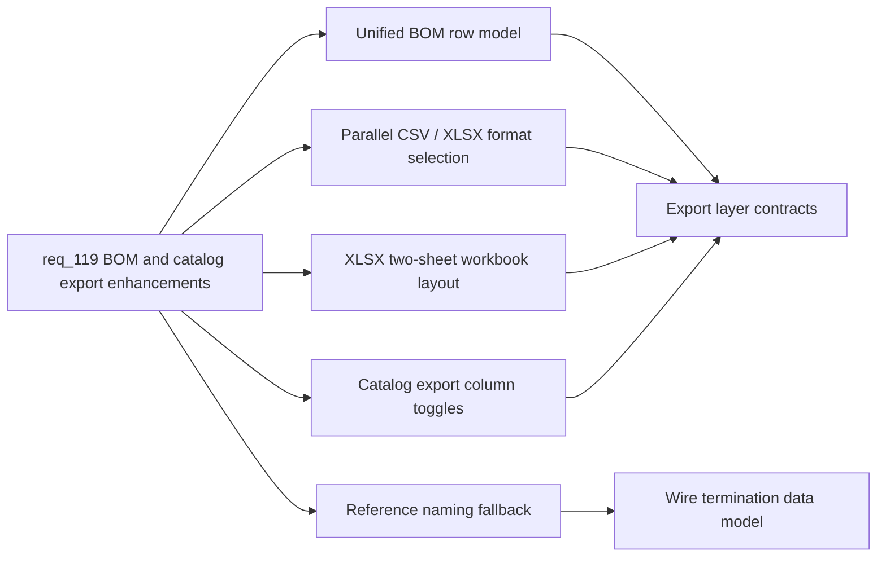

## adr_005_bom_and_export_contracts_for_csv_xlsx_and_reference_naming - BOM and Export Contracts for CSV, XLSX, and Reference Naming
> Date: 2026-04-14
> Status: Proposed
> Drivers: Unified BOM row model, parallel CSV/XLSX format selection, XLSX workbook layout, catalog export column toggles, reference naming fallback for wire terminations
> Related request: `req_119_bom_and_catalog_export_enhancements`
> Related backlog: `item_584_catalog_export_column_toggles`, `item_585_reference_naming_fallback_for_wire_terminations`, `item_586_flatten_bom_export_into_a_single_plane`, `item_587_parallel_csv_and_xlsx_export_options`, `item_588_grouped_bom_workbook_with_merged_connector_rows`
> Related task: `task_098_parallel_csv_and_xlsx_export_options`, `task_099_reference_naming_fallback_for_wire_terminations`, `task_100_flatten_bom_export_into_a_single_plane`, `task_102_grouped_bom_workbook_with_merged_connector_rows`
> Reminder: Update status, linked refs, decision rationale, consequences, migration plan, and follow-up work when you edit this doc.

# Overview
This ADR defines the architectural contracts for the export layer enhancements introduced in `req_119`. It covers the unified BOM row model, the parallel CSV/XLSX format selection, the XLSX workbook layout, catalog export column toggles, and the optional reference naming fallback for wire terminations.

# Context
- The existing export layer only emits CSV and uses a split BOM structure with a separate wire termination block.
- Users need Excel-compatible output, a flat BOM structure, a connector-grouped workbook sheet, and the ability to hide catalog columns at export time.
- Wire termination references need an optional friendly name that can be reused when the same reference appears again.
- All changes must remain local-first and must not break the existing CSV export path.

# Decision

## 1. Unified BOM row model
Replace the separate wire termination block with a single normalized row structure. Connectors, seals, and connection references share the same column layout. Row ordering is deterministic. The old split structure is removed — this is a breaking change to the internal BOM serialization contract, not to the user-visible file format.

## 2. Parallel CSV and XLSX format selection
Add an explicit, user-facing format choice (CSV or XLSX) applied to BOM and wire-by-wire exports. The selection is ephemeral (not persisted to local state). The CSV path remains unchanged when selected. XLSX is an opt-in parallel path using a new workbook writer dependency (e.g. `xlsx` / `exceljs` — final library choice deferred to implementation). No new domain model fields are required for format selection.

## 3. XLSX workbook layout — two-sheet BOM
The BOM XLSX workbook contains two sheets:
- **Sheet 1 (Summary):** global flat BOM using the unified row model.
- **Sheet 2 (By connector):** rows grouped by connector, with connector ID and name cells merged across each group. Quantities are independently correct per sheet.

Merged-cell ranges are computed at serialization time and must not affect in-memory domain state.

## 4. Catalog export column toggles
Column visibility is an export-time option only. The catalog table and form in the UI are unchanged. The toggle state is not persisted to local storage. Default export behavior (all columns included, existing order) is preserved unless a toggle is explicitly enabled.

## 5. Reference naming fallback for wire terminations
An optional `name` field is added to the seal reference and connection reference shapes in the wire termination data model. The field is nullable and defaults to `null` when absent. The app remembers the last known name for a given reference key and suggests it as a fallback when the same reference is entered again. Automatic renaming of existing references is out of scope.

# Consequences
- The unified BOM row model changes the internal serialization contract. Existing BOM tests must be updated.
- Adding XLSX support introduces a new runtime dependency. The dependency must be reviewed for bundle size impact before merging.
- The optional `name` field on wire termination references requires a schema version increment and a migration for any persisted state that does not carry the field.
- Catalog column toggles and format selection are stateless at runtime — no migration is needed for those slices.

# Migration plan
- Bump the persistence schema version when the `name` field is added to wire termination references.
- Provide a forward migration that sets `name: null` for existing records that lack the field.
- No backward migration is required (local-first, V1 scope).

# Follow-up
- Confirm the XLSX library choice and add it to `package.json` before starting `task_098`.
- Validate bundle size impact of the chosen XLSX library.
- Update this ADR to `Accepted` once implementation starts and the library choice is confirmed.
