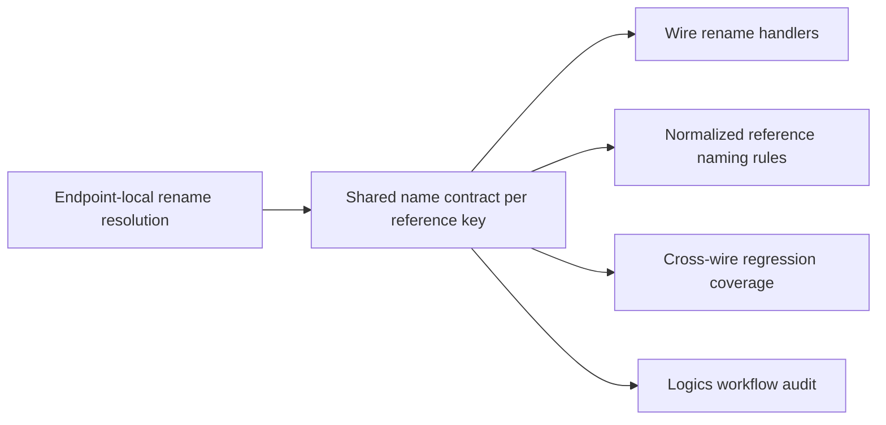

## adr_006_global_reference_name_propagation_for_wire_endpoint_renames - Global reference name propagation for wire endpoint renames
> Date: 2026-04-23
> Status: Settled
> Drivers: shared-name propagation by normalized reference, overwrite conflict atomicity, cross-kind isolation, zero propagation to empty references, release traceability
> Related request: `req_121_global_reference_name_propagation_for_wire_endpoint_renames`
> Related backlog: `item_590_global_reference_name_propagation_for_wire_endpoint_renames`
> Related task: `task_104_global_reference_name_propagation_for_wire_endpoint_renames`
> Reminder: Update status, linked refs, decision rationale, consequences, migration plan, and follow-up work when you edit this doc.

# Overview
Use one shared naming contract per `(reference kind, normalized reference)` key.
When the operator confirms an overwrite choice, propagate the winning name to every matching wire endpoint in the dataset.
Keep `connection` and `seal` isolated, keep empty or missing references ineligible, and keep cancel/discard atomic.
The impacted areas are the wire rename handler, rename conflict detection, and the regression tests that guard the cross-wire propagation rule.

# Context
- The wire rename flow must behave like a shared dictionary keyed by `(reference kind, normalized reference)`, not like a per-endpoint override.
- A previous contamination fix correctly isolated kinds and references, but it also narrowed propagation too far for confirmed overwrite choices.
- The dataset needs a single winning name for every shared reference key, while still refusing to rename unrelated references or empty slots.
- The implementation already exists; this ADR captures the architecture contract that explains why the confirmed overwrite must propagate globally.

# Decision
Adopt a shared-name propagation contract for wire endpoint references:
- resolve conflicts per exact `(kind, normalized reference)` key;
- on confirm, write the chosen name to every endpoint that carries that key;
- on cancel or discard, leave every matching endpoint unchanged;
- never propagate across kinds, across different normalized references, or into endpoints with no matching reference.

This keeps the rename model consistent with the rest of the local-first data model: one effective name per shared reference key across the dataset.

# Alternatives considered
- Keep the rename local to the edited endpoint only.
  Rejected because it breaks the shared-name rule for identical references across different wires.
- Broaden propagation to all wire endpoints without keying by normalized reference and kind.
  Rejected because it would reintroduce contamination across unrelated references and across `connection` / `seal`.
- Treat cancel/discard as a partial write.
  Rejected because it violates atomic overwrite semantics.

# Consequences
- Confirmed overwrite behavior is deterministic and dataset-wide for the targeted key.
- Regression coverage must continue to assert both propagation and isolation.
- The workflow audit can use this ADR as the traceable architecture reference required by the backlog and task docs.
- Future rename changes that alter keying, propagation scope, or atomicity should update this ADR first.

# Migration and rollout
- No schema migration is required for this contract.
- The rollout is already complete in code; this ADR formalizes the shipped rename semantics and keeps the Logics chain auditable.

# References
- `logics/request/req_121_global_reference_name_propagation_for_wire_endpoint_renames.md`
- `logics/backlog/item_590_global_reference_name_propagation_for_wire_endpoint_renames.md`
- `logics/tasks/task_104_global_reference_name_propagation_for_wire_endpoint_renames.md`
- `src/app/hooks/useWireHandlers.ts`
- `src/tests/app.ui.creation-flow-wire-endpoint-refs.spec.tsx`
- `src/tests/app.ui.catalog.spec.tsx`

# Follow-up work
- Keep the request, backlog, and task docs linked to this ADR.
- Preserve the exact `(kind, normalized reference)` key if rename logic evolves again.
- Extend regression coverage if a new rename surface reuses the same propagation contract.
