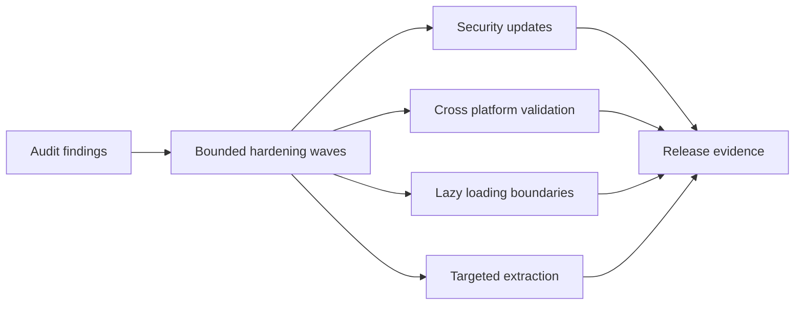

## adr_008_audit_hardening_delivery_strategy_for_security_ci_bundle_and_maintainability - Audit hardening delivery strategy for security CI bundle and maintainability
> Date: 2026-05-12
> Status: Accepted
> Drivers: dependency security, cross-platform validation, CI reliability, bundle size, PWA stability, incremental maintainability
> Related request: `req_124_audit_hardening_security_ci_bundle_and_maintainability_follow_ups`
> Related backlog: `item_596_audit_hardening_security_ci_bundle_and_maintainability_follow_ups`
> Related task: `task_107_audit_hardening_security_ci_bundle_and_maintainability_follow_ups`
> Reminder: Update status, linked refs, decision rationale, consequences, migration plan, and follow-up work when you edit this doc.

# Overview
Patch audit findings through bounded hardening waves.
Keep the existing React, Vite, PWA, local-first persistence, and Logics workflow architecture.
Prioritize reversible dependency, CI, and loading-boundary changes before broad refactors.
Use validation evidence as the release contract for each wave.

# Context
- The project audit in `AUDIT_PROJECT_2026-05-12.md` found that the application is functionally healthy, but release safety is weakened by dependency advisories, non-portable scripts, a flaky UI test lane exit, an oversized bundle, and large high-risk modules.
- The project is local-first and already has strict TypeScript, Vite, PWA, segmented Vitest lanes, Playwright E2E, and Logics traceability.
- The hardening work touches build tooling, test execution, dependency versions, runtime loading boundaries, and maintainability seams. Treating all of it as one broad rewrite would increase regression risk.
- The audit also identified Logics hygiene gaps, including a missing DoD checklist in `task_105` and placeholder cleanup follow-ups.

# Decision
Use an incremental audit-hardening delivery strategy:

- keep the current application architecture and deployment model;
- update vulnerable dependencies in controlled batches, starting with lockfile-safe fixes and then explicit package upgrades when needed;
- preserve `npm` as the package manager and keep `package-lock.json` as the dependency authority;
- replace Unix-only script behavior with cross-platform Node wrappers where local Windows and Linux CI need the same command;
- make UI validation reliable by reducing worker pressure, segmenting UI specs, or otherwise eliminating the Vitest `onTaskUpdate` unhandled error from the blocking path;
- reduce bundle cost by moving optional heavy paths behind lazy loading or dynamic imports, especially changelog markdown, markdown rendering, and XLSX export;
- keep PWA behavior as a first-class validation gate after build-tool or chunking changes;
- treat maintainability as focused extraction work around the largest risky files, not as a full rewrite;
- keep Logics docs synchronized with the hardening work and use validation evidence before closing any task.

# Alternatives considered
- Do a broad modernization rewrite.
  Rejected because the current app is functionally healthy and has many user-facing workflows; broad rewrites would risk regressions without directly addressing the audited release blockers.
- Only run `npm audit fix` and defer CI, bundle, and structure findings.
  Rejected because the audit showed multiple release risks; dependency safety alone would leave local validation and UI lane reliability broken.
- Raise bundle budgets and ignore chunk warnings.
  Rejected because the oversized bundle has identifiable avoidable eager-loading causes and affects user-facing load cost.
- Collapse all audit follow-up work into one task.
  Rejected because dependencies, CI, bundle loading, code extraction, and Logics hygiene have different risk profiles and validation needs.
- Introduce a new build system or package manager.
  Rejected because the current Vite/npm setup is serviceable; the risk is dependency freshness and loading boundaries, not the tool family itself.

# Consequences
- Hardening work should produce several bounded tasks or waves, each with a coherent validation checkpoint.
- Some dependency upgrades may require code or config adjustment, especially around Vite, PWA tooling, Vitest, Playwright, and transitive advisories.
- Bundle work should preserve feature behavior while changing load timing; tests must cover changelog rendering, exports, and PWA artifacts.
- Cross-platform scripts should avoid shell-specific syntax and prefer Node entrypoints when environment mutation is needed.
- Large-module extraction should proceed only where a clear seam exists and should keep existing orchestrators stable during the first pass.
- The Logics workflow remains the source of planning truth for this audit hardening chain.

# Migration and rollout
- Wave 1: fix validation portability and dependency security enough that the local and CI hardening loop is trustworthy.
- Wave 2: address UI lane reliability through segmentation, worker settings, or targeted slow-suite decomposition.
- Wave 3: reduce bundle size by lazy-loading optional heavy dependencies and measuring `npm run bundle:metrics:report`.
- Wave 4: repair Logics hygiene findings from the audit and ensure workflow audit no longer fails on the missing DoD checklist.
- Wave 5: implement or define the first focused extraction around the highest-risk large module, with targeted tests.
- Each wave should run the relevant subset first, then the broader gate: lint, typecheck, build, PWA quality, fast tests, UI tests or segmented replacement, E2E, `npm audit --audit-level=moderate`, and Logics lint/audit where touched.

# References
- `AUDIT_PROJECT_2026-05-12.md`
- `logics/request/req_124_audit_hardening_security_ci_bundle_and_maintainability_follow_ups.md`
- `logics/backlog/item_596_audit_hardening_security_ci_bundle_and_maintainability_follow_ups.md`
- `package.json`
- `vite.config.ts`
- `playwright.config.ts`
- `scripts/quality/run-vitest-segmented.mjs`

# Follow-up work
- Linked from `item_596_audit_hardening_security_ci_bundle_and_maintainability_follow_ups` and `task_107_audit_hardening_security_ci_bundle_and_maintainability_follow_ups`.
- Completed first task `task_107_audit_hardening_security_ci_bundle_and_maintainability_follow_ups` with explicit validation gates.
- Revisit this ADR if the hardening work requires changing package manager, build tool family, persistence schema, or PWA update strategy.
