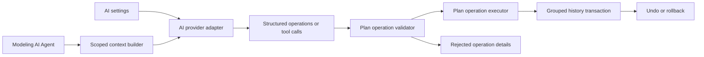

## adr_009_ai_agent_operation_contract_and_reversible_execution - AI Agent operation contract and reversible execution
> Date: 2026-05-30
> Status: Proposed
> Drivers: AI-assisted modeling, local-first safety, reversible mutations, provider independence, domain validation
> Related request: `req_128_ai_agent_modeling_workspace`
> Related backlog: `item_600_ai_provider_settings_and_capability_contract`, `item_601_ai_agent_context_builder_and_operation_contract`, `item_602_modeling_ai_agent_assisted_proposal_workflow`, `item_603_ai_agent_experimental_direct_execution_and_rollback`, `item_604_ai_agent_validation_regression_and_release_gate`
> Related task: TBD
> Reminder: Update status, linked refs, decision rationale, consequences, migration plan, and follow-up work when you edit this doc.

# Overview
Introduce AI-assisted Modeling through a bounded operation contract.
The AI provider may propose operations or request tool calls, but it must never mutate raw application state directly.
The application remains the authority for scope, validation, execution, history, rollback, and user-visible audit output.

# Context
The app already has a local-first state model, validation rules, import/export guards, undo/redo history, and selected-harness agent JSON export.
The new AI Agent workspace needs to move from read-only agent context to controlled in-app mutation.

AI output is not trustworthy enough to write directly into the store:
- model output can contain invalid IDs, stale coordinates, or unsupported entity combinations;
- provider behavior differs across vendors and local endpoints;
- destructive edits need the same safeguards as existing delete and cascade-delete flows;
- experimental direct execution needs to be reversible as one coherent user action.

# Decision
Use a provider-independent, operation-based architecture:

- Keep provider credentials and capabilities in Settings.
- Support OpenAI and Gemini as the first provider adapters.
- Let users enter API keys locally in app settings and persist those keys in local storage; `.env` keys may support developer workflows but are not the primary end-user path.
- Use editable model-name fields for OpenAI and Gemini in V1 instead of a rigid model catalog.
- Build scoped context from the current selection or active network in V1.
- Defer selected-harness mutation scope to V2 because a selected harness is a saved multi-network harness assembly with a broader mutation surface than the active network.
- Send structured context and user instructions to the configured provider through an `AIProviderService` boundary.
- Prefer provider output as an edited scoped plan JSON, then derive app-owned operations from a local before/after diff.
- Keep direct provider operation output as a compatibility path only.
- Validate every operation locally before any mutation.
- Execute operations only through app-owned operation handlers.
- Group each AI run into one history transaction or pre-run snapshot.
- Record accepted, rejected, skipped, and failed operations for the AI result view.
- Gate experimental direct execution behind settings and per-run UI affordances.

# Operation contract
The first provider contract should expose an editable scoped plan rather than forcing the model to author low-level operations.
The app builds a `modifiedPlan` request payload from the active-network or current-selection context.
The provider returns the full modified plan.
The app then derives a narrow operation vocabulary from the diff and validates those operations locally.

The derived operation vocabulary should remain narrow and explicit.

V1 families:
- `add_connector`, `add_splice`, `add_node`, `add_segment`, and tightly validated `add_wire`;
- `move_entity`: connector, splice, node, or selected supported canvas entities;
- `place_entity_relative_to_entity`: place a connector, splice, or node relative to another connector, splice, or node with explicit placement (`leftOf`, `rightOf`, `above`, `below`) and gap;
- `update_entity`: label, technical ID, section, material, color, protection, route lock, display metadata;
- `regenerate_route`: route recalculation within the current selection or active network.

V1 also accepts bounded identity resolution for provider output:
- exact internal IDs remain preferred;
- connector, splice, and wire technical IDs are accepted as aliases;
- unique partial aliases may be accepted when they match exactly one entity after generic words such as `connector` or `connecteur` are removed;
- unresolved or ambiguous aliases are rejected rather than guessed.

For movement, `move_entity` is appropriate for absolute positions or simple directional offsets.
Instructions such as "move SVC left of OBC" should use `place_entity_relative_to_entity` because they name both a target and an anchor.
When no persisted manual canvas position exists, validation may use the generated canvas layout as the read-only position source before creating the accepted proposal.

Deferred families:
- `assign_endpoint`: connector cavity or splice port assignment;
- `assign_catalog_reference`: connector, splice, terminal, seal, plug, or protection catalog association;
- `delete_entity`: destructive action, disabled until the assisted workflow and rollback path are proven;
- selected-harness multi-network operations.

Each operation should carry:
- operation ID;
- operation type;
- target scope;
- stable target IDs;
- arguments;
- optional before/after values;
- provider rationale;
- validation result;
- execution result.

# Validation boundaries
Validation must reject or downgrade operations when:
- the target network, harness, or entity does not exist;
- the operation reaches outside the selected scope;
- the operation type is not enabled by permissions;
- deletion is requested without explicit delete permission;
- dependency guards would block the same operation manually;
- coordinates, cavity indices, splice ports, route segments, or catalog references are invalid;
- the operation would silently overwrite unrelated user state.

# Alternatives considered
- Let the provider return a full patched store.
  Rejected because it bypasses domain validation, makes rollback harder to explain, and couples providers to internal state shape.
- Treat the AI feature as chat-only with no mutation.
  Rejected because the product goal is to accelerate Modeling work, not only explain it.
- Build provider-specific UI flows.
  Rejected because Settings should configure providers while Modeling stays provider-neutral.
- Ship experimental direct execution first.
  Rejected because assisted proposal review is the safer validation path and creates the shared operation contract needed by direct execution.

# Consequences
- The first implementation needs more upfront plumbing than a raw prompt call.
- Provider adapters can evolve independently from Modeling UI.
- Operation validation becomes testable without a provider.
- Assisted and experimental modes share one mutation path.
- Rollback behavior can be consistent because every AI run has an explicit transaction boundary.
- Some desired AI actions will be unsupported until the operation vocabulary expands.

# Migration and rollout
- Wave 1: AI settings and provider capability contract.
- Wave 2: scoped context builder and operation schema/validator.
- Wave 3: assisted proposal UI and grouped apply/reject behavior.
- Wave 4: experimental direct execution using the same validator/executor path.
- Wave 5: regression coverage, release gates, and Logics closure.

# References
- `logics/request/req_128_ai_agent_modeling_workspace.md`
- `logics/product/prod_004_ai_agent_modeling_workspace.md`
- `logics/request/req_127_selected_harness_agent_json_export.md`
- `logics/architecture/adr_003_modeling_create_flow_reset_and_canvas_group_movement_interaction_contracts.md`
- `logics/architecture/adr_008_audit_hardening_delivery_strategy_for_security_ci_bundle_and_maintainability.md`

# Follow-up work
- Confirm implementation-time default model names for OpenAI and Gemini.
- Define the exact user-facing copy that explains API keys are stored locally.
- Add a task-level validation matrix when implementation begins.
