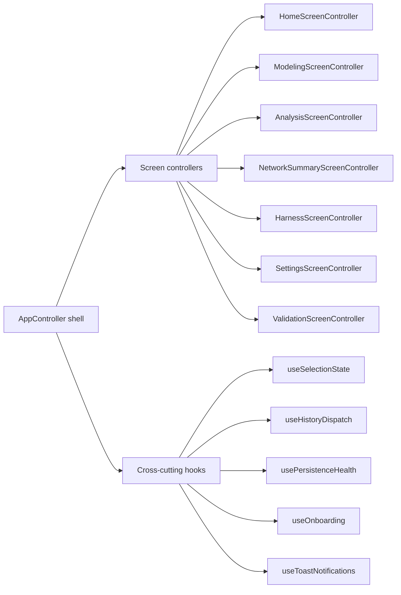

## adr_009_app_controller_decomposition_plan - AppController decomposition plan

> Date: 2026-05-30
> Status: Proposed
> Drivers: maintainability, screen-level testability, hooks modularization quality gate, AppController growth budget
> Related request: `req_129_app_controller_decomposition_plan`
> Related backlog: `item_600_appcontroller_decomposition_plan`
> Related task: `task_111_appcontroller_decomposition_plan`
> Reminder: Update status, linked refs, decision rationale, consequences, migration plan, and follow-up work when you edit this doc.
> Related quality gates: `quality:ui-modularization` (locked budget `src/app/AppController.tsx` = 1100 lines), `quality:hooks-modularization` (introduced in v1.10.4)
> Related files:
>   - `src/app/AppController.tsx` (1021 lines as of v1.10.4)
>   - `src/app/hooks/controller/useAppControllerScreenContentSlices.tsx` (978 lines)
>   - `src/app/hooks/controller/useAppControllerModelingAnalysisScreenDomains.tsx` (875 lines)
>   - `src/app/hooks/controller/useAppControllerNetworkSummaryPanelDomain.tsx` (744 lines)
>   - `src/app/hooks/controller/useAppControllerModelingHandlersOrchestrator.ts` (417 lines after parameter-contract compaction)

# Overview

Decompose `AppController.tsx` into a thin shell that wires screen-scoped controllers, rather than the current single 1000+ line orchestrator. Keep the public component contract (`<AppController store={...} />`) unchanged. The new `quality:hooks-modularization` gate already documents the current oversize controller hooks so any extraction step has an explicit retirement target.



# Context

- `src/app/AppController.tsx` is the entry composition for the React shell. It currently:
  - imports ~62 modules,
  - calls ~50 hooks,
  - destructures 11 entity-snapshot slices, 8 canvas-state slices, 7 preference slices, 4 workspace screen slices,
  - drives all screens, dialogs, and overlays through one render body.
- The file is governed by a locked budget of 1100 lines (`LOCKED_LINE_BUDGETS` in `scripts/quality/ui-modularization-gate-core.mjs`). The growth headroom is now ~80 lines.
- Several controller hooks are likewise oversized and documented as exceptions in `scripts/quality/hooks-modularization-gate-core.mjs`:
  - `useAppControllerScreenContentSlices.tsx` (978 lines): centralizes Home/Modeling/Analysis/NetworkScope/Settings/Validation screen content slice composition,
  - `useAppControllerModelingAnalysisScreenDomains.tsx` (875 lines): shared selection, navigation, and entity-snapshot bindings for Modeling + Analysis,
  - `useAppControllerNetworkSummaryPanelDomain.tsx` (744 lines): canvas-display, callout, viewport, and BOM-preview bindings for NetworkSummary,
  - `useAppControllerModelingHandlersOrchestrator.ts` is now under the 500-line hook budget after replacing its duplicated parameter list with composed handler contracts.
- Existing `*ScreenController`, `*DomainAssembly`, `*HandlersOrchestrator`, and `*Slices` hooks already split the surface horizontally, but the **vertical** composition still lives entirely inside `AppController.tsx`.

# Decision

Adopt an incremental, screen-scoped decomposition plan. The shell `AppController` becomes a thin composition root; one controller per workspace screen takes over its own state assembly, handler wiring, and content slice.

The plan is intentionally not a single refactor PR. It is a 4-wave roadmap with explicit per-wave validation evidence.

## Wave 1 — Extract `NetworkSummaryScreenController`

- **Scope**: move canvas-display, callout, viewport, BOM preview, and SVG export wiring from `AppController` + `useAppControllerNetworkSummaryPanelDomain` into a single `NetworkSummaryScreenController.tsx` rendered when the active workspace screen is `network-summary`.
- **Public contract**: `AppController` still owns the network-summary panel ref but receives a pre-assembled controller props object from the new hook+component pair.
- **Target line counts**:
  - new `NetworkSummaryScreenController.tsx` <= 500 lines,
  - `useAppControllerNetworkSummaryPanelDomain.tsx` retires (entry removed from `ALLOWED_HOOKS_OVERSIZE`),
  - `AppController.tsx` drops ~120 lines.
- **Validation evidence**: `app.ui.network-summary-*.spec.tsx` lane stays green; new spec covering the controller boundary.

## Wave 2 — Extract `ModelingScreenController` + `AnalysisScreenController`

- **Scope**: split `useAppControllerModelingAnalysisScreenDomains` into two screen controllers. Each owns its own selection bindings, navigation, entity-snapshot wiring, and handler orchestrator slice.
- **Cross-screen state**: keep `selection`, `history dispatch`, and `entity snapshot` as shared hooks at the shell level (these legitimately span screens via Go-to actions).
- **Target line counts**:
  - `ModelingScreenController.tsx` <= 500 lines,
  - `AnalysisScreenController.tsx` <= 400 lines,
  - `useAppControllerModelingAnalysisScreenDomains.tsx` retires,
  - `useAppControllerModelingHandlersOrchestrator.ts` either retires or shrinks to <= 500 lines.
- **Validation evidence**: `app.ui.modeling-*.spec.tsx` + `app.ui.analysis-*.spec.tsx` lanes stay green; controller-boundary spec coverage added.

## Wave 3 — Extract remaining screen controllers (Home, NetworkScope, Settings, Validation)

- **Scope**: split `useAppControllerScreenContentSlices.tsx` into per-screen content composers. Most of these are simpler than Modeling/Analysis because their inputs are read-only on AppState plus a handful of preference setters.
- **Target line counts**:
  - `HomeScreenController.tsx` <= 250 lines,
  - `NetworkScopeScreenController.tsx` <= 300 lines,
  - `SettingsScreenController.tsx` <= 400 lines,
  - `ValidationScreenController.tsx` <= 350 lines,
  - `useAppControllerScreenContentSlices.tsx` retires.
- **Validation evidence**: `app.ui.home.spec.tsx`, `app.ui.network-scope.spec.tsx`, `app.ui.settings.spec.tsx`, `app.ui.validation.spec.tsx` stay green.

## Wave 4 — Lower the AppController locked budget

- **Scope**: after waves 1–3, `AppController.tsx` is expected to drop from ~1020 lines to ~500–550 lines (shell composition + cross-cutting hooks + overlays). Update the locked budget in `scripts/quality/ui-modularization-gate-core.mjs` from `1100` to the new ceiling rounded up to the next 50-line boundary.
- **Validation evidence**: `quality:ui-modularization` passes at the lower budget. Documented oversize controller hooks in `quality:hooks-modularization` reduce to at most 4 entries (down from 12).

# Non-goals for this plan

- No change to `appReducer` shape or the dual-state invariant (`networkStates[activeNetworkId]` synchronization with root slices) — see `src/store/reducer.ts:32-46`.
- No change to the workspace persistence schema or to the network export file schema.
- No new external dependencies. The decomposition stays inside React + existing hook patterns.
- No splitting of `i18n.ts` (965 lines) or `migrations.ts` (987 lines) — those are out-of-scope dictionaries / migration ledgers tracked separately.

# Consequences

- **Maintainability**: each screen becomes diff-readable in isolation; new screen-scoped features avoid having to thread through the central shell.
- **Testability**: each screen controller can be unit-tested against a constructed store without rendering the full shell.
- **Performance**: no expected impact. Existing memoization patterns (`useMemo`-built namespaced bags) port directly to per-screen controllers.
- **Migration risk**: low when waves land separately. High if waves are bundled into one PR — selection routing across Go-to actions makes Modeling/Analysis the most coupled pair (Wave 2).
- **Quality gates**: the new `quality:hooks-modularization` allowlist is the authoritative checklist of what must shrink. Each wave includes an explicit allowlist update step.

# Validation evidence template per wave

Run before opening the PR:

```bash
npm run -s ci:blocking
npm run -s coverage:ui:report
npm run -s coverage:full:report
```

Add to the PR description:

- the targeted hook/component, its previous size, its new size,
- the `ALLOWED_HOOKS_OVERSIZE` entries that were removed,
- the `LOCKED_LINE_BUDGETS` value adjusted (if any),
- the specs added or moved.

# Follow-up work

- Once Wave 1 ships, write a short ADR amendment (or a `logics/specs/` doc) capturing the actual line-count deltas and any deviations from the plan.
- After Wave 4, consider lowering `LOCKED_LINE_BUDGETS["src/app/AppController.tsx"]` further and locking it as a permanent budget rather than a moving ceiling.

# Amendments

## 2026-05-31 - Modeling handler orchestrator contract compaction

`useAppControllerModelingHandlersOrchestrator.ts` shrank from 601 to 417 lines by composing its parameter type from `useConnectorHandlers`, `useSpliceHandlers`, `useNodeHandlers`, `useSegmentHandlers`, and `useWireHandlers` instead of duplicating each field. The hook remains a shared Modeling handler orchestrator, but it no longer needs an `quality:hooks-modularization` oversize exception.

`useConnectorHandlers.ts` also moved connector endpoint-reference cleanup helpers into `connectorEndpointReferences.ts`, shrinking from 519 to 484 lines and retiring its hooks modularization exception.

`useCanvasInteractionHandlers.ts` moved its parameter contract into `types/canvas-interactions.ts` and SVG/group-drag geometry into `lib/canvasInteractionGeometry.ts`, shrinking from 607 to 498 lines and retiring its hooks modularization exception.
