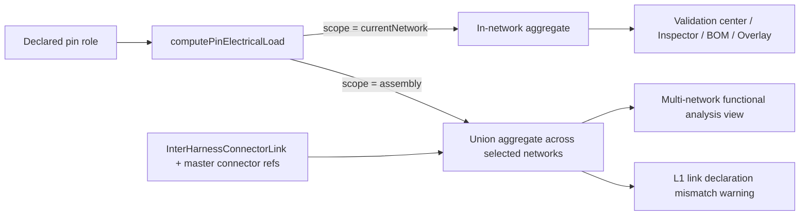

## adr_010_inter_network_current_bridge_semantics - Inter-network current bridge semantics for pin-load aggregation

> Date: 2026-06-02
> Status: Proposed
> Drivers: pin-level electrical roles, harness assembly cross-cutting analysis, permissive diagnostics, deterministic aggregation, multi-network functional analysis view
> Related request: `req_133_pin_level_source_consumer_currents_and_harness_dimensioning_diagnostics`
> Related backlog: `item_608_pin_electrical_role_data_model_and_catalog_defaults`, `item_610_in_network_pin_load_aggregation_engine`, `item_611_electrical_dimensioning_validation_category`, `item_614_multi_network_functional_analysis_view_and_assembly_scope`
> Related task: `task_116_pin_electrical_role_data_model_and_catalog_defaults`
> Reminder: Update status, linked refs, decision rationale, consequences, migration plan, and follow-up work when you edit this doc.

# Overview
Define how the pin-load aggregation engine treats inter-network constructs — `InterHarnessConnectorLink` and master connector references inside a `HarnessAssembly` — when propagating declared currents across linked networks.

The decision binds three concerns:
- the engine's public API surface (one function, two scopes);
- the network-level isolation of the validation center, connector inspector, BOM, and functional schematic overlay;
- the cross-network opt-in surface (the new multi-network functional analysis view).

# Context
The app already models multi-harness topologies through `HarnessAssembly`:
- `HarnessAssembly.members` lists the member networks;
- `HarnessAssembly.connectorLinks` carries explicit `InterHarnessConnectorLink` entries between two `(networkId, connectorId)` pairs;
- `HarnessAssembly.masterConnectorRefs` lists connectors that are visible as a shared physical interface to multiple member networks.

`req_133` introduces pin-level current declarations and a diagnostic engine that consumes them. Without an explicit cross-network policy, three risks appear:

1. **Silent leakage** — if the validation center traversed bridges by default, a consumer declared in network B would silently mutate the diagnostics of network A. Users would see warnings or errors on A that have no observable cause inside A's own data. This breaks the local-first model and the explicit "scope = current network" reading habit.
2. **Inconsistent semantics across bridge kinds** — `InterHarnessConnectorLink` is symmetric and explicit; a shared master connector reference is descriptive (two networks "see" the same physical connector). Without an explicit rule, these two constructs could drift into divergent propagation behaviors.
3. **Cross-bridge contradictions** — the two sides of a bridge may declare incompatible roles or different `currentA` values. Without a rule, the engine could pick one side arbitrarily, double-count, or crash on a contradictory loop.

The decision must also preserve the permissiveness contract from `req_133`: partial declarations must never block work, and missing data must never produce an `error`.

# Decision

## 1. Single aggregation engine with a scope discriminated union
The engine is a single pure function `computePinElectricalLoad(networks, scope, options)`.

`Scope` is a discriminated union:
- `{ kind: "currentNetwork" }` — used by the validation center, connector inspector, BOM export, and functional schematic overlay.
- `{ kind: "assembly"; networkIds: ReadonlyArray<NetworkId> }` — used **exclusively** by the multi-network functional analysis view. `networkIds` is the subset of the active `HarnessAssembly`'s members the user selected. The set must be non-empty and must be a subset of the active assembly; otherwise the engine rejects the call with a typed error.

This isolates cross-network behavior behind an explicit opt-in and gives both surfaces one canonical implementation.

## 2. Bridges are current-conserving pass-through nodes
Within `scope = "assembly"`, two constructs introduce inter-network propagation:

- **`InterHarnessConnectorLink`** between `(sourceNetworkId, sourceConnectorId, ...)` and `(targetNetworkId, targetConnectorId, ...)`. The link binds the two connectors at the matching cavity level. For each `(cavityIndex)` pair where both connectors expose a cavity, the engine treats the two pins as a single virtual node and lets current flow between them with Kirchhoff conservation, identical to a `Splice`.
- **Shared master connector references** — every pair of member networks of the active assembly that both list the same connector in `HarnessAssembly.masterConnectorRefs` is treated as a bridge over that connector's cavities. The same pin pairing and pass-through semantics apply.

Within `scope = "currentNetwork"`, **both constructs are ignored**. A linked consumer or a shared master reference contributes nothing to the local aggregate.

## 3. Cavity-level pairing rules
A bridge couples cavities by index (1-based). When the two connectors at the two ends of a bridge expose different cavity counts, only the cavities present on **both** sides are bridged; the extra cavities on the longer side are left as in-network endpoints (and may still emit their own D1–D4 issues locally when re-aggregated under `currentNetwork`).

Cavity indices are matched 1:1 by default. Future bridge variants (rotated mating, harness adapters) may introduce a permutation map; for this release the 1:1 rule holds.

## 4. Conflict resolution at a bridge — L1 link declaration mismatch
When the two pins at the two ends of a bridge both declare a role or a current and the declarations are **incompatible**, the engine emits one `L1` warning per bridge / cavity pair and continues aggregation by taking `max(declaredCurrentA, declaredCurrentA)`.

Incompatibility is defined as:
- both sides declare the same non-passive role (`source ↔ source` or `consumer ↔ consumer`); or
- opposing roles (`source ↔ consumer`) with different `currentA` values where both are declared.

Compatibility (no L1) covers:
- one side declared and the other side undeclared or `passive`;
- both sides undeclared;
- opposing roles with the same `currentA`;
- one or both sides `bidirectional` (no signed contradiction can be inferred).

L1 is `warning` severity, never `error`. It surfaces only inside the multi-network functional analysis view.

## 5. Cycle safety
The engine uses a single visited set keyed by the **scoped pin id** `(networkId, connectorId, cavityIndex)`. Each scoped pin is visited at most once per aggregation pass. A loop closure attempt emits one `warning` "Inter-network aggregation did not converge" listing the participating scoped pins, aborts that branch's propagation, and continues with the remaining branches. The engine never throws on loops.

## 6. Boundary: outside-assembly networks
Networks that are not members of the active `HarnessAssembly` are **never** aggregated, even if a defunct or stale `InterHarnessConnectorLink` points to them. Bridges whose far end resolves outside the selected `networkIds` set are dropped silently from the propagation pass and listed in the engine's `diagnostics.skippedBridges` output for the view to render an informational badge if it wishes.

## 7. No silent default
When the user opens the multi-network analysis view without an active `HarnessAssembly`, the scope picker offers only `currentNetwork`. The engine never falls back from `assembly` to `currentNetwork`; the view is responsible for offering a scope the engine accepts.

## 8. Determinism
For a fixed input `(networks, scope, ampacity table, options)`, the engine returns deeply equal outputs across calls. Iteration order over connectors, splices, fuse-box pairs, and bridges is sorted by stable IDs; no `Set`/`Map` insertion order is exposed in observable outputs.

# Alternatives considered

- **Always aggregate across the active assembly (no scope parameter).**
  Rejected because it leaks cross-network state into the validation center and inspector, breaks the user's "what I see is what's in this network" mental model, and forces every diagnostic surface to deal with multi-network labels.

- **Make every inter-network bridge an explicit virtual splice in the persisted graph.**
  Rejected because it pollutes the data model with engine-internal artifacts, complicates persistence migration, and conflates routing with electrical aggregation.

- **Resolve bridge contradictions by picking the side with the latest `updatedAt`.**
  Rejected because it would silently hide a user mistake under a heuristic. L1 surfaces the contradiction and the engine continues conservatively with `max(currentA)`.

- **Throw on loops.**
  Rejected because a loop can result from valid editing in progress (a partially wired assembly). Throwing would block the entire view; a per-loop warning preserves usability.

- **Propagate currents across master connector references but not across `InterHarnessConnectorLink` (or vice versa).**
  Rejected for inconsistency; both constructs describe a physical bridge from the user's point of view and should behave identically.

# Consequences

- The validation center, connector inspector, BOM, and functional schematic overlay are guaranteed to be local-first and free of silent cross-network leakage. Reviewing a single network is exactly that.
- The multi-network functional analysis view is the single surface where bridge traversal happens. Removing the view (or closing it) removes every cross-network finding.
- The engine has one API surface with two implementations behind a discriminated union. `item_610` ships the `currentNetwork` arm and the scope dispatch; `item_614` adds the `assembly` arm.
- L1 emission lives next to the engine and is delivered to the view as part of the engine output, not as a side channel.
- Loop and skipped-bridge diagnostics are first-class engine outputs, not exceptions; the view can render them informationally.
- Adding a future bridge variant (e.g. inter-assembly bridge, harness adapter with a cavity permutation) means adding a new `BridgeKind` variant inside the engine and extending the scope; the public API does not change.

# Migration and rollout

- Wave 1 (`item_608` + `item_609`): foundation — data model, catalog merge, ampacity table. No engine yet.
- Wave 2 (`item_610`): engine with the `currentNetwork` arm and the scope discriminated union; `assembly` arm throws `NotImplemented`. Bridges are not traversed.
- Wave 3 (`item_611`): D1–D4 emission against the `currentNetwork` arm.
- Wave 4 (`item_612` + `item_613`): editing surfaces and overlay, both using `currentNetwork`.
- Wave 5 (`item_614`): `assembly` arm, multi-network view, L1 emission, loop diagnostics, skipped-bridge diagnostics.
- Wave 6 (`item_615`): release validation, permissiveness gate, modeling-canvas-unchanged snapshot, AI-Agent-untouched snapshot.

# References
- `logics/request/req_133_pin_level_source_consumer_currents_and_harness_dimensioning_diagnostics.md`
- `docs/pin-level-source-consumer-currents-product-brief.md`
- `src/core/harnessAssembly.ts` (link + master connector references)
- `src/core/entities.ts` (`HarnessAssembly`, `InterHarnessConnectorLink`, `Connector`)
- `logics/architecture/adr_007_harness_assembly_and_physical_interconnector_contract.md` (harness assembly contract foundation)

# Follow-up work
- Inter-assembly bridges (link spanning two distinct `HarnessAssembly`s). Out of scope for this release; would require an explicit cross-assembly opt-in.
- Cavity permutation maps for harness adapters. Out of scope; the current rule is 1:1 by cavity index.
- Engine-level voltage propagation and voltage-drop refinements that consume the bridge graph.
- AI Agent context exposure of bridge-resolved aggregates. Explicitly deferred by `req_133`.
