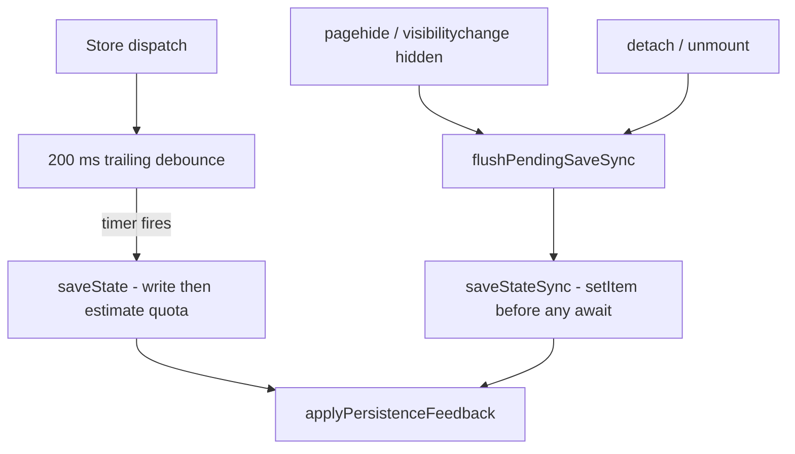

## adr_011_local_first_persistence_durability_lifecycle_flush_and_synchronous_write - Local-first persistence durability: lifecycle flush and synchronous write

> Date: 2026-06-09
> Status: Settled
> Drivers: local-first persistence guarantee, debounced persistence performance, page-lifecycle durability, deterministic save feedback
> Related request: `req_142_debounced_persistence_durability_flush_on_unload`
> Related backlog: `item_628_debounced_persistence_loses_unsaved_edits_on_tab_close_or_unmount`
> Related task: `task_138_debounced_persistence_loses_unsaved_edits_on_tab_close_or_unmount`
> Reminder: Update status, linked refs, decision rationale, consequences, migration plan, and follow-up work when you edit this doc.

# Overview
Define the durability contract for the debounced localStorage persistence introduced in `1.15.0`, so the local-first persistence guarantee holds across tab close, reload, navigation, and component unmount while keeping the debounce performance benefit for in-session editing.

The decision binds three concerns:
- when a pending debounced save must be forced to disk (page-lifecycle transitions and detach);
- how that forced write executes (synchronously, before any awaited storage-pressure estimation);
- how save feedback (quota / write-failure / recovery) stays consistent between the debounced and forced paths.

# Context
`1.15.0` made persistence sync debounced: `attachPersistenceSync` (`src/app/store.ts`) schedules a single trailing `saveState` 200 ms after the last dispatch. This removed the per-dispatch `JSON.stringify` + write cost, but introduced a durability gap:

1. **No lifecycle flush** — there was no `pagehide`, `visibilitychange`, or `beforeunload` handler. An edit made within ~200 ms of the tab closing, reloading, or navigating away was dropped because the trailing timer never fired.
2. **Detach discarded pending work** — the detach handle cleared the pending timer without flushing, so a React unmount or explicit unsubscribe also lost the most recent pending save.
3. **The write was not synchronous** — `saveState` awaited `estimateStoragePressure` (which calls `navigator.storage.estimate()`) before `storage.setItem`. Even a flush triggered from an unload handler would schedule the actual write in a microtask that runs after the page has begun tearing down, so the write would not complete.

This contradicts the product guarantee in `LOGICS.md`: "Local-first persistence is a product guarantee." Before `1.15.0`, every dispatch saved synchronously, so the latest state was always durable at unload.

# Decision
- **Force a synchronous flush on page-lifecycle transitions.** `attachPersistenceSync` registers `pagehide` and `visibilitychange` (state `hidden`) listeners. `beforeunload` is intentionally avoided because it can disable the back/forward cache; the hidden-state and pagehide signals cover tab close, reload, navigation, and tab switching.
- **Flush on detach.** The detach handle flushes any pending save before clearing the timer and unsubscribing, then removes the lifecycle listeners. The flush is a no-op when no timer is pending (e.g. `debounceMs: 0`, where saves are already synchronous), so synchronous-mode save semantics and their assertions are unchanged.
- **Provide a synchronous write path.** `saveStateSync` (`src/adapters/persistence/localStorage.ts`) performs `setItem` immediately and never awaits storage-pressure estimation. The forced flush uses it so the durable write completes before page teardown. `saveState` is refactored to write first (via a shared `writeStateSnapshot` helper) and only then compute the non-blocking near-quota warning, so durability no longer depends on the async estimate even on the debounced path.
- **Keep feedback deterministic.** Both paths funnel results through one `applyPersistenceFeedback` routine. The synchronous flush bumps the internal save sequence so a late-resolving async save cannot clobber the forced result. Quota-exceeded, storage-near-quota, write-failure, and recovery messages are preserved.
- **Preserve the in-session debounce.** Normal editing keeps the 200 ms trailing debounce so a burst of dispatches still collapses to a single write.

# Consequences
- Edits are durable across tab close, reload, navigation, tab hide, and unmount, restoring the local-first guarantee without giving up debounce batching.
- `saveStateSync` is a new public persistence surface; lifecycle/detach flushes must use it rather than the async `saveState`.
- The near-quota warning on the synchronous path is skipped by design (no `await` is possible during teardown); the warning still surfaces on the next debounced save while the tab is active.
- `attachPersistenceSync` now owns DOM lifecycle listeners; it must remove them on detach to avoid leaks (covered by a regression test). In non-DOM environments the listeners are skipped.
- Tests can inject a `saveSync` stub alongside `save` to assert forced-flush behavior deterministically.

# References
- Related request: `req_142_debounced_persistence_durability_flush_on_unload`
- Related backlog: `item_628_debounced_persistence_loses_unsaved_edits_on_tab_close_or_unmount`
- Related task: `task_138_debounced_persistence_loses_unsaved_edits_on_tab_close_or_unmount`
- `src/app/store.ts`
- `src/adapters/persistence/localStorage.ts`
- `src/tests/store.persistence-durability.spec.ts`
- `changelogs/CHANGELOGS_1_15_0.md`
