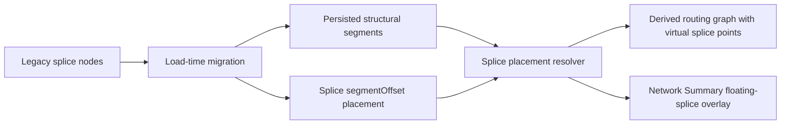

## adr_012_floating_splice_placement_architecture - Floating splice placement architecture
> Date: 2026-06-10
> Status: Proposed
> Amended: 2026-06-10 (migration safety, determinism, and visibility contract from pre-implementation review)
> Drivers: physical harness fidelity, splice/topology decoupling, deterministic routing, load-time legacy migration, Network Summary continuity, migration visibility
> Related request: `logics/request/req_144_floating_splice_placements_decoupled_from_network_topology.md`
> Related backlog: `logics/backlog/item_630_floating_splice_placements_decoupled_from_network_topology.md`
> Related task: `logics/tasks/task_139_floating_splice_placements_decoupled_from_network_topology.md`
> Reminder: Update status, linked refs, decision rationale, consequences, and follow-up work when you edit this doc.

# Overview
Represent splices as placed electrical contact points instead of structural routing nodes.
The structural network remains connectors, structural nodes, and segments.
Every connectable splice is placed on a segment by a millimeter offset from one endpoint node, while routing and rendering derive virtual splice points from that placement.



# Context
- The current model stores `Splice` as an electrical entity, but wire endpoints and routing depend on a separate `NetworkNode.kind === "splice"` to map splice ports into the route graph.
- That coupling makes the splice shape the physical network topology even when the real harness topology is a continuous segment with an electrical contact point.
- Operators want the model to reflect physical reality: a splice is a point where several cables contact, not a required structural graph vertex.
- Canvas coordinates are a visual representation and are not proportional to real length, so placement must be edited through real segment length data rather than drag geometry.
- Existing local workspaces and exported network files may contain splice nodes. They must be converted automatically while preserving loadability and route meaning.

# Decision
Adopt segment-offset splice placement as the canonical architecture.

The canonical placement model is:

```ts
type SplicePlacement = {
  kind: "segmentOffset";
  segmentId: SegmentId;
  fromNodeId: NodeId;
  offsetMm: number;
};
```

Core data contract:
- A connectable splice must have a valid segment placement before wires can reference its ports.
- `offsetMm` is measured from `fromNodeId`, which must be one endpoint of `segmentId`.
- `offsetMm` may be `0` or exactly the segment length. The UI must display those cases explicitly instead of hiding them.
- `nodeAnchor` is not a canonical saved placement. If topology needs a branch point, the branch point is a structural intermediate node, and the splice is placed on an adjacent segment at `0 mm` from that node.
- Connected unplaced splices are invalid. A splice without placement may exist only as draft or migration recovery data; it is not visible in Network Summary and cannot be selected as a wire endpoint.
- Multiple splices may share the same segment offset. No explicit same-segment ordering is required.
- Segment placements cannot target `rearBackshellLink` segments.
- Removing the placement of a splice is blocked while wires are connected to its ports, with the same guarded-action feedback as host-segment deletion.
- Moving a placement (segment, reference node, or offset change) triggers full wire route recomputation; the move is blocked with feedback when it would invalidate a locked route, consistent with the segment-edit policy.
- The term "placement" is reserved for this physical segment-offset model. The existing canvas-position optimization naming (`splicePlacementReducer.ts`, `splice/applyOptimizedPlacement`) must be renamed to canvas-layout wording to avoid semantic collision.

Routing contract:
- Build a derived routing graph from persisted nodes, segments, and resolved splice placements.
- Insert virtual routing points at floating splice placements for route computation, without adding persisted splice nodes.
- Keep `Wire.routeSegmentIds` as the primary public route summary.
- Add route detail only where needed to represent partial first or last segment traversal when a wire endpoint is a floating splice.
- Connector-to-splice lengths use only the covered portion of the host segment.
- Connector-to-splice-to-connector displays may keep complete segment IDs, while length calculation uses endpoint portions.
- Preserve deterministic route tie-break behavior based on current segment ID ordering.
- Insert virtual splice points only for the endpoints of the wire being routed; other splices' placements never fragment the graph seen by an unrelated route.
- Synthetic sub-edge identifiers never leak into tie-break comparisons or `routeSegmentIds`; comparisons and route summaries always use host segment IDs, with consecutive duplicate host IDs deduplicated.
- Zero-length sub-edges are valid in the derived graph (offset `0`/`lengthMm`, same-offset splices), even though persisted segments keep the `lengthMm >= 1` rule.
- A zero-length route (endpoint splice resolved at the same point as the other endpoint) is represented as `routeSegmentIds = [hostSegmentId]` with a `0 mm` partial traversal detail — never as an empty route — and validation accepts it as valid.
- Directional splice L/R inference adapts to the resolved floating placement and route direction while preserving manual side locking.

Rendering and interaction contract:
- Network Summary renders floating splices through a dedicated overlay model such as `renderedFloatingSplices`, not by forcing them into `renderedNodes`.
- Floating splice markers visually match current splice nodes.
- Floating splices remain selectable, focusable, and activatable.
- Splice callouts anchor to resolved splice positions and remain available for every placed splice.
- Visibility first: a floating splice marker must never be hidden under a node or another splice marker. When a resolved position coincides with (or comes within a minimum clearance of) a node or another splice, the marker is rendered with a deterministic render-only offset plus a short anchor tick to its true position; same-position splices fan out in splice ID order. Persisted `offsetMm` is never altered for visual reasons.
- A migrated splice may legitimately appear at an unexpected canvas position (fused segments render as one straight line); that displacement is accepted as long as the marker stays individually visible and selectable.
- Floating splices inherit sub-network de-emphasis from their host segment's `subNetworkTag`.
- Canvas dragging does not edit splice placement in the first implementation because canvas distance is not physical distance.
- Form editing owns initial placement changes: host segment, reference node, and offset in millimeters.

Mutation and validation contract:
- Deleting a segment that hosts any splice is blocked with user-facing feedback telling the operator to move or delete the splice first.
- Segment length edits preserve absolute `offsetMm` when possible.
- When segment length changes alter the splice's relative position, show feedback that reports the old and new percentage.
- If a segment length edit makes `offsetMm` exceed the segment length, clamp and report the adjustment.
- Clamp and relative-position feedback use a non-blocking warning channel (the action succeeds and a warning is surfaced), distinct from the blocking `lastError` path; this warning channel is new infrastructure required by this ADR.
- Validation reports missing host segment, invalid `fromNodeId`, out-of-range offset, `rearBackshellLink` host segment, unresolved migration state, and any attempt to connect a wire to an unplaced splice.

Migration contract:
- Run migration at load time for both local persisted workspaces and network file imports. The conversion is implemented once and invoked from both paths: the workspace persistence pipeline (schema v3 -> v4, relying on the existing pre-migration backup) and network file import normalization (file schema v3 -> v4). Both paths share parity tests.
- Legacy splice nodes are processed in deterministic lexicographic node ID order; adjacency is re-evaluated after each conversion so chains of adjacent degree-2 splice nodes converge deterministically.
- Degree-2 fusion is allowed only when the safe-fusion predicate holds:
  - the two adjacent segments are distinct and neither has `role: "rearBackshellLink"`;
  - the far endpoints are distinct nodes (fusion never creates a self-loop);
  - semantic metadata is identical on both segments: `subNetworkTag`, `sheathType`, `insulation`, `lineStyle`, `internalPartReference`.
  When the predicate fails, fall back to the intermediate-node conversion below instead of fusing — no silent metadata loss.
- Deterministic fusion outcome: the surviving segment ID is the lexicographically smaller of the two; `fromNodeId` is the surviving segment's non-junction endpoint; `offsetMm` equals the surviving segment's pre-fusion `lengthMm`; the fused length is the sum of both lengths; `mountingLabels` are the union of both segments' labels; the surviving segment's callout position is kept.
- Segment fusion rewrites `routeSegmentIds` for ALL wires that reference the fused segments — locked and unlocked alike — replacing the old pair with the surviving ID and deduplicating consecutive duplicates, preserving wire lengths. Persisted routes are never left referencing removed segment IDs: a route that cannot be rewritten is recomputed (unlocked) or kept loadable with an explicit route-lock diagnostic (locked).
- Degree-greater-than-2 legacy splice node: replace the splice node with a structural intermediate node, preserve branch segments against that node, and place the splice on a deterministic adjacent segment (lexicographically smallest segment ID) at `0 mm` from the intermediate node.
- Degree-1 legacy splice node: convert the node to a structural intermediate node and place the splice at `0 mm` from it on its single adjacent segment.
- Degree-0 legacy splice node: remove the node; the splice becomes an unplaced draft with a validation diagnostic (visible in splice tables and the validation center, not in Network Summary).
- Every node created or converted by migration gets a clearly distinguishable reserved label: `MIG-SPLICE-<spliceTechnicalId>` (numeric suffix on collision). These labels must stand out from operator-authored node names.
- A single modal migration report (explicit dismissal, no auto-dismiss) is shown after any load or import that performed migration actions. It lists: created/converted nodes with their labels, fused segments (removed ID -> surviving ID), rewritten wire routes, clamped or unresolved placements, unplaced splices, locked-route conversion failures, metadata-divergence fallbacks, and detected directional L/R side changes.
- Directional L/R sides are NOT locked by migration: they are re-inferred from the resolved floating placement. The migration computes pre/post inferred sides and lists changes in the report informationally; existing manual locks are preserved untouched.
- Migration removes orphan `nodePositions` entries for deleted nodes and rewrites both state copies (root mirror and `networkStates`) consistently.
- Newly exported files emit the new placement model only and never emit legacy splice nodes.

# Consequences
- Splices no longer define structural topology, which aligns the model with physical harness intent.
- Route computation becomes more complex because it must handle virtual points and partial segment lengths.
- Some consumers of `routeSegmentIds` need access to richer route detail for exact length, while existing displays can keep complete segment IDs.
- Persistence and network file schemas will need versioned migration when the canonical payload changes.
- Network Summary must treat floating splices as first-class rendered electrical components even without node records.
- Segment deletion and segment length edits gain splice-placement dependency rules.
- The first implementation is larger than a narrow UI change because model, routing, rendering, validation, import/export, and migration all need to move together.
- Migration becomes a user-visible event: a modal report and reserved `MIG-SPLICE-*` node labels surface every structural change instead of hiding it.
- A new non-blocking warning feedback channel is required alongside the existing blocking error path.
- Migrated splices may render at displaced canvas positions; this is accepted by design, while superposition with nodes or other splices is explicitly forbidden through the render-only anti-superposition offset.
- Directional L/R sides may change after migration for unlocked endpoints; changes are reported in the migration report, not prevented.

# Alternatives considered
- Keep splice nodes as the persisted topology and only change labels or rendering.
  Rejected because it preserves the false coupling where a splice conditions the network topology.
- Add `nodeAnchor` as a canonical placement.
  Rejected because the user clarified that a connectable splice must be on a segment; branch topology should use structural intermediate nodes with a segment-offset placement.
- Allow unplaced splices to be connectable and route later.
  Rejected because wire lengths and routing become ambiguous. A splice must be placed before it can be connected to a wire.
- Use canvas drag as the primary placement workflow.
  Rejected for the first implementation because the canvas is not proportional to physical length.
- Persist virtual splice nodes in the normal `nodes` collection.
  Rejected because that would recreate the topology coupling this ADR removes.
- Lock directional L/R sides automatically during migration.
  Rejected: re-inference from the resolved placement is preferred over hidden implicit locks; side changes are reported informationally in the migration report instead.
- Fuse degree-2 segments even when semantic metadata diverges.
  Rejected: divergent `subNetworkTag`/`sheathType`/`insulation`/`lineStyle`/`internalPartReference` fall back to the intermediate-node conversion so no metadata is silently lost.
- Persist a visual nudge offset to avoid marker superposition.
  Rejected: the anti-superposition offset is render-only; persisted placement data stays physically truthful.

# Migration and rollout
- First delivery should be one coordinated task after this ADR because partial delivery would leave incompatible routing or rendering states.
- Add the placement field and resolver first, then migrate routing, validation, Network Summary rendering, persistence/import/export, and form editing in the same delivery.
- Add compatibility tests for both localStorage snapshots and network file imports because both are first-class compatibility targets.
- Keep migration deterministic and prefer preserving existing IDs where feasible to reduce history/export churn.
- Use diagnostics rather than silent data loss for ambiguous legacy cases.

# References
- Related request: `logics/request/req_144_floating_splice_placements_decoupled_from_network_topology.md`
- Related backlog: `logics/backlog/item_630_floating_splice_placements_decoupled_from_network_topology.md`
- Related task: `logics/tasks/task_139_floating_splice_placements_decoupled_from_network_topology.md`

# Follow-up work
- Promote the request to one backlog item and one implementation task after accepting this ADR.
- Revisit the ADR if future work requires canvas drag placement, ratio-based placement, route detail as the public primary contract, or backward compatibility for new exports in older app versions.
