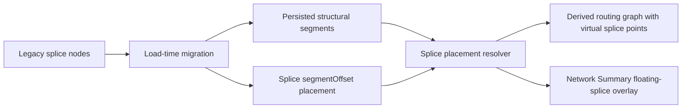

## adr_012_floating_splice_placement_architecture - Floating splice placement architecture
> Date: 2026-06-10
> Status: Proposed
> Drivers: physical harness fidelity, splice/topology decoupling, deterministic routing, load-time legacy migration, Network Summary continuity
> Related request: `logics/request/req_144_floating_splice_placements_decoupled_from_network_topology.md`
> Related backlog: (none yet)
> Related task: (none yet)
> Reminder: Update status, linked refs, decision rationale, consequences, and follow-up work when you edit this doc.

# Overview
Represent splices as placed electrical contact points instead of structural routing nodes.
The structural network remains connectors, structural nodes, and segments.
Every connectable splice is placed on a segment by a millimeter offset from one endpoint node, while routing and rendering derive virtual splice points from that placement.



# Context
- The current model stores `Splice` as an electrical entity, but wire endpoints and routing depend on a separate `NetworkNode.kind === "splice"` to map splice ports into the route graph.
- That coupling makes the splice shape the physical network topology even when the real harness topology is a continuous segment with an electrical contact point.
- Operators want the model to reflect physical reality: a splice is a point where several cables contact, not a required structural graph vertex.
- Canvas coordinates are a visual representation and are not proportional to real length, so placement must be edited through real segment length data rather than drag geometry.
- Existing local workspaces and exported network files may contain splice nodes. They must be converted automatically while preserving loadability and route meaning.

# Decision
Adopt segment-offset splice placement as the canonical architecture.

The canonical placement model is:

```ts
type SplicePlacement = {
  kind: "segmentOffset";
  segmentId: SegmentId;
  fromNodeId: NodeId;
  offsetMm: number;
};
```

Core data contract:
- A connectable splice must have a valid segment placement before wires can reference its ports.
- `offsetMm` is measured from `fromNodeId`, which must be one endpoint of `segmentId`.
- `offsetMm` may be `0` or exactly the segment length. The UI must display those cases explicitly instead of hiding them.
- `nodeAnchor` is not a canonical saved placement. If topology needs a branch point, the branch point is a structural intermediate node, and the splice is placed on an adjacent segment at `0 mm` from that node.
- Connected unplaced splices are invalid. A splice without placement may exist only as draft or migration recovery data; it is not visible in Network Summary and cannot be selected as a wire endpoint.
- Multiple splices may share the same segment offset. No explicit same-segment ordering is required.
- Segment placements cannot target `rearBackshellLink` segments.

Routing contract:
- Build a derived routing graph from persisted nodes, segments, and resolved splice placements.
- Insert virtual routing points at floating splice placements for route computation, without adding persisted splice nodes.
- Keep `Wire.routeSegmentIds` as the primary public route summary.
- Add route detail only where needed to represent partial first or last segment traversal when a wire endpoint is a floating splice.
- Connector-to-splice lengths use only the covered portion of the host segment.
- Connector-to-splice-to-connector displays may keep complete segment IDs, while length calculation uses endpoint portions.
- Preserve deterministic route tie-break behavior based on current segment ID ordering.
- Directional splice L/R inference adapts to the resolved floating placement and route direction while preserving manual side locking.

Rendering and interaction contract:
- Network Summary renders floating splices through a dedicated overlay model such as `renderedFloatingSplices`, not by forcing them into `renderedNodes`.
- Floating splice markers visually match current splice nodes.
- Floating splices remain selectable, focusable, and activatable.
- Splice callouts anchor to resolved splice positions and remain available for every placed splice.
- Canvas dragging does not edit splice placement in the first implementation because canvas distance is not physical distance.
- Form editing owns initial placement changes: host segment, reference node, and offset in millimeters.

Mutation and validation contract:
- Deleting a segment that hosts any splice is blocked with user-facing feedback telling the operator to move or delete the splice first.
- Segment length edits preserve absolute `offsetMm` when possible.
- When segment length changes alter the splice's relative position, show feedback that reports the old and new percentage.
- If a segment length edit makes `offsetMm` exceed the segment length, clamp and report the adjustment.
- Validation reports missing host segment, invalid `fromNodeId`, out-of-range offset, `rearBackshellLink` host segment, unresolved migration state, and any attempt to connect a wire to an unplaced splice.

Migration contract:
- Run migration at load time for both local persisted workspaces and network file imports.
- Degree-2 legacy splice node: merge the two adjacent segments into one host segment when safe, place the splice at the previous adjacent length, and preserve segment IDs where possible.
- Degree-greater-than-2 legacy splice node: replace the splice node with a structural intermediate node, preserve branch segments against that node, and place the splice on a deterministic adjacent segment at `0 mm` from the intermediate node.
- Locked routes are converted automatically to the new route representation when possible; otherwise they remain loadable with explicit route-lock diagnostics.
- Newly exported files should emit the new placement model only and should not emit legacy splice nodes.

# Consequences
- Splices no longer define structural topology, which aligns the model with physical harness intent.
- Route computation becomes more complex because it must handle virtual points and partial segment lengths.
- Some consumers of `routeSegmentIds` need access to richer route detail for exact length, while existing displays can keep complete segment IDs.
- Persistence and network file schemas will need versioned migration when the canonical payload changes.
- Network Summary must treat floating splices as first-class rendered electrical components even without node records.
- Segment deletion and segment length edits gain splice-placement dependency rules.
- The first implementation is larger than a narrow UI change because model, routing, rendering, validation, import/export, and migration all need to move together.

# Alternatives considered
- Keep splice nodes as the persisted topology and only change labels or rendering.
  Rejected because it preserves the false coupling where a splice conditions the network topology.
- Add `nodeAnchor` as a canonical placement.
  Rejected because the user clarified that a connectable splice must be on a segment; branch topology should use structural intermediate nodes with a segment-offset placement.
- Allow unplaced splices to be connectable and route later.
  Rejected because wire lengths and routing become ambiguous. A splice must be placed before it can be connected to a wire.
- Use canvas drag as the primary placement workflow.
  Rejected for the first implementation because the canvas is not proportional to physical length.
- Persist virtual splice nodes in the normal `nodes` collection.
  Rejected because that would recreate the topology coupling this ADR removes.

# Migration and rollout
- First delivery should be one coordinated task after this ADR because partial delivery would leave incompatible routing or rendering states.
- Add the placement field and resolver first, then migrate routing, validation, Network Summary rendering, persistence/import/export, and form editing in the same delivery.
- Add compatibility tests for both localStorage snapshots and network file imports because both are first-class compatibility targets.
- Keep migration deterministic and prefer preserving existing IDs where feasible to reduce history/export churn.
- Use diagnostics rather than silent data loss for ambiguous legacy cases.

# References
- Related request: `logics/request/req_144_floating_splice_placements_decoupled_from_network_topology.md`
- Related backlog: (none yet)
- Related task: (none yet)

# Follow-up work
- Promote the request to one backlog item and one implementation task after accepting this ADR.
- Revisit the ADR if future work requires canvas drag placement, ratio-based placement, route detail as the public primary contract, or backward compatibility for new exports in older app versions.
