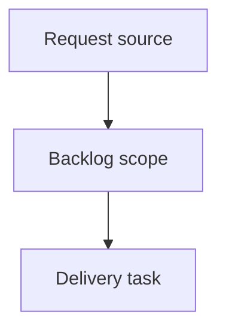

## item_398_persistence_load_guard_when_storage_read_throws_and_safe_fallback_continuity - Persistence load guard when storage read throws and safe fallback continuity
> From version: 0.9.16
> Status: Done
> Understanding: 95%
> Confidence: 91%
> Progress: 100%
> Complexity: Medium
> Theme: Persistence resilience against storage read exceptions
> Reminder: Update Understanding/Confidence/Progress and dependencies/references when you edit this doc. When you update backlog indicators, review and update any linked tasks as well.

> Maintenance edit: strict Logics corpus repair formalized gates, traceability, and workflow overview metadata.
# Problem
If storage read access throws during state load, the persistence path can break hard and compromise app bootstrap reliability.

# Scope
- In:
  - Ensure load path catches storage read exceptions and never throws to app shell.
  - Preserve current fallback behavior (backup-first when available, then safe bootstrap state).
  - Keep existing error signaling semantics clear and deterministic.
- Out:
  - Persistence schema redesign.
  - New backup formats.

# Acceptance criteria
- Storage read exceptions during load no longer crash bootstrap.
- Existing fallback behavior remains functional and deterministic.
- Regression coverage validates thrown-read behavior.

# Priority
- Impact: High.
- Urgency: High.

# Notes
- Dependencies: `req_077`.
- Blocks: `item_404`.
- Related AC: AC1.
- References:
  - `logics/request/req_077_review_followups_persistence_version_sync_import_normalization_and_export_hardening.md`
  - `src/adapters/persistence/localStorage.ts`
  - `src/tests/persistence.localStorage.spec.ts`

# AC Traceability
- request-AC1 -> This backlog slice. Evidence needed: persistence load path no longer throws when storage read access throws; safe fallback still applies.
- request-AC2 -> This backlog slice. Evidence needed: persisted/exported `appVersion` is synchronized with `package.json` version and no longer drifts.
- request-AC3 -> This backlog slice. Evidence needed: imported malformed network timestamps are normalized/fixed automatically; import succeeds with explicit warning(s).
- request-AC4 -> This backlog slice. Evidence needed: `saveState` preserves `createdAtIso` without requiring a full payload migration parse on each write.
- request-AC5 -> This backlog slice. Evidence needed: CSV export neutralizes formula-leading values to prevent spreadsheet formula execution.
- request-AC6 -> This backlog slice. Evidence needed: JSON export download remains reliable with safe URL revoke timing.
- request-AC7 -> This backlog slice. Evidence needed: all updated tests pass in CI-equivalent local validation.
- request-AC1 -> This backlog slice. Proof: Historical delivery is recorded in the linked backlog/task report and validation sections; this corpus repair formalizes strict audit traceability without changing shipped scope. Source: `logics corpus strict audit repair`
- request-AC2 -> This backlog slice. Proof: Historical delivery is recorded in the linked backlog/task report and validation sections; this corpus repair formalizes strict audit traceability without changing shipped scope. Source: `logics corpus strict audit repair`
- request-AC3 -> This backlog slice. Proof: Historical delivery is recorded in the linked backlog/task report and validation sections; this corpus repair formalizes strict audit traceability without changing shipped scope. Source: `logics corpus strict audit repair`
- request-AC4 -> This backlog slice. Proof: Historical delivery is recorded in the linked backlog/task report and validation sections; this corpus repair formalizes strict audit traceability without changing shipped scope. Source: `logics corpus strict audit repair`
- request-AC5 -> This backlog slice. Proof: Historical delivery is recorded in the linked backlog/task report and validation sections; this corpus repair formalizes strict audit traceability without changing shipped scope. Source: `logics corpus strict audit repair`
- request-AC6 -> This backlog slice. Proof: Historical delivery is recorded in the linked backlog/task report and validation sections; this corpus repair formalizes strict audit traceability without changing shipped scope. Source: `logics corpus strict audit repair`
- request-AC7 -> This backlog slice. Proof: Historical delivery is recorded in the linked backlog/task report and validation sections; this corpus repair formalizes strict audit traceability without changing shipped scope. Source: `logics corpus strict audit repair`
- request-AC3A -> This backlog slice. Proof: Historical delivery or planned chain is recorded in the linked Logics report and validation sections; this corpus repair formalizes strict audit traceability without changing shipped scope. Source: `logics corpus strict audit repair`
