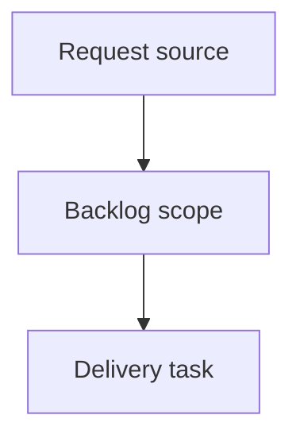

## item_405_update_app_button_breathing_glow_motion_policy_and_theme_safety - Update app button breathing glow motion policy and theme safety
> From version: 0.9.16
> Status: Done
> Understanding: 95%
> Confidence: 92%
> Progress: 100%
> Complexity: Medium
> Theme: Attention-state animation refinement for update-ready action
> Reminder: Update Understanding/Confidence/Progress and dependencies/references when you edit this doc. When you update backlog indicators, review and update any linked tasks as well.

> Maintenance edit: strict Logics corpus repair formalized gates, traceability, and workflow overview metadata.
# Problem
Current update-ready visual emphasis can feel blink-like and should be replaced by a smoother breathing glow without accessibility regressions.

# Scope
- In:
  - Replace blink/flicker behavior with continuous breathing glow.
  - Preserve current update-ready visibility/trigger behavior.
  - Enforce reduced-motion fallback with static highlighted state.
  - Validate theme legibility and focus-ring clarity.
- Out:
  - Header action system redesign.
  - PWA lifecycle logic changes.

# Acceptance criteria
- Update-ready action no longer blinks.
- Breathing glow is active only in update-ready state.
- Reduced-motion environments receive non-animated accessible highlight behavior.

# Priority
- Impact: Medium.
- Urgency: Medium.

# Notes
- Dependencies: `req_078`.
- Blocks: `item_408`.
- Related AC: AC1, AC2, AC3.
- References:
  - `logics/request/req_078_update_app_button_breathing_glow_and_timestamped_save_filename.md`
  - `src/app/components/workspace/AppHeaderAndStats.tsx`
  - `src/app/styles/base/base-foundation.css`
  - `src/tests/pwa.header-actions.spec.tsx`

# AC Traceability
- request-AC1 -> This backlog slice. Evidence needed: `Update app` action no longer blinks.
- request-AC2 -> This backlog slice. Evidence needed: `Update app` action displays a breathing glow when update is available.
- request-AC3 -> This backlog slice. Evidence needed: Reduced-motion environments do not receive forced breathing animation and keep an accessible highlighted state.
- request-AC4 -> This backlog slice. Evidence needed: Save/export filenames include a timestamp suffix.
- request-AC5 -> This backlog slice. Evidence needed: Filename timestamp format is filesystem-safe and deterministic.
- request-AC6 -> This backlog slice. Evidence needed: Export payload content/schema remains unchanged.
- request-AC7 -> This backlog slice. Evidence needed: Home changelog feed supports lazy loading on scroll (infinite-scroll style) while preserving entry order.
- request-AC1 -> This backlog slice. Proof: Historical delivery is recorded in the linked backlog/task report and validation sections; this corpus repair formalizes strict audit traceability without changing shipped scope. Source: `logics corpus strict audit repair`
- request-AC2 -> This backlog slice. Proof: Historical delivery is recorded in the linked backlog/task report and validation sections; this corpus repair formalizes strict audit traceability without changing shipped scope. Source: `logics corpus strict audit repair`
- request-AC3 -> This backlog slice. Proof: Historical delivery is recorded in the linked backlog/task report and validation sections; this corpus repair formalizes strict audit traceability without changing shipped scope. Source: `logics corpus strict audit repair`
- request-AC4 -> This backlog slice. Proof: Historical delivery is recorded in the linked backlog/task report and validation sections; this corpus repair formalizes strict audit traceability without changing shipped scope. Source: `logics corpus strict audit repair`
- request-AC5 -> This backlog slice. Proof: Historical delivery is recorded in the linked backlog/task report and validation sections; this corpus repair formalizes strict audit traceability without changing shipped scope. Source: `logics corpus strict audit repair`
- request-AC6 -> This backlog slice. Proof: Historical delivery is recorded in the linked backlog/task report and validation sections; this corpus repair formalizes strict audit traceability without changing shipped scope. Source: `logics corpus strict audit repair`
- request-AC7 -> This backlog slice. Proof: Historical delivery is recorded in the linked backlog/task report and validation sections; this corpus repair formalizes strict audit traceability without changing shipped scope. Source: `logics corpus strict audit repair`
- request-AC7A -> This backlog slice. Proof: Historical delivery or planned chain is recorded in the linked Logics report and validation sections; this corpus repair formalizes strict audit traceability without changing shipped scope. Source: `logics corpus strict audit repair`
