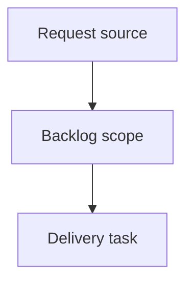

## item_519_bom_csv_utf8_compatibility_hardening_for_network_summary_export - BOM CSV UTF-8 compatibility hardening for Network summary export
> From version: 1.3.3
> Status: Done
> Understanding: 100%
> Confidence: 97%
> Progress: 100%
> Complexity: Medium
> Theme: Export / BOM / Compatibility
> Reminder: Update status/understanding/confidence/progress and linked task references when you edit this doc.

> Maintenance edit: strict Logics corpus repair formalized gates, traceability, and workflow overview metadata.
# Problem
`Network summary` BOM export does not explicitly use the UTF-8 BOM download contract already applied to wire CSV exports, which creates risk of accented/special-character corruption in spreadsheet consumers.

# Scope
- In:
  - harden `Network summary` BOM CSV download path with explicit UTF-8 BOM compatibility behavior;
  - preserve existing BOM CSV escaping and formula-neutralization behavior;
  - add focused coverage proving accented/special characters remain readable in the exported BOM flow.
- Out:
  - BOM schema redesign;
  - non-BOM CSV export changes beyond shared utility reuse already required by this item.

# Acceptance criteria
- AC1: `Network summary` BOM CSV export preserves accented/special characters without mojibake.
- AC2: BOM export uses an explicit UTF-8-compatible browser download payload.
- AC3: Existing CSV escaping/formula-neutralization behavior remains unchanged.
- AC4: Regression tests cover BOM export encoding behavior.

# AC Traceability
- AC1/AC2 -> `src/app/AppController.tsx` and `src/app/lib/csv.ts`.
- AC3/AC4 -> `src/tests/csv.export.spec.ts` and/or `src/tests/app.ui.network-summary-bom-export.spec.tsx`.
- request-AC1 -> This backlog slice. Evidence needed: `Network summary` BOM CSV export uses a UTF-8-compatible download payload and preserves accented/special characters in common spreadsheet clients.
- request-AC2 -> This backlog slice. Evidence needed: Existing catalog-backed BOM rows remain exported in the same CSV without regression to current grouping/pricing behavior.
- request-AC3 -> This backlog slice. Evidence needed: The same BOM CSV export includes a second `Wire terminations` section after the existing BOM content.
- request-AC4 -> This backlog slice. Evidence needed: The `Wire terminations` section exports aggregated rows with headers `Type`, `Reference`, `Quantity`.
- request-AC5 -> This backlog slice. Evidence needed: `Connection` and `Seal` references are counted separately and aggregated by `type + reference`.
- request-AC6 -> This backlog slice. Evidence needed: Empty/whitespace-only wire-side termination references are ignored and do not create rows.
- request-AC7 -> This backlog slice. Evidence needed: Modeling wire CSV export includes `Begin connection ref`, `Begin seal ref`, `End connection ref`, `End seal ref`.
- request-AC8 -> This backlog slice. Evidence needed: Analysis wire CSV export includes the same four columns in the same schema order.
- request-AC9 -> This backlog slice. Evidence needed: Current wire CSV UTF-8 and CSV-safety behavior remains non-regressed.
- request-AC10 -> This backlog slice. Evidence needed: `Node analysis` associated-segment rows expose a `Go to` action for each segment.
- request-AC11 -> This backlog slice. Evidence needed: Activating `Go to` from an associated-segment row opens the `Segment` analysis sub-screen and selects the targeted segment.
- request-AC12 -> This backlog slice. Evidence needed: Missing-segment edge cases disable the `Go to` action safely instead of failing at runtime.
- request-AC13 -> This backlog slice. Evidence needed: `Segment analysis` traversing-wire rows expose a `Go to` action for each wire.
- request-AC14 -> This backlog slice. Evidence needed: Activating `Go to` from a traversing-wire row opens the `Wire` analysis sub-screen and selects the targeted wire.
- request-AC15 -> This backlog slice. Evidence needed: Missing-wire edge cases disable the `Go to` action safely instead of failing at runtime.
- request-AC16 -> This backlog slice. Evidence needed: Export cartouche identity metadata is no longer unnecessarily truncated for ordinary-length values such as medium-length author names when export size allows readable layout.
- request-AC17 -> This backlog slice. Evidence needed: SVG and PNG exports follow the same cartouche metadata readability behavior.
- request-AC18 -> This backlog slice. Evidence needed: Both new navigation tables use the existing `Actions` column + iconized `Go to` button pattern already used in `Catalog analysis`.
- request-AC19 -> This backlog slice. Evidence needed: On-screen plan rendering increases label distance from the stroke for horizontal and near-horizontal segments.
- request-AC20 -> This backlog slice. Evidence needed: Exported SVG follows the same horizontal/near-horizontal label-offset behavior as the on-screen plan.
- request-AC21 -> This backlog slice. Evidence needed: `logics_lint`, `lint`, `typecheck`, and relevant export/UI tests pass after implementation.
- request-AC1 -> This backlog slice. Proof: Historical delivery is recorded in the linked backlog/task report and validation sections; this corpus repair formalizes strict audit traceability without changing shipped scope. Source: `logics corpus strict audit repair`
- request-AC2 -> This backlog slice. Proof: Historical delivery is recorded in the linked backlog/task report and validation sections; this corpus repair formalizes strict audit traceability without changing shipped scope. Source: `logics corpus strict audit repair`
- request-AC3 -> This backlog slice. Proof: Historical delivery is recorded in the linked backlog/task report and validation sections; this corpus repair formalizes strict audit traceability without changing shipped scope. Source: `logics corpus strict audit repair`
- request-AC4 -> This backlog slice. Proof: Historical delivery is recorded in the linked backlog/task report and validation sections; this corpus repair formalizes strict audit traceability without changing shipped scope. Source: `logics corpus strict audit repair`
- request-AC5 -> This backlog slice. Proof: Historical delivery is recorded in the linked backlog/task report and validation sections; this corpus repair formalizes strict audit traceability without changing shipped scope. Source: `logics corpus strict audit repair`
- request-AC6 -> This backlog slice. Proof: Historical delivery is recorded in the linked backlog/task report and validation sections; this corpus repair formalizes strict audit traceability without changing shipped scope. Source: `logics corpus strict audit repair`
- request-AC7 -> This backlog slice. Proof: Historical delivery is recorded in the linked backlog/task report and validation sections; this corpus repair formalizes strict audit traceability without changing shipped scope. Source: `logics corpus strict audit repair`
- request-AC8 -> This backlog slice. Proof: Historical delivery is recorded in the linked backlog/task report and validation sections; this corpus repair formalizes strict audit traceability without changing shipped scope. Source: `logics corpus strict audit repair`
- request-AC9 -> This backlog slice. Proof: Historical delivery is recorded in the linked backlog/task report and validation sections; this corpus repair formalizes strict audit traceability without changing shipped scope. Source: `logics corpus strict audit repair`
- request-AC10 -> This backlog slice. Proof: Historical delivery is recorded in the linked backlog/task report and validation sections; this corpus repair formalizes strict audit traceability without changing shipped scope. Source: `logics corpus strict audit repair`
- request-AC11 -> This backlog slice. Proof: Historical delivery is recorded in the linked backlog/task report and validation sections; this corpus repair formalizes strict audit traceability without changing shipped scope. Source: `logics corpus strict audit repair`
- request-AC12 -> This backlog slice. Proof: Historical delivery is recorded in the linked backlog/task report and validation sections; this corpus repair formalizes strict audit traceability without changing shipped scope. Source: `logics corpus strict audit repair`
- request-AC13 -> This backlog slice. Proof: Historical delivery is recorded in the linked backlog/task report and validation sections; this corpus repair formalizes strict audit traceability without changing shipped scope. Source: `logics corpus strict audit repair`
- request-AC14 -> This backlog slice. Proof: Historical delivery is recorded in the linked backlog/task report and validation sections; this corpus repair formalizes strict audit traceability without changing shipped scope. Source: `logics corpus strict audit repair`
- request-AC15 -> This backlog slice. Proof: Historical delivery is recorded in the linked backlog/task report and validation sections; this corpus repair formalizes strict audit traceability without changing shipped scope. Source: `logics corpus strict audit repair`
- request-AC16 -> This backlog slice. Proof: Historical delivery is recorded in the linked backlog/task report and validation sections; this corpus repair formalizes strict audit traceability without changing shipped scope. Source: `logics corpus strict audit repair`
- request-AC17 -> This backlog slice. Proof: Historical delivery is recorded in the linked backlog/task report and validation sections; this corpus repair formalizes strict audit traceability without changing shipped scope. Source: `logics corpus strict audit repair`
- request-AC18 -> This backlog slice. Proof: Historical delivery is recorded in the linked backlog/task report and validation sections; this corpus repair formalizes strict audit traceability without changing shipped scope. Source: `logics corpus strict audit repair`
- request-AC19 -> This backlog slice. Proof: Historical delivery is recorded in the linked backlog/task report and validation sections; this corpus repair formalizes strict audit traceability without changing shipped scope. Source: `logics corpus strict audit repair`
- request-AC20 -> This backlog slice. Proof: Historical delivery is recorded in the linked backlog/task report and validation sections; this corpus repair formalizes strict audit traceability without changing shipped scope. Source: `logics corpus strict audit repair`
- request-AC21 -> This backlog slice. Proof: Historical delivery is recorded in the linked backlog/task report and validation sections; this corpus repair formalizes strict audit traceability without changing shipped scope. Source: `logics corpus strict audit repair`

# Priority
- Impact: High (data readability and trust).
- Urgency: High.

# Notes
- Derived from `logics/request/req_106_bom_export_wire_termination_coverage_wire_csv_termination_columns_and_horizontal_label_offset_harmonization.md`.
- Orchestrated by `logics/tasks/task_085_req_106_export_analysis_navigation_and_render_readability_orchestration_and_delivery_control.md`.
- Risks:
  - spreadsheet-client behavior may still differ if users bypass UTF-8-aware import paths;
  - touching shared CSV download behavior requires non-regression validation for existing exports.
- References:
  - `src/app/AppController.tsx`
  - `src/app/lib/csv.ts`
  - `src/tests/csv.export.spec.ts`
  - `src/tests/app.ui.network-summary-bom-export.spec.tsx`

# Delivery
- `Network summary` BOM export now downloads through an explicit UTF-8 BOM-compatible CSV path.
- Accented/special-character compatibility is covered by export regression tests.

# Validation
- `npm test -- --run src/tests/app.ui.network-summary-bom-export.spec.tsx`
- `npm run lint`
- `npm run typecheck`
- request-AC17B -> This backlog slice. Proof: Historical delivery or planned chain is recorded in the linked Logics report and validation sections; this corpus repair formalizes strict audit traceability without changing shipped scope. Source: `logics corpus strict audit repair`
