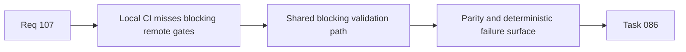

## item_525_local_and_github_blocking_ci_command_parity_and_shared_orchestration - Local and GitHub blocking CI command parity and shared orchestration
> From version: 1.4.0
> Status: Done
> Understanding: 100%
> Confidence: 98%
> Progress: 100%
> Complexity: High
> Theme: Reliability
> Reminder: Update status/understanding/confidence/progress and linked task references when you edit this doc.

# Problem
The canonical local validation path is not aligned with the blocking GitHub CI workflow. This lets a change pass `ci:local` while still failing remote CI on missing `logics` guards or Python workflow checks, which weakens release confidence and wastes review time.

# Scope
- In:
  - define a canonical local blocking CI command aligned with GitHub blocking CI gates;
  - remove silent drift between local and remote validation orchestration for blocking steps;
  - include Logics sync/audit and Logics kit Python tests in the blocking local path;
  - keep informational/non-blocking reporting steps separable from the canonical blocking flow.
- Out:
  - full redesign of the GitHub Actions job structure;
  - optimization of total CI runtime beyond what is required for parity.

# Acceptance criteria
- AC1: The canonical local blocking CI command includes the same blocking validation gates as GitHub CI.
- AC2: Blocking `logics` flow checks are executed locally before release/push validation is considered complete.
- AC3: Logics kit Python tests are part of the canonical local blocking path.
- AC4: Documentation and scripts make the canonical blocking path explicit and unambiguous.

# AC Traceability
- AC1/AC2/AC3/AC4 -> `package.json` and `.github/workflows/ci.yml`.
- request-AC1 -> This backlog slice. Evidence needed: The canonical local CI command includes the same blocking `logics` gates as GitHub CI.
- request-AC2 -> This backlog slice. Evidence needed: GitHub CI and local CI orchestration no longer drift silently on blocking validation steps.
- request-AC3 -> This backlog slice. Evidence needed: CSV export neutralizes formula-like strings when dangerous characters are preceded by whitespace/control characters.
- request-AC4 -> This backlog slice. Evidence needed: Numeric values and normal text values remain non-regressed in CSV export output.
- request-AC5 -> This backlog slice. Evidence needed: Regression tests cover whitespace/control-prefixed dangerous CSV inputs.
- request-AC6 -> This backlog slice. Evidence needed: Persistence write failures surface a visible runtime error/warning without crashing the app.
- request-AC7 -> This backlog slice. Evidence needed: Persistence failure reporting is covered by tests and does not break reducer/store determinism.
- request-AC8 -> This backlog slice. Evidence needed: Export/cartouche and callout measurement paths no longer emit repeated jsdom canvas not-implemented noise during normal successful tests.
- request-AC9 -> This backlog slice. Evidence needed: Export/callout fallback behavior remains deterministic and covered by targeted tests.
- request-AC10 -> This backlog slice. Evidence needed: `logics_lint`, blocking `workflow_audit`, and the canonical local CI command pass after implementation.
- request-AC1 -> This backlog slice. Proof: Historical delivery is recorded in the linked backlog/task report and validation sections; this corpus repair formalizes strict audit traceability without changing shipped scope. Source: `logics corpus strict audit repair`
- request-AC2 -> This backlog slice. Proof: Historical delivery is recorded in the linked backlog/task report and validation sections; this corpus repair formalizes strict audit traceability without changing shipped scope. Source: `logics corpus strict audit repair`
- request-AC3 -> This backlog slice. Proof: Historical delivery is recorded in the linked backlog/task report and validation sections; this corpus repair formalizes strict audit traceability without changing shipped scope. Source: `logics corpus strict audit repair`
- request-AC4 -> This backlog slice. Proof: Historical delivery is recorded in the linked backlog/task report and validation sections; this corpus repair formalizes strict audit traceability without changing shipped scope. Source: `logics corpus strict audit repair`
- request-AC5 -> This backlog slice. Proof: Historical delivery is recorded in the linked backlog/task report and validation sections; this corpus repair formalizes strict audit traceability without changing shipped scope. Source: `logics corpus strict audit repair`
- request-AC6 -> This backlog slice. Proof: Historical delivery is recorded in the linked backlog/task report and validation sections; this corpus repair formalizes strict audit traceability without changing shipped scope. Source: `logics corpus strict audit repair`
- request-AC7 -> This backlog slice. Proof: Historical delivery is recorded in the linked backlog/task report and validation sections; this corpus repair formalizes strict audit traceability without changing shipped scope. Source: `logics corpus strict audit repair`
- request-AC8 -> This backlog slice. Proof: Historical delivery is recorded in the linked backlog/task report and validation sections; this corpus repair formalizes strict audit traceability without changing shipped scope. Source: `logics corpus strict audit repair`
- request-AC9 -> This backlog slice. Proof: Historical delivery is recorded in the linked backlog/task report and validation sections; this corpus repair formalizes strict audit traceability without changing shipped scope. Source: `logics corpus strict audit repair`
- request-AC10 -> This backlog slice. Proof: Historical delivery is recorded in the linked backlog/task report and validation sections; this corpus repair formalizes strict audit traceability without changing shipped scope. Source: `logics corpus strict audit repair`

# Links
- Request: `req_107_post_release_ci_csv_persistence_and_export_test_signal_hardening`
- Primary task(s): `task_086_req_107_post_release_ci_csv_persistence_and_export_test_signal_hardening_orchestration_and_delivery_control`

# Priority
- Impact: High.
- Urgency: High.

# Notes
- Derived from request `req_107_post_release_ci_csv_persistence_and_export_test_signal_hardening`.
- Orchestrated by `logics/tasks/task_086_req_107_post_release_ci_csv_persistence_and_export_test_signal_hardening_orchestration_and_delivery_control.md`.
- Delivered via shared `ci:blocking` orchestration in `package.json` and `.github/workflows/ci.yml`, with `ci:local` rebased onto the same blocking path.
- References:
  - `package.json`
  - `.github/workflows/ci.yml`
