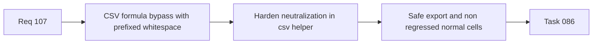

## item_526_csv_formula_neutralization_hardening_for_whitespace_and_control_prefixed_inputs - CSV formula neutralization hardening for whitespace and control prefixed inputs
> From version: 1.4.0
> Status: Done
> Understanding: 100%
> Confidence: 98%
> Progress: 100%
> Complexity: Medium
> Theme: Security
> Reminder: Update status/understanding/confidence/progress and linked task references when you edit this doc.

# Problem
CSV export neutralization currently protects formula-like cells only when the dangerous character is the first visible character. Spreadsheet-dangerous payloads prefixed by spaces, tabs, or control characters can still slip through and be interpreted by downstream spreadsheet software.

# Scope
- In:
  - harden CSV cell neutralization for whitespace/control-prefixed dangerous formula inputs;
  - preserve numeric cell behavior and current CSV quoting/escaping semantics;
  - add regression coverage for representative bypass cases.
- Out:
  - redesign of the full CSV export format;
  - unrelated export schema changes.

# Acceptance criteria
- AC1: Strings with leading whitespace or control characters before `=`, `+`, `-`, or `@` are neutralized in CSV export.
- AC2: Plain numeric values remain non-regressed in exported CSV content.
- AC3: Ordinary text values remain non-regressed.
- AC4: Regression tests cover representative dangerous inputs such as leading space and tab cases.

# AC Traceability
- AC1/AC2/AC3 -> `src/app/lib/csv.ts`.
- AC4 -> `src/tests/csv.export.spec.ts`.

# Links
- Request: `req_107_post_release_ci_csv_persistence_and_export_test_signal_hardening`
- Primary task(s): `task_086_req_107_post_release_ci_csv_persistence_and_export_test_signal_hardening_orchestration_and_delivery_control`

# Priority
- Impact: High.
- Urgency: High.

# Notes
- Derived from request `req_107_post_release_ci_csv_persistence_and_export_test_signal_hardening`.
- Orchestrated by `logics/tasks/task_086_req_107_post_release_ci_csv_persistence_and_export_test_signal_hardening_orchestration_and_delivery_control.md`.
- Delivered in `src/app/lib/csv.ts` with regression coverage for leading-space, tab-prefixed, and control-prefixed dangerous spreadsheet inputs.
- References:
  - `src/app/lib/csv.ts`
  - `src/tests/csv.export.spec.ts`
