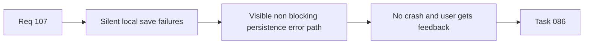

## item_527_persistence_write_failure_runtime_feedback_without_reducer_instability - Persistence write failure runtime feedback without reducer instability
> From version: 1.4.0
> Status: Done
> Understanding: 100%
> Confidence: 98%
> Progress: 100%
> Complexity: Medium
> Theme: Reliability
> Reminder: Update status/understanding/confidence/progress and linked task references when you edit this doc.

# Problem
The app currently swallows storage write failures silently. Users can continue editing while persistence is broken, which creates hidden data-loss risk because nothing in the runtime communicates that saves are no longer succeeding.

# Scope
- In:
  - surface a visible runtime warning/error when persistence writes fail;
  - keep app behavior in-memory and non-crashing when storage is unavailable;
  - avoid reducer/store instability while reporting the failure;
  - add regression coverage for storage write failure handling.
- Out:
  - server-side backup or cloud sync;
  - broad redesign of the error-notification system.

# Acceptance criteria
- AC1: Storage write failures surface a visible runtime warning or error.
- AC2: The app does not throw or crash when persistence writes fail.
- AC3: The session remains usable in memory after a write failure.
- AC4: Tests cover storage write failure reporting and non-crashing behavior.

# AC Traceability
- AC1/AC2/AC3 -> `src/app/store.ts` and `src/adapters/persistence/localStorage.ts`.
- AC4 -> `src/tests/persistence.localStorage.spec.ts`.
- request-AC1 -> This backlog slice. Evidence needed: The canonical local CI command includes the same blocking `logics` gates as GitHub CI.
- request-AC2 -> This backlog slice. Evidence needed: GitHub CI and local CI orchestration no longer drift silently on blocking validation steps.
- request-AC3 -> This backlog slice. Evidence needed: CSV export neutralizes formula-like strings when dangerous characters are preceded by whitespace/control characters.
- request-AC4 -> This backlog slice. Evidence needed: Numeric values and normal text values remain non-regressed in CSV export output.
- request-AC5 -> This backlog slice. Evidence needed: Regression tests cover whitespace/control-prefixed dangerous CSV inputs.
- request-AC6 -> This backlog slice. Evidence needed: Persistence write failures surface a visible runtime error/warning without crashing the app.
- request-AC7 -> This backlog slice. Evidence needed: Persistence failure reporting is covered by tests and does not break reducer/store determinism.
- request-AC8 -> This backlog slice. Evidence needed: Export/cartouche and callout measurement paths no longer emit repeated jsdom canvas not-implemented noise during normal successful tests.
- request-AC9 -> This backlog slice. Evidence needed: Export/callout fallback behavior remains deterministic and covered by targeted tests.
- request-AC10 -> This backlog slice. Evidence needed: `logics_lint`, blocking `workflow_audit`, and the canonical local CI command pass after implementation.
- request-AC1 -> This backlog slice. Proof: Historical delivery is recorded in the linked backlog/task report and validation sections; this corpus repair formalizes strict audit traceability without changing shipped scope. Source: `logics corpus strict audit repair`
- request-AC2 -> This backlog slice. Proof: Historical delivery is recorded in the linked backlog/task report and validation sections; this corpus repair formalizes strict audit traceability without changing shipped scope. Source: `logics corpus strict audit repair`
- request-AC3 -> This backlog slice. Proof: Historical delivery is recorded in the linked backlog/task report and validation sections; this corpus repair formalizes strict audit traceability without changing shipped scope. Source: `logics corpus strict audit repair`
- request-AC4 -> This backlog slice. Proof: Historical delivery is recorded in the linked backlog/task report and validation sections; this corpus repair formalizes strict audit traceability without changing shipped scope. Source: `logics corpus strict audit repair`
- request-AC5 -> This backlog slice. Proof: Historical delivery is recorded in the linked backlog/task report and validation sections; this corpus repair formalizes strict audit traceability without changing shipped scope. Source: `logics corpus strict audit repair`
- request-AC6 -> This backlog slice. Proof: Historical delivery is recorded in the linked backlog/task report and validation sections; this corpus repair formalizes strict audit traceability without changing shipped scope. Source: `logics corpus strict audit repair`
- request-AC7 -> This backlog slice. Proof: Historical delivery is recorded in the linked backlog/task report and validation sections; this corpus repair formalizes strict audit traceability without changing shipped scope. Source: `logics corpus strict audit repair`
- request-AC8 -> This backlog slice. Proof: Historical delivery is recorded in the linked backlog/task report and validation sections; this corpus repair formalizes strict audit traceability without changing shipped scope. Source: `logics corpus strict audit repair`
- request-AC9 -> This backlog slice. Proof: Historical delivery is recorded in the linked backlog/task report and validation sections; this corpus repair formalizes strict audit traceability without changing shipped scope. Source: `logics corpus strict audit repair`
- request-AC10 -> This backlog slice. Proof: Historical delivery is recorded in the linked backlog/task report and validation sections; this corpus repair formalizes strict audit traceability without changing shipped scope. Source: `logics corpus strict audit repair`

# Links
- Request: `req_107_post_release_ci_csv_persistence_and_export_test_signal_hardening`
- Primary task(s): `task_086_req_107_post_release_ci_csv_persistence_and_export_test_signal_hardening_orchestration_and_delivery_control`

# Priority
- Impact: High.
- Urgency: Medium-High.

# Notes
- Derived from request `req_107_post_release_ci_csv_persistence_and_export_test_signal_hardening`.
- Orchestrated by `logics/tasks/task_086_req_107_post_release_ci_csv_persistence_and_export_test_signal_hardening_orchestration_and_delivery_control.md`.
- Delivered through explicit `SaveStateResult` feedback, `attachPersistenceSync`, runtime warning reuse via `ui.lastError`, and dedicated store/UI regression coverage.
- References:
  - `src/app/store.ts`
  - `src/adapters/persistence/localStorage.ts`
  - `src/tests/persistence.localStorage.spec.ts`
