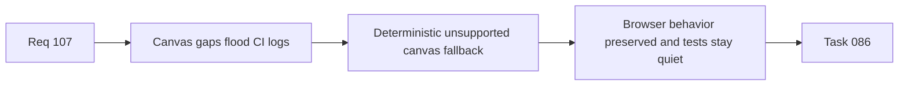

## item_528_export_and_callout_measurement_fallback_signal_hardening_for_jsdom_canvas_gaps - Export and callout measurement fallback signal hardening for jsdom canvas gaps
> From version: 1.4.0
> Status: Done
> Understanding: 100%
> Confidence: 98%
> Progress: 100%
> Complexity: Medium
> Theme: Testing
> Reminder: Update status/understanding/confidence/progress and linked task references when you edit this doc.

# Problem
Export cartouche and callout measurement paths rely on canvas text measurement in environments where jsdom does not fully implement canvas APIs. The current fallback behavior still produces heavy not-implemented warning noise during successful tests, which weakens CI log signal.

# Scope
- In:
  - harden unsupported-canvas detection for export/cartouche and callout measurement helpers;
  - avoid repeated noisy jsdom warnings during successful test runs;
  - preserve deterministic browser behavior and meaningful export assertions;
  - add targeted tests around unsupported-canvas fallback behavior.
- Out:
  - redesign of cartouche or callout visual layout;
  - weakening export tests just to silence logs.

# Acceptance criteria
- AC1: Unsupported-canvas environments fall back deterministically without repeated noisy warnings.
- AC2: Browser/runtime measurement behavior remains non-regressed when canvas measurement is available.
- AC3: Export/cartouche and callout tests keep meaningful assertions after fallback hardening.
- AC4: Targeted tests cover unsupported-canvas fallback behavior.

# AC Traceability
- AC1/AC2/AC3 -> `src/app/components/network-summary/export/networkSummaryExport.ts` and `src/app/components/network-summary/callouts/calloutLayout.ts`.
- AC4 -> `src/tests/app.ui.network-summary-bom-export.spec.tsx` and related export/callout tests.
- request-AC1 -> This backlog slice. Evidence needed: The canonical local CI command includes the same blocking `logics` gates as GitHub CI.
- request-AC2 -> This backlog slice. Evidence needed: GitHub CI and local CI orchestration no longer drift silently on blocking validation steps.
- request-AC3 -> This backlog slice. Evidence needed: CSV export neutralizes formula-like strings when dangerous characters are preceded by whitespace/control characters.
- request-AC4 -> This backlog slice. Evidence needed: Numeric values and normal text values remain non-regressed in CSV export output.
- request-AC5 -> This backlog slice. Evidence needed: Regression tests cover whitespace/control-prefixed dangerous CSV inputs.
- request-AC6 -> This backlog slice. Evidence needed: Persistence write failures surface a visible runtime error/warning without crashing the app.
- request-AC7 -> This backlog slice. Evidence needed: Persistence failure reporting is covered by tests and does not break reducer/store determinism.
- request-AC8 -> This backlog slice. Evidence needed: Export/cartouche and callout measurement paths no longer emit repeated jsdom canvas not-implemented noise during normal successful tests.
- request-AC9 -> This backlog slice. Evidence needed: Export/callout fallback behavior remains deterministic and covered by targeted tests.
- request-AC10 -> This backlog slice. Evidence needed: `logics_lint`, blocking `workflow_audit`, and the canonical local CI command pass after implementation.
- request-AC1 -> This backlog slice. Proof: Historical delivery is recorded in the linked backlog/task report and validation sections; this corpus repair formalizes strict audit traceability without changing shipped scope. Source: `logics corpus strict audit repair`
- request-AC2 -> This backlog slice. Proof: Historical delivery is recorded in the linked backlog/task report and validation sections; this corpus repair formalizes strict audit traceability without changing shipped scope. Source: `logics corpus strict audit repair`
- request-AC3 -> This backlog slice. Proof: Historical delivery is recorded in the linked backlog/task report and validation sections; this corpus repair formalizes strict audit traceability without changing shipped scope. Source: `logics corpus strict audit repair`
- request-AC4 -> This backlog slice. Proof: Historical delivery is recorded in the linked backlog/task report and validation sections; this corpus repair formalizes strict audit traceability without changing shipped scope. Source: `logics corpus strict audit repair`
- request-AC5 -> This backlog slice. Proof: Historical delivery is recorded in the linked backlog/task report and validation sections; this corpus repair formalizes strict audit traceability without changing shipped scope. Source: `logics corpus strict audit repair`
- request-AC6 -> This backlog slice. Proof: Historical delivery is recorded in the linked backlog/task report and validation sections; this corpus repair formalizes strict audit traceability without changing shipped scope. Source: `logics corpus strict audit repair`
- request-AC7 -> This backlog slice. Proof: Historical delivery is recorded in the linked backlog/task report and validation sections; this corpus repair formalizes strict audit traceability without changing shipped scope. Source: `logics corpus strict audit repair`
- request-AC8 -> This backlog slice. Proof: Historical delivery is recorded in the linked backlog/task report and validation sections; this corpus repair formalizes strict audit traceability without changing shipped scope. Source: `logics corpus strict audit repair`
- request-AC9 -> This backlog slice. Proof: Historical delivery is recorded in the linked backlog/task report and validation sections; this corpus repair formalizes strict audit traceability without changing shipped scope. Source: `logics corpus strict audit repair`
- request-AC10 -> This backlog slice. Proof: Historical delivery is recorded in the linked backlog/task report and validation sections; this corpus repair formalizes strict audit traceability without changing shipped scope. Source: `logics corpus strict audit repair`

# Links
- Request: `req_107_post_release_ci_csv_persistence_and_export_test_signal_hardening`
- Primary task(s): `task_086_req_107_post_release_ci_csv_persistence_and_export_test_signal_hardening_orchestration_and_delivery_control`

# Priority
- Impact: Medium.
- Urgency: Medium-High.

# Notes
- Derived from request `req_107_post_release_ci_csv_persistence_and_export_test_signal_hardening`.
- Orchestrated by `logics/tasks/task_086_req_107_post_release_ci_csv_persistence_and_export_test_signal_hardening_orchestration_and_delivery_control.md`.
- Delivered through shared unsupported-canvas measurement helpers and targeted regression tests proving export/cartouche and callout flows avoid jsdom `getContext` noise.
- References:
  - `src/app/components/network-summary/export/networkSummaryExport.ts`
  - `src/app/components/network-summary/callouts/calloutLayout.ts`
  - `src/tests/app.ui.network-summary-bom-export.spec.tsx`
