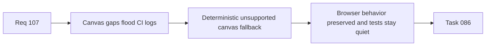

## item_528_export_and_callout_measurement_fallback_signal_hardening_for_jsdom_canvas_gaps - Export and callout measurement fallback signal hardening for jsdom canvas gaps
> From version: 1.4.0
> Status: Ready
> Understanding: 98%
> Confidence: 96%
> Progress: 0%
> Complexity: Medium
> Theme: Testing
> Reminder: Update status/understanding/confidence/progress and linked task references when you edit this doc.

# Problem
Export cartouche and callout measurement paths rely on canvas text measurement in environments where jsdom does not fully implement canvas APIs. The current fallback behavior still produces heavy not-implemented warning noise during successful tests, which weakens CI log signal.

# Scope
- In:
  - harden unsupported-canvas detection for export/cartouche and callout measurement helpers;
  - avoid repeated noisy jsdom warnings during successful test runs;
  - preserve deterministic browser behavior and meaningful export assertions;
  - add targeted tests around unsupported-canvas fallback behavior.
- Out:
  - redesign of cartouche or callout visual layout;
  - weakening export tests just to silence logs.

# Acceptance criteria
- AC1: Unsupported-canvas environments fall back deterministically without repeated noisy warnings.
- AC2: Browser/runtime measurement behavior remains non-regressed when canvas measurement is available.
- AC3: Export/cartouche and callout tests keep meaningful assertions after fallback hardening.
- AC4: Targeted tests cover unsupported-canvas fallback behavior.

# AC Traceability
- AC1/AC2/AC3 -> `src/app/components/network-summary/export/networkSummaryExport.ts` and `src/app/components/network-summary/callouts/calloutLayout.ts`.
- AC4 -> `src/tests/app.ui.network-summary-bom-export.spec.tsx` and related export/callout tests.

# Links
- Request: `req_107_post_release_ci_csv_persistence_and_export_test_signal_hardening`
- Primary task(s): `task_086_req_107_post_release_ci_csv_persistence_and_export_test_signal_hardening_orchestration_and_delivery_control`

# Priority
- Impact: Medium.
- Urgency: Medium-High.

# Notes
- Derived from request `req_107_post_release_ci_csv_persistence_and_export_test_signal_hardening`.
- Orchestrated by `logics/tasks/task_086_req_107_post_release_ci_csv_persistence_and_export_test_signal_hardening_orchestration_and_delivery_control.md`.
- References:
  - `src/app/components/network-summary/export/networkSummaryExport.ts`
  - `src/app/components/network-summary/callouts/calloutLayout.ts`
  - `src/tests/app.ui.network-summary-bom-export.spec.tsx`

