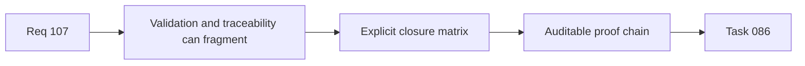

## item_529_req_107_validation_matrix_and_traceability_closure - Req 107 validation matrix and traceability closure
> From version: 1.4.0
> Status: Done
> Understanding: 100%
> Confidence: 98%
> Progress: 100%
> Complexity: Medium
> Theme: Quality
> Reminder: Update status/understanding/confidence/progress and linked task references when you edit this doc.

# Problem
Req_107 spans CI orchestration, CSV safety, persistence runtime behavior, and export-test signal quality. Without an explicit closure slice, validation evidence and traceability across these concerns will become fragmented and error-prone.

# Scope
- In:
  - define the req_107 validation matrix across items `525` to `528`;
  - capture deterministic proof for CI parity, CSV hardening, persistence feedback, and measurement fallback behavior;
  - synchronize request/backlog/task state at closure;
  - summarize delivered safeguards and residual assumptions.
- Out:
  - new feature work beyond req_107 closure.

# Acceptance criteria
- AC1: Validation matrix covers req_107 acceptance criteria with explicit evidence.
- AC2: Traceability links between request, backlog items, and task are complete and coherent.
- AC3: Required validation commands are executed and outcomes recorded.
- AC4: Closure notes summarize delivered safeguards and residual assumptions.

# AC Traceability
- AC1 -> Functional guarantees are validated.
- AC2 -> Documentation chain is auditable.
- AC3 -> Technical confidence is reproducible.
- AC4 -> Closure context is explicit.

# Links
- Request: `req_107_post_release_ci_csv_persistence_and_export_test_signal_hardening`
- Primary task(s): `task_086_req_107_post_release_ci_csv_persistence_and_export_test_signal_hardening_orchestration_and_delivery_control`

# Priority
- Impact: High.
- Urgency: High.

# Notes
- Derived from request `req_107_post_release_ci_csv_persistence_and_export_test_signal_hardening`.
- Orchestrated by `logics/tasks/task_086_req_107_post_release_ci_csv_persistence_and_export_test_signal_hardening_orchestration_and_delivery_control.md`.
- Closure evidence recorded across `logics_lint`, blocking `workflow_audit`, targeted req_107 regressions, segmented quality guards, and full `ci:blocking`.
- References:
  - `logics/backlog/item_525_local_and_github_blocking_ci_command_parity_and_shared_orchestration.md`
  - `logics/backlog/item_526_csv_formula_neutralization_hardening_for_whitespace_and_control_prefixed_inputs.md`
  - `logics/backlog/item_527_persistence_write_failure_runtime_feedback_without_reducer_instability.md`
  - `logics/backlog/item_528_export_and_callout_measurement_fallback_signal_hardening_for_jsdom_canvas_gaps.md`
