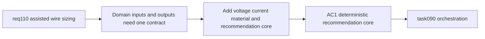

## item_542_wire_sizing_metadata_and_recommendation_core_contract - Wire sizing metadata and recommendation core contract
> From version: 1.4.3
> Schema version: 1.0
> Status: Done
> Understanding: 98%
> Confidence: 95%
> Progress: 100%
> Complexity: Medium-High
> Theme: Wire sizing domain model / recommendation core / deterministic contracts
> Reminder: Update status/understanding/confidence/progress and linked task references when you edit this doc.

# Problem
`req_110` requires assisted wire sizing, but the current model only stores manual `sectionMm2` and computed `lengthMm`. Without a clear domain contract for sizing inputs and recommendation output, later UI and persistence work would duplicate logic and drift.

# Scope
- In:
  - extend the domain contract with `Network.voltageV` and wire sizing inputs (`currentA`, `material`);
  - define the V1 default material behavior (`copper`);
  - add a centralized recommendation core that consumes `currentA`, `material`, `voltageV`, and `lengthMm`;
  - lock the supported standard section list used for normalization;
  - define deterministic null-result behavior when required inputs are missing or invalid.
- Out:
  - form field wiring and `Apply` interaction (handled in `item_543`);
  - persistence/import-export compatibility work (handled in `item_544`);
  - final validation/closure traceability (handled in `item_545`).

# Acceptance criteria
- AC1: `Network` supports optional positive `voltageV` and `Wire` supports optional `currentA` plus `material`.
- AC2: V1 default material behavior resolves missing wire material to `copper`.
- AC3: A centralized recommendation function returns either a normalized standard section or `null` when required inputs are missing or invalid.
- AC4: The recommendation contract uses the existing wire `lengthMm` as the V1 length input.
- AC5: Supported standard section values are defined in one shared core contract rather than duplicated in UI code.

# AC Traceability
- AC1 -> domain entities and action payloads are extended coherently. Proof: updated entity and store contracts compile and are consumed by downstream slices.
- AC2 -> fallback behavior stays explicit. Proof: core/reducer tests cover missing material resolving to `copper`.
- AC3 -> sizing logic is deterministic. Proof: unit tests cover valid recommendations and null-result cases.
- AC4 -> no hidden alternate length contract is introduced. Proof: recommendation inputs consume stored `lengthMm`.
- AC5 -> section normalization source is unique. Proof: shared core constant/helper is imported by consumers.

# Decision framing
- Product framing: Not needed
- Product signals: (none detected)
- Product follow-up: No product brief follow-up is expected based on current signals.
- Architecture framing: Required
- Architecture signals: contracts and integration
- Architecture follow-up: Captured in `adr_001_modeling_assisted_sizing_and_guarded_delete_contracts`.

# Links
- Product brief(s): (none yet)
- Architecture decision(s): `adr_001_modeling_assisted_sizing_and_guarded_delete_contracts`
- Request: `logics/request/req_110_automatic_recommended_wire_section_from_current_material_network_voltage_and_wire_length.md`
- Primary task(s): `logics/tasks/task_090_super_orchestration_delivery_execution_for_req_110_to_req_112_with_validation_gates_and_staged_checkpoints.md`

# AI Context
- Summary: Establish the core domain contract for assisted wire sizing, including sizing metadata, standard section normalization, and deterministic recommendation behavior.
- Keywords: req110, wire sizing, voltageV, currentA, material, copper, recommendation core, standard section
- Use when: Use when implementing or reviewing the domain and core logic foundations for assisted wire sizing.
- Skip when: Skip when only wiring UI fields or persistence paths without changing the core recommendation contract.

# Priority
- Impact: High.
- Urgency: High.

# Notes
- Dependencies: `req_110`.
- Blocks: `item_543`, `item_544`, `item_545`, `task_090`.
- Related AC: AC1, AC2, AC5, AC8.
- References:
  - `logics/request/req_110_automatic_recommended_wire_section_from_current_material_network_voltage_and_wire_length.md`
  - `src/core/entities.ts`
  - `src/core/wireSection.ts`
  - `src/store/actions.ts`
  - `src/store/reducer/networkReducer.ts`
  - `src/store/reducer/wireReducer.ts`
