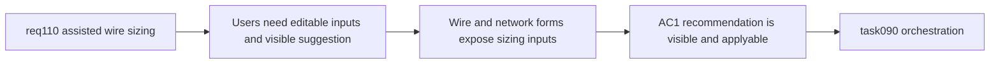

## item_543_wire_and_network_forms_for_voltage_current_material_and_section_recommendation_apply_flow - Wire and network forms for voltage current material and section recommendation apply flow
> From version: 1.4.3
> Schema version: 1.0
> Status: Ready
> Understanding: 97%
> Confidence: 94%
> Progress: 0%
> Complexity: Medium
> Theme: Modeling UX / network metadata form wiring / assisted section application
> Reminder: Update status/understanding/confidence/progress and linked task references when you edit this doc.

# Problem
Even with a core recommendation contract, `req_110` is not useful unless users can enter the required sizing inputs and see/apply the suggested section at the point where `sectionMm2` is decided.

# Scope
- In:
  - add `Voltage (V)` editing to the network create/edit workflow;
  - add wire `Current (A)` and `Material` inputs to wire create/edit;
  - show `Recommended section: X mm2` directly below `Section (mm²)` when inputs are sufficient;
  - add an explicit `Apply` interaction that copies the recommendation into the wire section draft;
  - recompute the recommendation live from current draft/context inputs;
  - preserve normal save/cancel semantics and manual override behavior.
- Out:
  - core contract definition for recommendation inputs/outputs (handled in `item_542`);
  - persistence/import-export compatibility work (handled in `item_544`);
  - final regression closure item (handled in `item_545`).

# Acceptance criteria
- AC1: Network create/edit flows expose `Voltage (V)` and persist it in the form draft workflow.
- AC2: Wire create/edit flows expose `Current (A)` and `Material`, with `Copper` as the default material choice.
- AC3: When the required inputs are available, the wire form shows the recommendation directly below `Section (mm²)` as helper text.
- AC4: The wire form exposes an explicit `Apply` action that copies the recommendation into the section draft without silently overwriting it.
- AC5: Manual edits to `sectionMm2` remain possible before save, and `Cancel edit` restores persisted values as usual.

# AC Traceability
- AC1 -> network scope form supports voltage input. Proof: network form tests cover create/edit and persisted draft behavior.
- AC2 -> wire form gains the required sizing inputs. Proof: UI tests cover default material and editable current/material.
- AC3 -> suggestion placement is locked. Proof: rendered helper text appears below `Section (mm²)` when inputs qualify.
- AC4 -> recommendation remains user-driven. Proof: `Apply` changes the draft only on explicit user action.
- AC5 -> assisted sizing stays non-destructive. Proof: save/cancel regression tests preserve existing semantics.

# Decision framing
- Product framing: Not needed
- Product signals: (none detected)
- Product follow-up: No product brief follow-up is expected based on current signals.
- Architecture framing: Not needed
- Architecture signals: (none detected)
- Architecture follow-up: No architecture decision follow-up is expected based on current signals.

# Links
- Product brief(s): (none yet)
- Architecture decision(s): (none yet)
- Request: `logics/request/req_110_automatic_recommended_wire_section_from_current_material_network_voltage_and_wire_length.md`
- Primary task(s): `logics/tasks/task_090_super_orchestration_delivery_execution_for_req_110_to_req_112_with_validation_gates_and_staged_checkpoints.md`

# AI Context
- Summary: Surface assisted wire sizing in the UI by wiring network voltage, wire current/material, and a visible recommendation with explicit apply semantics.
- Keywords: req110, wire form, network form, voltage, current, material, recommended section, apply
- Use when: Use when implementing or reviewing the user-facing assisted sizing flow in forms.
- Skip when: Skip when only changing core contracts or persistence without form-level behavior.

# Priority
- Impact: High.
- Urgency: High.

# Notes
- Dependencies: `req_110`, `item_542`.
- Blocks: `item_545`, `task_090`.
- Related AC: AC3, AC4, AC5, AC6, AC7.
- References:
  - `logics/request/req_110_automatic_recommended_wire_section_from_current_material_network_voltage_and_wire_length.md`
  - `logics/backlog/item_542_wire_sizing_metadata_and_recommendation_core_contract.md`
  - `src/app/components/workspace/ModelingWireFormPanel.tsx`
  - `src/app/components/workspace/NetworkScopeWorkspaceContent.tsx`
  - `src/app/AppController.tsx`
