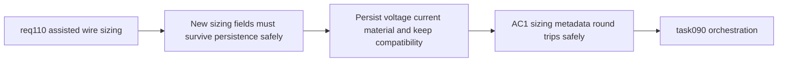

## item_544_wire_sizing_persistence_compatibility_and_standard_section_normalization - Wire sizing persistence compatibility and standard section normalization
> From version: 1.4.3
> Schema version: 1.0
> Status: Ready
> Understanding: 96%
> Confidence: 92%
> Progress: 0%
> Complexity: Medium-High
> Theme: Persistence / portability / compatibility for assisted sizing metadata
> Reminder: Update status/understanding/confidence/progress and linked task references when you edit this doc.

# Problem
`req_110` adds new network and wire sizing metadata. If those fields are not normalized consistently through persistence, migration, and import/export, the feature will behave unpredictably or break older saved workspaces.

# Scope
- In:
  - preserve `voltageV`, `currentA`, and `material` through persistence and portability layers;
  - ensure legacy payloads missing the new fields remain loadable and editable;
  - keep the V1 standard section normalization contract consistent across persistence/import/export paths;
  - avoid inventing a fake default voltage when older data lacks `voltageV`;
  - keep existing export flows non-regressed even if they do not yet surface the new sizing metadata.
- Out:
  - core recommendation contract (handled in `item_542`);
  - form UX and `Apply` interaction (handled in `item_543`);
  - final validation/closure traceability (handled in `item_545`).

# Acceptance criteria
- AC1: `voltageV`, `currentA`, and `material` survive local persistence and file portability round trips.
- AC2: Legacy saved/imported payloads lacking the new sizing fields remain loadable and editable.
- AC3: Missing legacy `voltageV` does not trigger a silent fake default write-back.
- AC4: Standard section normalization used by assisted sizing remains consistent across persistence/import/export code paths.
- AC5: Existing export/import flows remain non-regressed when the new sizing metadata is absent.

# AC Traceability
- AC1 -> persistence and portability serializers understand the new fields. Proof: round-trip tests preserve values.
- AC2 -> compatibility remains intact. Proof: legacy fixtures/import tests load with no failure.
- AC3 -> voltage defaults stay honest. Proof: normalization tests confirm `undefined` remains `undefined` unless the user sets a value.
- AC4 -> normalization logic is shared, not drifted. Proof: portability/persistence tests import the same section contract.
- AC5 -> current import/export features do not break. Proof: existing relevant tests still pass.

# Decision framing
- Product framing: Not needed
- Product signals: (none detected)
- Product follow-up: No product brief follow-up is expected based on current signals.
- Architecture framing: Required
- Architecture signals: data model and persistence
- Architecture follow-up: Existing request-level framing is sufficient for now; no additional ADR is required before backlog execution.

# Links
- Product brief(s): (none yet)
- Architecture decision(s): (none yet)
- Request: `logics/request/req_110_automatic_recommended_wire_section_from_current_material_network_voltage_and_wire_length.md`
- Primary task(s): `logics/tasks/task_090_super_orchestration_delivery_execution_for_req_110_to_req_112_with_validation_gates_and_staged_checkpoints.md`

# AI Context
- Summary: Make assisted sizing metadata survive persistence, portability, and compatibility paths without regressing existing saved/imported workspaces.
- Keywords: req110, persistence, portability, migration, compatibility, voltageV, currentA, material, standard section
- Use when: Use when implementing or reviewing persistence and import/export handling for assisted sizing.
- Skip when: Skip when only changing form rendering or core recommendation logic.

# Priority
- Impact: High.
- Urgency: Medium-High.

# Notes
- Dependencies: `req_110`, `item_542`.
- Blocks: `item_545`, `task_090`.
- Related AC: AC2, AC8, AC9, AC10.
- References:
  - `logics/request/req_110_automatic_recommended_wire_section_from_current_material_network_voltage_and_wire_length.md`
  - `logics/backlog/item_542_wire_sizing_metadata_and_recommendation_core_contract.md`
  - `src/adapters/persistence/migrations.ts`
  - `src/adapters/portability/networkFile.ts`
  - `src/store/reducer/networkReducer.ts`
  - `src/store/reducer/wireReducer.ts`
