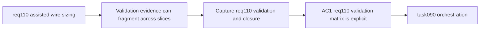

## item_545_req_110_validation_matrix_and_assisted_wire_sizing_closure_traceability - Req 110 validation matrix and assisted wire sizing closure traceability
> From version: 1.4.3
> Schema version: 1.0
> Status: Ready
> Understanding: 96%
> Confidence: 94%
> Progress: 0%
> Complexity: Low-Medium
> Theme: Quality / Validation / Traceability
> Reminder: Update understanding/confidence/progress and linked task references when you edit this doc.

# Problem
`req_110` spans domain contracts, form UX, and persistence compatibility. Without an explicit closure item, acceptance-criteria evidence and non-regression proof can remain fragmented across several implementation slices.

# Scope
- In:
  - define the req_110 validation matrix against acceptance criteria;
  - capture closure evidence for core recommendation logic, form behavior, and persistence compatibility;
  - synchronize request/backlog/task references for req_110 delivery;
  - record the locked V1 UX contract around helper text placement and explicit `Apply`.
- Out:
  - new feature work beyond req_110 closure.

# Acceptance criteria
- AC1: Validation evidence explicitly covers req_110 acceptance criteria for domain contract, form behavior, and compatibility behavior.
- AC2: Request, backlog, and task references are synchronized across items `542` to `544`.
- AC3: Closure notes explicitly record the locked V1 UX policy: helper text below `Section (mm²)` plus explicit `Apply`.
- AC4: Validation commands and targeted proof points are recorded for future regression triage.

# AC Traceability
- AC1 -> acceptance criteria have reproducible validation evidence. Proof: closure notes map tests and checks to req_110 guarantees.
- AC2 -> doc chain is coherent. Proof: request, backlog, and orchestration task references align.
- AC3 -> UX contract is not lost in implementation churn. Proof: closure notes record the locked placement and apply semantics.
- AC4 -> regression confidence is durable. Proof: validation commands are listed in the closure record.

# Decision framing
- Product framing: Not needed
- Product signals: (none detected)
- Product follow-up: No product brief follow-up is expected based on current signals.
- Architecture framing: Not needed
- Architecture signals: (none detected)
- Architecture follow-up: No architecture decision follow-up is expected based on current signals.

# Links
- Product brief(s): (none yet)
- Architecture decision(s): (none yet)
- Request: `logics/request/req_110_automatic_recommended_wire_section_from_current_material_network_voltage_and_wire_length.md`
- Primary task(s): `logics/tasks/task_090_super_orchestration_delivery_execution_for_req_110_to_req_112_with_validation_gates_and_staged_checkpoints.md`

# AI Context
- Summary: Capture req_110 validation evidence and close the traceability chain across assisted wire sizing delivery slices.
- Keywords: req110, validation, traceability, closure, recommendation, forms, persistence
- Use when: Use when closing or reviewing req_110 delivery.
- Skip when: Skip when implementing a new functional slice rather than recording closure evidence.

# Priority
- Impact: Medium-High.
- Urgency: High.

# Notes
- Derived from `logics/request/req_110_automatic_recommended_wire_section_from_current_material_network_voltage_and_wire_length.md`.
- Depends on: `item_542`, `item_543`, `item_544`.
- Orchestrated by `logics/tasks/task_090_super_orchestration_delivery_execution_for_req_110_to_req_112_with_validation_gates_and_staged_checkpoints.md`.
- References:
  - `logics/backlog/item_542_wire_sizing_metadata_and_recommendation_core_contract.md`
  - `logics/backlog/item_543_wire_and_network_forms_for_voltage_current_material_and_section_recommendation_apply_flow.md`
  - `logics/backlog/item_544_wire_sizing_persistence_compatibility_and_standard_section_normalization.md`
  - `logics/request/req_110_automatic_recommended_wire_section_from_current_material_network_voltage_and_wire_length.md`
