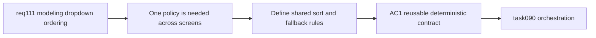

## item_546_shared_alphabetical_sorting_contract_for_modeling_dynamic_dropdown_options - Shared alphabetical sorting contract for modeling dynamic dropdown options
> From version: 1.4.3
> Schema version: 1.0
> Status: Done
> Understanding: 98%
> Confidence: 96%
> Progress: 100%
> Complexity: Medium
> Theme: Modeling select option ordering / reusable sorting policy / deterministic presentation
> Reminder: Update status/understanding/confidence/progress and linked task references when you edit this doc.

# Problem
`req_111` should not be solved by copy-pasting ad hoc sorting logic into each form. Without a shared contract for how modeling dropdown options are sorted, the app will drift across screens and mishandle missing fallback options.

# Scope
- In:
  - define a reusable sorting contract for dynamic `Modeling` dropdown options;
  - sort by visible option label with trimmed, case-insensitive comparison;
  - define stable tie-break behavior using technical ID and then entity ID;
  - define missing selected fallback handling, including pinning a selected missing option above the normal sorted list;
  - explicitly separate dynamic entity/catalog selects from static semantic selects.
- Out:
  - applying the contract to every relevant modeling form (handled in `item_547`);
  - final validation/closure traceability (handled in `item_548`).

# Acceptance criteria
- AC1: A shared contract exists for sorting dynamic modeling dropdown options by visible label.
- AC2: Sorting ignores leading/trailing whitespace and compares labels case-insensitively.
- AC3: Stable tie-break rules use technical ID and then entity ID where needed.
- AC4: A selected missing fallback option remains visible and pinned above the normal sorted options.
- AC5: Static semantic selects are explicitly excluded from the alphabetical sorting contract.

# AC Traceability
- AC1 -> implementation is reusable rather than duplicated. Proof: forms consume one helper/policy surface.
- AC2 -> ordering is stable for user-visible text. Proof: targeted tests cover trimmed and case-insensitive comparisons.
- AC3 -> equal labels remain deterministic. Proof: comparator tests cover stable secondary ordering.
- AC4 -> compatibility fallback remains safe. Proof: tests cover missing selected options remaining visible and pinned.
- AC5 -> the scope stays controlled. Proof: static semantic selects are not routed through the shared alphabetical helper.
- request-AC6 -> This backlog slice. Evidence needed: Regression tests cover representative connector, splice, wire, node, and segment modeling dropdown ordering behavior.

# Decision framing
- Product framing: Not needed
- Product signals: (none detected)
- Product follow-up: No product brief follow-up is expected based on current signals.
- Architecture framing: Required
- Architecture signals: contracts and integration
- Architecture follow-up: Captured in `adr_001_modeling_assisted_sizing_and_guarded_delete_contracts`.

# Links
- Product brief(s): (none yet)
- Architecture decision(s): `adr_001_modeling_assisted_sizing_and_guarded_delete_contracts`
- Request: `logics/request/req_111_alphabetically_sorted_dropdown_menus_in_modeling_screens.md`
- Primary task(s): `logics/tasks/task_090_super_orchestration_delivery_execution_for_req_110_to_req_112_with_validation_gates_and_staged_checkpoints.md`

# AI Context
- Summary: Define the reusable sorting and fallback policy for dynamic modeling dropdowns before wiring individual forms.
- Keywords: req111, modeling, dropdown, sorting helper, visible label, tie break, missing fallback
- Use when: Use when implementing or reviewing the shared contract behind modeling dropdown ordering.
- Skip when: Skip when only applying an already-defined contract to specific forms.

# Priority
- Impact: Medium-High.
- Urgency: High.

# Notes
- Dependencies: `req_111`.
- Blocks: `item_547`, `item_548`, `task_090`.
- Related AC: AC1, AC2, AC3, AC5.
- References:
  - `logics/request/req_111_alphabetically_sorted_dropdown_menus_in_modeling_screens.md`
  - `src/app/components/workspace/ModelingWireFormPanel.tsx`
  - `src/app/components/workspace/ModelingConnectorFormPanel.tsx`
  - `src/app/components/workspace/ModelingSpliceFormPanel.tsx`
  - `src/app/components/workspace/ModelingNodeFormPanel.tsx`
  - `src/app/components/workspace/ModelingSegmentFormPanel.tsx`

# Delivery
- Introduced a shared modeling-select helper that sorts dynamic options by trimmed, case-insensitive visible label and falls back to technical ID, then entity ID, for deterministic ties.
- The helper also supports pinning a selected missing compatibility option above the normal sorted list without mutating entity order in state.
