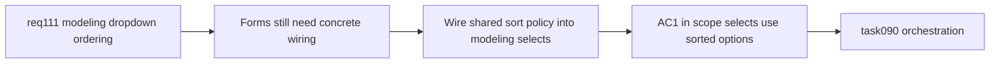

## item_547_modeling_form_dropdown_wiring_for_alphabetical_option_ordering_and_missing_fallback_pinning - Modeling form dropdown wiring for alphabetical option ordering and missing fallback pinning
> From version: 1.4.3
> Schema version: 1.0
> Status: Ready
> Understanding: 97%
> Confidence: 95%
> Progress: 0%
> Complexity: Medium
> Theme: Modeling forms / dynamic select wiring / user-facing option ordering
> Reminder: Update status/understanding/confidence/progress and linked task references when you edit this doc.

# Problem
After the shared sort contract is defined, the app still needs each dynamic `Modeling` dropdown to actually use it. Otherwise users will continue to see inconsistent ordering across forms.

# Scope
- In:
  - apply the shared alphabetical ordering contract to all in-scope dynamic selects in `Modeling`;
  - cover at minimum catalog-backed connector/splice selectors, wire endpoint connector/splice selectors, wire fuse catalog selector, node connector/splice selectors, and segment node selectors;
  - keep selected missing fallback options visible and pinned above the sorted list where compatibility fallbacks exist;
  - preserve existing static semantic select ordering.
- Out:
  - defining the shared sort policy itself (handled in `item_546`);
  - final validation/closure traceability (handled in `item_548`).

# Acceptance criteria
- AC1: All in-scope dynamic modeling selects use the shared alphabetical ordering contract.
- AC2: Wire form connector/splice selectors and fuse catalog selector follow the same ordering rules.
- AC3: Node and segment modeling selectors follow the same ordering rules.
- AC4: Static semantic selects in modeling remain in their deliberate non-alphabetical order.
- AC5: Compatibility fallback options remain visible and pinned when selected.

# AC Traceability
- AC1 -> screen coverage is complete. Proof: targeted UI tests cover representative modeling forms.
- AC2 -> wire-specific selects are not special-cased incorrectly. Proof: wire form tests cover connector/splice/catalog option ordering.
- AC3 -> node and segment forms behave consistently. Proof: UI tests cover option ordering in both flows.
- AC4 -> scope boundaries are preserved. Proof: semantic selects retain their old order.
- AC5 -> compatibility behavior remains safe. Proof: missing selected fallback options stay visible and pinned.

# Decision framing
- Product framing: Not needed
- Product signals: (none detected)
- Product follow-up: No product brief follow-up is expected based on current signals.
- Architecture framing: Not needed
- Architecture signals: (none detected)
- Architecture follow-up: No architecture decision follow-up is expected based on current signals.

# Links
- Product brief(s): (none yet)
- Architecture decision(s): (none yet)
- Request: `logics/request/req_111_alphabetically_sorted_dropdown_menus_in_modeling_screens.md`
- Primary task(s): `logics/tasks/task_090_super_orchestration_delivery_execution_for_req_110_to_req_112_with_validation_gates_and_staged_checkpoints.md`

# AI Context
- Summary: Apply the shared alphabetical dropdown ordering contract across the actual modeling forms.
- Keywords: req111, modeling forms, dropdown wiring, connector selector, splice selector, node selector, segment selector
- Use when: Use when implementing or reviewing concrete screen wiring for modeling dropdown ordering.
- Skip when: Skip when only changing the shared helper or closure docs.

# Priority
- Impact: Medium-High.
- Urgency: High.

# Notes
- Dependencies: `req_111`, `item_546`.
- Blocks: `item_548`, `task_090`.
- Related AC: AC1, AC2, AC4, AC5, AC6.
- References:
  - `logics/request/req_111_alphabetically_sorted_dropdown_menus_in_modeling_screens.md`
  - `logics/backlog/item_546_shared_alphabetical_sorting_contract_for_modeling_dynamic_dropdown_options.md`
  - `src/app/components/workspace/ModelingConnectorFormPanel.tsx`
  - `src/app/components/workspace/ModelingSpliceFormPanel.tsx`
  - `src/app/components/workspace/ModelingWireFormPanel.tsx`
  - `src/app/components/workspace/ModelingNodeFormPanel.tsx`
  - `src/app/components/workspace/ModelingSegmentFormPanel.tsx`
