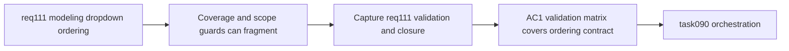

## item_548_req_111_validation_matrix_and_modeling_dropdown_ordering_closure_traceability - Req 111 validation matrix and modeling dropdown ordering closure traceability
> From version: 1.4.3
> Schema version: 1.0
> Status: Ready
> Understanding: 96%
> Confidence: 95%
> Progress: 0%
> Complexity: Low-Medium
> Theme: Quality / Validation / Traceability
> Reminder: Update understanding/confidence/progress and linked task references when you edit this doc.

# Problem
`req_111` looks small, but it affects many forms and has an important scope guard: dynamic selects must be alphabetized while static semantic selects must not change. Without an explicit closure item, that distinction can be lost.

# Scope
- In:
  - define the req_111 validation matrix against acceptance criteria;
  - capture evidence for shared helper behavior, form wiring coverage, and missing fallback pinning;
  - record the explicit non-regression contract for static semantic select ordering;
  - synchronize request/backlog/task traceability for req_111.
- Out:
  - new feature work beyond req_111 closure.

# Acceptance criteria
- AC1: Validation evidence explicitly covers req_111 acceptance criteria for shared sorting policy and screen wiring.
- AC2: Closure notes explicitly record that static semantic selects were preserved.
- AC3: Request, backlog, and orchestration-task references are synchronized across items `546` and `547`.
- AC4: Validation commands and representative UI proof points are recorded for future regression triage.

# AC Traceability
- AC1 -> ordering guarantees are reproducible. Proof: closure notes link targeted tests to req_111 acceptance criteria.
- AC2 -> scope boundaries remain explicit. Proof: closure notes mention preserved semantic-order selects.
- AC3 -> doc chain stays coherent. Proof: request, backlog, and task references align.
- AC4 -> regression evidence remains durable. Proof: validation commands are captured in the closure record.

# Decision framing
- Product framing: Not needed
- Product signals: (none detected)
- Product follow-up: No product brief follow-up is expected based on current signals.
- Architecture framing: Not needed
- Architecture signals: (none detected)
- Architecture follow-up: No architecture decision follow-up is expected based on current signals.

# Links
- Product brief(s): (none yet)
- Architecture decision(s): (none yet)
- Request: `logics/request/req_111_alphabetically_sorted_dropdown_menus_in_modeling_screens.md`
- Primary task(s): `logics/tasks/task_090_super_orchestration_delivery_execution_for_req_110_to_req_112_with_validation_gates_and_staged_checkpoints.md`

# AI Context
- Summary: Capture req_111 validation evidence and close the traceability chain for modeling dropdown ordering.
- Keywords: req111, validation, traceability, dropdown ordering, closure, modeling
- Use when: Use when closing or reviewing req_111 delivery.
- Skip when: Skip when implementing a new functional slice.

# Priority
- Impact: Medium.
- Urgency: High.

# Notes
- Derived from `logics/request/req_111_alphabetically_sorted_dropdown_menus_in_modeling_screens.md`.
- Depends on: `item_546`, `item_547`.
- Orchestrated by `logics/tasks/task_090_super_orchestration_delivery_execution_for_req_110_to_req_112_with_validation_gates_and_staged_checkpoints.md`.
- References:
  - `logics/backlog/item_546_shared_alphabetical_sorting_contract_for_modeling_dynamic_dropdown_options.md`
  - `logics/backlog/item_547_modeling_form_dropdown_wiring_for_alphabetical_option_ordering_and_missing_fallback_pinning.md`
  - `logics/request/req_111_alphabetically_sorted_dropdown_menus_in_modeling_screens.md`
