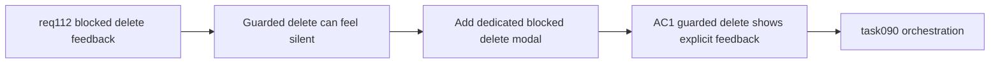

## item_549_dedicated_blocked_delete_feedback_modal_and_delete_guard_explanation_orchestration - Dedicated blocked delete feedback modal and delete guard explanation orchestration
> From version: 1.4.3
> Schema version: 1.0
> Status: Ready
> Understanding: 97%
> Confidence: 93%
> Progress: 0%
> Complexity: Medium
> Theme: Delete UX clarity / modal feedback / reducer guard surfacing
> Reminder: Update status/understanding/confidence/progress and linked task references when you edit this doc.

# Problem
`req_112` exists because guarded delete actions can currently feel silent. The first corrective slice is to make blocked deletes visible and understandable without relying on the top-level error banner alone.

# Scope
- In:
  - add a dedicated modal/dialog for blocked delete attempts;
  - route guarded delete failures through delete-attempt-level feedback instead of passive banner-only feedback;
  - show the target entity identity and a readable blocked-delete explanation;
  - preserve existing `req_074` delete confirmation behavior for normal successful deletes;
  - keep reducer guard semantics intact.
- Out:
  - structured dependency summaries beyond basic explanation (handled in `item_550`);
  - cascade delete execution (handled in `item_551`);
  - final validation/closure traceability (handled in `item_552`).

# Acceptance criteria
- AC1: A delete attempt blocked by existing integrity guards opens a dedicated feedback modal/dialog.
- AC2: The modal identifies the target entity and explains that the delete is blocked.
- AC3: The blocked-delete flow no longer depends on the global error banner as the primary user-facing explanation.
- AC4: Existing successful delete confirmation flows from `req_074` remain unchanged.
- AC5: No reducer guard is weakened or bypassed by this slice.

# AC Traceability
- AC1 -> delete failures become visible. Proof: UI tests verify blocked delete opens a dedicated modal/dialog.
- AC2 -> the user understands what was targeted. Proof: modal copy includes entity identity and blocked reason.
- AC3 -> delete feedback is local to the action. Proof: no primary reliance on the passive banner for the guarded flow.
- AC4 -> normal delete flows do not regress. Proof: existing confirmation tests still pass.
- AC5 -> business rules stay intact. Proof: reducer behavior remains guarded and non-destructive.

# Decision framing
- Product framing: Not needed
- Product signals: (none detected)
- Product follow-up: No product brief follow-up is expected based on current signals.
- Architecture framing: Not needed
- Architecture signals: (none detected)
- Architecture follow-up: No architecture decision follow-up is expected based on current signals.

# Links
- Product brief(s): (none yet)
- Architecture decision(s): (none yet)
- Request: `logics/request/req_112_explicit_blocked_delete_feedback_and_dependency_aware_cascade_delete_confirmation.md`
- Primary task(s): `logics/tasks/task_090_super_orchestration_delivery_execution_for_req_110_to_req_112_with_validation_gates_and_staged_checkpoints.md`

# AI Context
- Summary: Introduce a dedicated blocked-delete feedback modal so guarded deletes stop feeling like silent no-ops.
- Keywords: req112, delete, blocked delete, feedback modal, guard explanation, req074
- Use when: Use when implementing or reviewing the first UX slice for req_112.
- Skip when: Skip when working on structured dependency summaries or cascade execution.

# Priority
- Impact: High.
- Urgency: High.

# Notes
- Dependencies: `req_112`, `logics/request/req_074_all_delete_actions_require_styled_confirmation_modal.md`.
- Blocks: `item_550`, `item_551`, `item_552`, `task_090`.
- Related AC: AC1, AC2, AC3.
- References:
  - `logics/request/req_112_explicit_blocked_delete_feedback_and_dependency_aware_cascade_delete_confirmation.md`
  - `logics/request/req_074_all_delete_actions_require_styled_confirmation_modal.md`
  - `src/app/components/dialogs/ConfirmDialog.tsx`
  - `src/app/components/workspace/AppHeaderAndStats.tsx`
  - `src/app/AppController.tsx`
