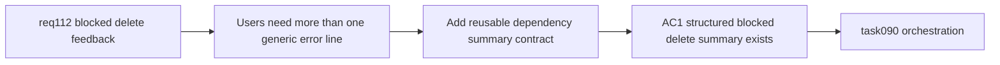

## item_550_delete_dependency_summary_contract_and_representative_impacted_reference_visibility - Delete dependency summary contract and representative impacted reference visibility
> From version: 1.4.3
> Schema version: 1.0
> Status: Done
> Understanding: 96%
> Confidence: 91%
> Progress: 100%
> Complexity: Medium-High
> Theme: Delete dependency inspection / impact summary / explanation detail
> Reminder: Update status/understanding/confidence/progress and linked task references when you edit this doc.

# Problem
Showing only a generic blocked-delete sentence is better than silence, but it still does not tell users enough about what is preventing the delete. `req_112` needs a structured way to summarize dependency categories, counts, and representative impacted references.

# Scope
- In:
  - define a reusable dependency-summary contract for blocked delete attempts;
  - provide category-level details such as linked node references, wire endpoint references, connected segments, or linked catalog usages where applicable;
  - include counts and representative labels/technical IDs when the app can compute them cheaply and deterministically;
  - feed the blocked-delete modal with structured details rather than only raw reducer strings;
  - support explanation-only flows even when cascade delete is not offered.
- Out:
  - baseline modal orchestration (handled in `item_549`);
  - cascade delete execution (handled in `item_551`);
  - final validation/closure traceability (handled in `item_552`).

# Acceptance criteria
- AC1: A reusable dependency-summary contract exists for blocked delete flows.
- AC2: The summary can express dependency categories and counts for representative guarded delete cases.
- AC3: When available, representative impacted references are visible in the blocked-delete explanation flow.
- AC4: The explanation flow still works safely when only a partial summary is available and cascade is not offered.
- AC5: Structured delete-summary logic is reusable by both explanation-only and future cascade-confirmation flows.

# AC Traceability
- AC1 -> structured data replaces brittle copy-only logic. Proof: delete UX consumes a typed/shared summary surface.
- AC2 -> users see meaningful blocker categories. Proof: tests cover counts/categories for representative entity types.
- AC3 -> explanations become concrete. Proof: modal content includes sample labels or technical IDs when available.
- AC4 -> the feature fails safe. Proof: explanation modal still works without requiring full cascade eligibility.
- AC5 -> summary logic is not duplicated. Proof: both blocked explanation and cascade candidate flows use the same summary contract.

# Decision framing
- Product framing: Not needed
- Product signals: (none detected)
- Product follow-up: No product brief follow-up is expected based on current signals.
- Architecture framing: Required
- Architecture signals: contracts and integration
- Architecture follow-up: Existing request-level framing is sufficient for now; no additional ADR is required before backlog execution.

# Links
- Product brief(s): (none yet)
- Architecture decision(s): (none yet)
- Request: `logics/request/req_112_explicit_blocked_delete_feedback_and_dependency_aware_cascade_delete_confirmation.md`
- Primary task(s): `logics/tasks/task_090_super_orchestration_delivery_execution_for_req_110_to_req_112_with_validation_gates_and_staged_checkpoints.md`

# AI Context
- Summary: Add a structured dependency-summary contract so blocked delete feedback can show categories, counts, and representative impacted references.
- Keywords: req112, delete summary, dependency categories, counts, impacted references, explanation modal
- Use when: Use when implementing or reviewing the structured explanation layer for blocked deletes.
- Skip when: Skip when only wiring the basic blocked-delete modal or finalizing cascade execution.

# Priority
- Impact: High.
- Urgency: High.

# Notes
- Dependencies: `req_112`, `item_549`.
- Blocks: `item_551`, `item_552`, `task_090`.
- Related AC: AC2, AC3, AC4.
- References:
  - `logics/request/req_112_explicit_blocked_delete_feedback_and_dependency_aware_cascade_delete_confirmation.md`
  - `logics/backlog/item_549_dedicated_blocked_delete_feedback_modal_and_delete_guard_explanation_orchestration.md`
  - `src/store/reducer/connectorReducer.ts`
  - `src/store/reducer/spliceReducer.ts`
  - `src/store/reducer/nodeReducer.ts`
  - `src/store/reducer/catalogReducer.ts`

# Delivery
- Added a shared delete-impact summary module that computes dependency categories, counts, and representative labels before the user confirms or dismisses a delete path.
- Covered representative blocked flows for connectors, splices, nodes, segments, and catalog items with structured summaries instead of reducer-string-only feedback.
- Reused the same summary contract for both explanation-only modals and cascade confirmation candidates.
