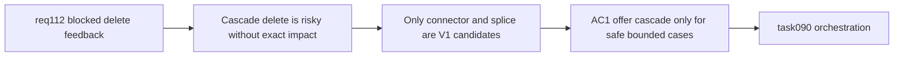

## item_551_safe_connector_and_splice_cascade_delete_confirmation_and_execution_contract - Safe connector and splice cascade delete confirmation and execution contract
> From version: 1.4.3
> Schema version: 1.0
> Status: Done
> Understanding: 96%
> Confidence: 90%
> Progress: 100%
> Complexity: High
> Theme: Safe cascade deletion / impact-bounded destructive operations / integrity preservation
> Reminder: Update status/understanding/confidence/progress and linked task references when you edit this doc.

# Problem
Users sometimes want to remove a connector or splice together with the items that make the delete impossible. But cascade delete is dangerous if the app cannot calculate and summarize the exact impact set. `req_112` needs a conservative contract: offer cascade only when the full impact is known, otherwise fall back to explanation-only blocking.

# Scope
- In:
  - evaluate and implement a safe V1 cascade-delete path for `connector` and `splice` only;
  - require a precomputed exact impact summary before offering cascade confirmation;
  - show the target entity plus the exact dependent-delete set in the confirmation dialog;
  - execute supported cascade delete as one logical destructive operation when confirmed;
  - fall back to explanation-only blocking whenever the exact impact set cannot be produced confidently.
- Out:
  - cascade support for `node`, `segment`, `catalog item`, or `network` in V1;
  - unconditional recursive graph deletion without explicit and bounded impact summary;
  - final validation/closure traceability (handled in `item_552`).

# Acceptance criteria
- AC1: V1 cascade delete is offered only for `connector` and `splice` cases whose exact impact set can be computed and summarized confidently.
- AC2: The cascade confirmation dialog shows the target plus the exact dependent entities that will also be removed.
- AC3: If the exact impact set cannot be produced confidently, the product falls back to explanation-only blocking and does not offer cascade delete.
- AC4: Successful cascade delete executes as one logical destructive operation with coherent integrity cleanup.
- AC5: Unsupported blocked-delete entity types remain explanation-only in V1.

# AC Traceability
- AC1 -> cascade stays conservative. Proof: only connector/splice candidate flows can reach cascade confirmation.
- AC2 -> users are not surprised. Proof: confirmation content lists counts and representative impacted entities from the exact impact set.
- AC3 -> unsafe cases fail safe. Proof: tests cover fallback from cascade candidate to explanation-only behavior.
- AC4 -> destructive state changes remain coherent. Proof: integration tests verify one logical delete operation and intact state afterward.
- AC5 -> V1 scope remains bounded. Proof: node/segment/catalog/network blocked deletes never offer cascade.
- request-AC6 -> This backlog slice. Evidence needed: Existing delete confirmation behavior from `req_074` remains non-regressed for normal deletions.
- request-AC9 -> This backlog slice. Evidence needed: Regression tests cover representative connector, splice, node, and catalog blocked-delete flows, plus any supported cascade cases.

# Decision framing
- Product framing: Not needed
- Product signals: (none detected)
- Product follow-up: No product brief follow-up is expected based on current signals.
- Architecture framing: Required
- Architecture signals: contracts and integration
- Architecture follow-up: Captured in `adr_001_modeling_assisted_sizing_and_guarded_delete_contracts`.

# Links
- Product brief(s): (none yet)
- Architecture decision(s): `adr_001_modeling_assisted_sizing_and_guarded_delete_contracts`
- Request: `logics/request/req_112_explicit_blocked_delete_feedback_and_dependency_aware_cascade_delete_confirmation.md`
- Primary task(s): `logics/tasks/task_090_super_orchestration_delivery_execution_for_req_110_to_req_112_with_validation_gates_and_staged_checkpoints.md`

# AI Context
- Summary: Implement the safe V1 cascade-delete contract for connector and splice only when the exact impact set is known and explain-only fallback remains available otherwise.
- Keywords: req112, cascade delete, connector, splice, exact impact set, safe fallback, explanation only
- Use when: Use when implementing or reviewing the bounded cascade-delete slice for req_112.
- Skip when: Skip when working on basic blocked-delete modal feedback or generic dependency summaries.

# Priority
- Impact: High.
- Urgency: Medium-High.

# Notes
- Dependencies: `req_112`, `item_549`, `item_550`.
- Blocks: `item_552`, `task_090`.
- Related AC: AC4, AC7, AC8.
- References:
  - `logics/request/req_112_explicit_blocked_delete_feedback_and_dependency_aware_cascade_delete_confirmation.md`
  - `logics/backlog/item_549_dedicated_blocked_delete_feedback_modal_and_delete_guard_explanation_orchestration.md`
  - `logics/backlog/item_550_delete_dependency_summary_contract_and_representative_impacted_reference_visibility.md`
  - `src/store/reducer/connectorReducer.ts`
  - `src/store/reducer/spliceReducer.ts`
  - `src/store/reducer/nodeReducer.ts`
  - `src/store/reducer/segmentReducer.ts`
  - `src/store/reducer/wireReducer.ts`

# Delivery
- Added conservative cascade delete support for `connector` and `splice` only when the exact impact set is limited to linked nodes and no wire endpoints or connected segments remain.
- Implemented dedicated cascade delete actions so the supported connector/splice cascade path is recorded as one logical undo/redo operation.
- Kept unsupported or unsafe cases on the explanation-only path, including all `node`, `segment`, `catalog item`, and `network` delete attempts.
