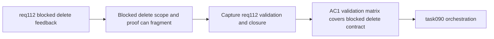

## item_552_req_112_validation_matrix_and_blocked_delete_closure_traceability - Req 112 validation matrix and blocked delete closure traceability
> From version: 1.4.3
> Schema version: 1.0
> Status: Ready
> Understanding: 96%
> Confidence: 92%
> Progress: 0%
> Complexity: Low-Medium
> Theme: Quality / Validation / Traceability
> Reminder: Update understanding/confidence/progress and linked task references when you edit this doc.

# Problem
`req_112` touches destructive-action UX, reducer guard visibility, and possibly cascade deletion. Without an explicit closure item, it becomes hard to prove which cases are explanation-only in V1 and which cases, if any, support safe cascade delete.

# Scope
- In:
  - define the req_112 validation matrix against acceptance criteria;
  - capture evidence for blocked-delete modal behavior, dependency summary content, and any delivered connector/splice cascade behavior;
  - record the explicit V1 scope guard that unsupported entity types remain explanation-only;
  - synchronize request/backlog/task traceability across req_112 delivery slices.
- Out:
  - new feature work beyond req_112 closure.

# Acceptance criteria
- AC1: Validation evidence explicitly covers req_112 acceptance criteria for blocked-delete feedback, structured summaries, and any delivered cascade behavior.
- AC2: Closure notes explicitly record which entity types remain explanation-only in V1.
- AC3: Request, backlog, and orchestration-task references are synchronized across items `549` to `551`.
- AC4: Validation commands and representative destructive-action proof points are recorded for future regression triage.

# AC Traceability
- AC1 -> acceptance criteria are reproducible. Proof: closure notes map targeted tests to req_112 guarantees.
- AC2 -> scope boundaries remain explicit. Proof: closure notes document explanation-only entity types and any delivered cascade matrix.
- AC3 -> doc chain stays coherent. Proof: request, backlog, and task references align.
- AC4 -> regression confidence is durable. Proof: validation commands and proof points are recorded at closure.

# Decision framing
- Product framing: Not needed
- Product signals: (none detected)
- Product follow-up: No product brief follow-up is expected based on current signals.
- Architecture framing: Not needed
- Architecture signals: (none detected)
- Architecture follow-up: No architecture decision follow-up is expected based on current signals.

# Links
- Product brief(s): (none yet)
- Architecture decision(s): (none yet)
- Request: `logics/request/req_112_explicit_blocked_delete_feedback_and_dependency_aware_cascade_delete_confirmation.md`
- Primary task(s): `logics/tasks/task_090_super_orchestration_delivery_execution_for_req_110_to_req_112_with_validation_gates_and_staged_checkpoints.md`

# AI Context
- Summary: Capture req_112 validation evidence and close the traceability chain for blocked-delete UX and any safe cascade delivery.
- Keywords: req112, validation, closure, blocked delete, cascade delete, traceability
- Use when: Use when closing or reviewing req_112 delivery.
- Skip when: Skip when implementing a new functional slice.

# Priority
- Impact: Medium-High.
- Urgency: High.

# Notes
- Derived from `logics/request/req_112_explicit_blocked_delete_feedback_and_dependency_aware_cascade_delete_confirmation.md`.
- Depends on: `item_549`, `item_550`, `item_551`.
- Orchestrated by `logics/tasks/task_090_super_orchestration_delivery_execution_for_req_110_to_req_112_with_validation_gates_and_staged_checkpoints.md`.
- References:
  - `logics/backlog/item_549_dedicated_blocked_delete_feedback_modal_and_delete_guard_explanation_orchestration.md`
  - `logics/backlog/item_550_delete_dependency_summary_contract_and_representative_impacted_reference_visibility.md`
  - `logics/backlog/item_551_safe_connector_and_splice_cascade_delete_confirmation_and_execution_contract.md`
  - `logics/request/req_112_explicit_blocked_delete_feedback_and_dependency_aware_cascade_delete_confirmation.md`
