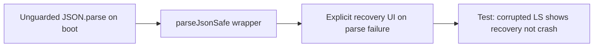

## item_553_safe_json_parse_wrapper_and_boot_recovery_ui_for_corrupted_localstorage - Safe JSON.parse wrapper and boot recovery UI for corrupted localStorage
> From version: 1.4.4
> Schema version: 1.0
> Status: Draft
> Understanding: 97%
> Confidence: 94%
> Progress: 0%
> Complexity: Low-Medium
> Theme: Persistence safety / boot resilience
> Reminder: Update understanding/confidence/progress and linked task references when you edit this doc.

# Problem
All `JSON.parse()` calls in the persistence layer are unguarded. A corrupted or truncated localStorage value causes an unhandled `SyntaxError` at boot, leaving the user with a blank screen and no recovery path. This is a silent data-loss scenario.

# Scope
- In:
  - introduce a typed `parseJsonSafe<T>()` utility that returns a `Result<T, ParseError>` instead of throwing;
  - replace all bare `JSON.parse()` calls in `localStorage.ts`, `migrations.ts`, and `recentChanges.ts` with the safe wrapper;
  - when the root state cannot be parsed, show an explicit recovery UI (reset to clean state) instead of crashing;
  - add a test that deliberately writes malformed JSON to localStorage and asserts the recovery UI is shown.
- Out:
  - migration rollback (covered in `item_554`);
  - quota handling (covered in `item_555`).

# Acceptance criteria
- AC1: A deliberately corrupted localStorage value at boot shows a recovery UI; no unhandled exception reaches the user.
- AC2: `parseJsonSafe<T>()` is the only entry point for JSON deserialization in the persistence layer; bare `JSON.parse()` calls no longer exist in the three affected files.
- AC3: The recovery UI offers at least one explicit action (reset to clean state) and explains that local data could not be loaded.
- AC4: A new or updated test in `persistence.localStorage.spec.ts` covers the corrupted-input scenario end to end.

# AC Traceability
- AC1 → boot resilience. Proof: test writes invalid JSON and asserts recovery UI renders.
- AC2 → call-site hygiene. Proof: grep confirms no bare `JSON.parse(` in the three files.
- AC3 → UX clarity. Proof: recovery UI component renders message and reset CTA.
- AC4 → regression coverage. Proof: spec file contains the corrupted-input test case.

# Decision framing
- Product framing: Not needed
- Architecture framing: Not needed

# Links
- Request: `logics/request/req_113_technical_debt_hardening_persistence_safety_performance_and_architecture_quality.md`
- Primary task(s): `logics/tasks/task_091_orchestration_delivery_execution_for_req_113_technical_debt_hardening.md`

# AI Context
- Summary: Replace all bare JSON.parse calls in the persistence layer with a safe typed wrapper and surface a recovery UI when boot deserialization fails.
- Keywords: JSON.parse, parseJsonSafe, localStorage, boot crash, recovery UI, persistence safety
- Use when: Implementing or reviewing persistence-layer deserialization in the boot path.
- Skip when: Working on features unrelated to persistence or deserialization.

# Priority
- Impact: Very high.
- Urgency: Immediate.

# Notes
- Derived from `logics/request/req_113_...` audit item A1.
- Depends on: none.
- Blocks: `item_554` (migration rollback relies on the safe wrapper).
- References:
  - `src/adapters/persistence/localStorage.ts`
  - `src/adapters/persistence/migrations.ts`
  - `src/adapters/persistence/recentChanges.ts`
  - `src/tests/persistence.localStorage.spec.ts`

# Validation
- `npm run -s lint`
- `npm run -s typecheck`
- `npm test -- --run src/tests/persistence.localStorage.spec.ts`
- `npm run -s build`
