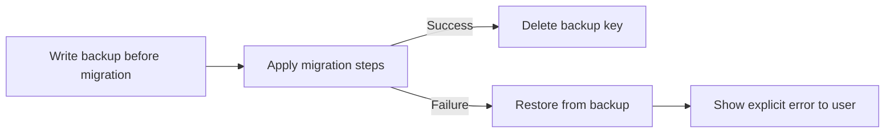

## item_554_migration_backup_and_rollback_on_failure_with_explicit_user_feedback - Migration backup and rollback on failure with explicit user feedback
> From version: 1.4.4
> Schema version: 1.0
> Status: Draft
> Understanding: 96%
> Confidence: 92%
> Progress: 0%
> Complexity: Medium
> Theme: Persistence safety / migration resilience
> Reminder: Update understanding/confidence/progress and linked task references when you edit this doc.

# Problem
The migration system applies schema upgrades linearly without any rollback capability. If a migration step throws or produces an invalid state, `normalizeNetworkEntityState()` silently discards user data and bootstraps with sample data. The user is not informed that their networks were lost.

# Scope
- In:
  - before applying any migration, write the current raw localStorage value to a dated backup key (e.g., `APP_STATE_BACKUP_PRE_MIGRATION_v{N}`);
  - if any migration step throws or returns a state that fails basic structural validation, restore from the backup key and surface an explicit error message to the user;
  - clean up the backup key after a successful migration completes;
  - add tests that simulate a mid-migration failure and assert that the backup is restored and the error is surfaced.
- Out:
  - safe JSON parsing (covered in `item_553`);
  - adding new migration versions (not in scope here).

# Acceptance criteria
- AC1: A migration step that throws or returns structurally invalid state causes the system to restore the pre-migration backup, not to fall through to sample data.
- AC2: The backup key is written before any migration mutation and deleted only after a successful full migration.
- AC3: The user sees an explicit error message when rollback occurs, explaining that the upgrade failed and prior data was restored.
- AC4: Tests cover the mid-migration failure scenario, asserting backup restoration and error surfacing.
- AC5: Normal successful migration continues to work end to end; no regression in happy-path boot.

# AC Traceability
- AC1 → data preservation. Proof: test injects a throwing migration step and asserts backup is restored.
- AC2 → backup lifecycle. Proof: test checks backup key existence before and after migration.
- AC3 → UX clarity. Proof: test asserts error message is shown on rollback.
- AC4 → regression coverage. Proof: new spec cases in `persistence.migrations.spec.ts`.
- AC5 → non-regression. Proof: existing persistence specs continue to pass.

# Decision framing
- Product framing: Not needed
- Architecture framing: Not needed

# Links
- Request: `logics/request/req_113_technical_debt_hardening_persistence_safety_performance_and_architecture_quality.md`
- Primary task(s): `logics/tasks/task_091_orchestration_delivery_execution_for_req_113_technical_debt_hardening.md`

# AI Context
- Summary: Write a pre-migration backup to localStorage before each schema upgrade and restore it automatically if the migration fails, surfacing an explicit error to the user.
- Keywords: migration, rollback, backup, localStorage, schema version, data loss, persistence
- Use when: Implementing or reviewing the migration execution path in `migrations.ts`.
- Skip when: Working on features unrelated to persistence migrations.

# Priority
- Impact: Very high.
- Urgency: Immediate.

# Notes
- Derived from `logics/request/req_113_...` audit item A2.
- Depends on: `item_553` (safe JSON.parse wrapper).
- Blocks: `item_561` (migration spec depends on this item being in place).
- References:
  - `src/adapters/persistence/migrations.ts`
  - `src/adapters/persistence/localStorage.ts`
  - `src/tests/persistence.migrations.spec.ts`

# Validation
- `npm run -s lint`
- `npm run -s typecheck`
- `npm test -- --run src/tests/persistence.migrations.spec.ts src/tests/persistence.localStorage.spec.ts`
- `npm run -s build`
