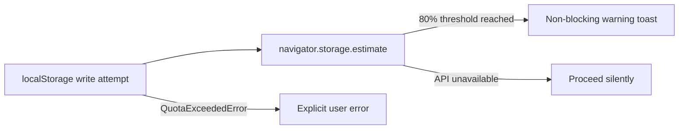

## item_555_localstorage_quota_awareness_and_write_failure_surfacing - localStorage quota awareness and write failure surfacing
> From version: 1.4.4
> Schema version: 1.0
> Status: Done
> Understanding: 95%
> Confidence: 90%
> Progress: 100%
> Complexity: Low-Medium
> Theme: Persistence safety / storage resilience
> Reminder: Update understanding/confidence/progress and linked task references when you edit this doc.

# Problem
The persistence adapter writes to localStorage without checking available quota. On large networks (500+ entities), the serialized payload can silently exceed the 5–10 MB browser limit. A `QuotaExceededError` is currently swallowed without any user feedback, meaning changes are lost without notice.

# Scope
- In:
  - before each write, estimate the payload size and compare it to available quota using `navigator.storage.estimate()` where supported;
  - if the estimated payload exceeds 80 % of remaining quota, show a non-blocking warning toast;
  - catch `QuotaExceededError` on write and surface a clear user-facing error instead of swallowing it;
  - fall back gracefully when `navigator.storage.estimate()` is unavailable (no crash, no warning).
- Out:
  - compressing or splitting the payload to fit within quota (not in scope for V1);
  - cloud backup or external storage alternatives.

# Acceptance criteria
- AC1: A write that triggers `QuotaExceededError` is caught and surfaces a clear user-facing error; the exception does not propagate unhandled.
- AC2: When `navigator.storage.estimate()` is available and the estimated payload exceeds 80 % of remaining quota, a non-blocking warning toast is displayed before the write.
- AC3: When `navigator.storage.estimate()` is unavailable, the adapter proceeds normally without throwing or warning.
- AC4: A test simulates a `QuotaExceededError` on write and asserts the error is surfaced correctly.

# AC Traceability
- AC1 → write resilience. Proof: test mocks a throwing `localStorage.setItem` and asserts error surface.
- AC2 → proactive user feedback. Proof: test mocks `navigator.storage.estimate` returning near-quota values and asserts toast.
- AC3 → graceful degradation. Proof: test omits `navigator.storage.estimate` and asserts no crash.
- AC4 → regression coverage. Proof: new spec case in `persistence.localStorage.spec.ts`.
- request-AC5 -> This backlog slice. Evidence needed: `selectRoutingGraphIndex` does not call `buildRoutingGraphIndex()` more than once per render cycle when `segments` and `nodePositions` have not changed.
- request-AC6 -> This backlog slice. Evidence needed: `AppController.tsx` exposes Context providers for store dispatch and the main handler namespaces; at least one deeply nested consumer is updated to use them instead of props.
- request-AC7 -> This backlog slice. Evidence needed: Every domain reducer that mutates entity state calls `syncCurrentScopeToNetworkMap()` (or a type-enforced equivalent); the audit list is documented in the implementation.
- request-AC8 -> This backlog slice. Evidence needed: Unit tests exist for the five listed controller hooks and run in isolation without full UI setup.
- request-AC9 -> This backlog slice. Evidence needed: `persistence.migrations.spec.ts` exists and covers happy-path migration from each persisted schema version and corrupt-input handling at each step.
- request-AC10 -> This backlog slice. Evidence needed: All writes to `connectorCavityOccupancy` and `splicePortOccupancy` are guarded by `isValidSlotIndex()`; out-of-bounds writes are rejected without corrupting the map.
- request-AC11 -> This backlog slice. Evidence needed: Canvas viewport state is Redux-backed and undo/redo restores it alongside entity state unless the explicit opt-out preference is disabled.
- request-AC12 -> This backlog slice. Evidence needed: `ui.lastError` is typed as `AppError | null`; all existing raw-string error assignments are updated; the error display component renders the structured fields.

# Decision framing
- Product framing: Not needed
- Architecture framing: Not needed

# Links
- Request: `logics/request/req_113_technical_debt_hardening_persistence_safety_performance_and_architecture_quality.md`
- Primary task(s): `logics/tasks/task_091_orchestration_delivery_execution_for_req_113_technical_debt_hardening.md`

# AI Context
- Summary: Add quota estimation before localStorage writes and surface QuotaExceededError explicitly to the user instead of swallowing it.
- Keywords: localStorage, quota, QuotaExceededError, navigator.storage.estimate, persistence, write failure
- Use when: Implementing or reviewing the localStorage write path.
- Skip when: Working on read paths or features unrelated to persistence.

# Priority
- Impact: High.
- Urgency: Soon.

# Notes
- Derived from `logics/request/req_113_...` audit item A3.
- Depends on: `item_553` (safe error handling patterns established there).
- References:
  - `src/adapters/persistence/localStorage.ts`
  - `src/tests/persistence.localStorage.spec.ts`

# Validation
- `npm run -s lint`
- `npm run -s typecheck`
- `npm test -- --run src/tests/persistence.localStorage.spec.ts`
- `npm run -s build`
