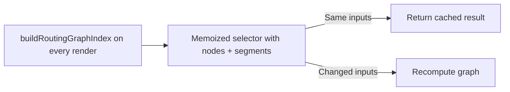

## item_557_memoize_routing_graph_construction_in_selector - Memoize routing graph construction in selector
> From version: 1.4.4
> Schema version: 1.0
> Status: Done
> Understanding: 96%
> Confidence: 93%
> Progress: 100%
> Complexity: Low-Medium
> Theme: Performance / selector memoization
> Reminder: Update understanding/confidence/progress and linked task references when you edit this doc.

# Problem
`buildRoutingGraphIndex()` in `src/core/graph.ts` is called on every render via `selectRoutingGraphIndex` in `src/store/selectors.ts`, even when neither `nodes` nor `segments` has changed. For mid-size networks this is a measurable wasted computation on every state change, including unrelated UI interactions.

# Scope
- In:
  - refactor `selectRoutingGraphIndex` to use structural memoization (`createSelector` or equivalent) with `nodes` and `segments` as the only inputs;
  - confirm that `buildRoutingGraphIndex()` is not called more than once per render cycle when the relevant state slices are unchanged;
  - add a test or proof point that the selector does not recompute on unrelated state changes.
- Out:
  - changes to the `buildRoutingGraphIndex()` algorithm itself (covered in `item_556` if relevant);
  - memoization of other selectors beyond `selectRoutingGraphIndex`.

# Acceptance criteria
- AC1: `buildRoutingGraphIndex()` is not called more than once per render cycle when `nodes` and `segments` have not changed.
- AC2: `selectRoutingGraphIndex` is implemented with a memoized selector pattern; the raw function call no longer sits directly inside the selector body without caching.
- AC3: Existing `core.graph.spec.ts` and all routing-related tests continue to pass without modification.
- AC4: A test or inline proof point demonstrates that the selector returns a cached reference when inputs are unchanged.

# AC Traceability
- AC1 → recompute guard. Proof: test asserts selector call count when unrelated state changes.
- AC2 → selector structure. Proof: code review shows `createSelector` wrapping.
- AC3 → non-regression. Proof: CI run of `core.graph.spec.ts` and full test suite.
- AC4 → cache proof. Proof: referential equality check in test when inputs are stable.

# Decision framing
- Product framing: Not needed
- Architecture framing: Not needed

# Links
- Request: `logics/request/req_113_technical_debt_hardening_persistence_safety_performance_and_architecture_quality.md`
- Primary task(s): `logics/tasks/task_091_orchestration_delivery_execution_for_req_113_technical_debt_hardening.md`

# AI Context
- Summary: Wrap selectRoutingGraphIndex in a memoized selector so buildRoutingGraphIndex is only recomputed when segments or nodePositions change.
- Keywords: selector, memoization, createSelector, routing graph, buildRoutingGraphIndex, performance, render
- Use when: Implementing or reviewing the routing graph selector in `src/store/selectors.ts`.
- Skip when: Working on pathfinding algorithm internals or features unrelated to the graph selector.

# Priority
- Impact: High.
- Urgency: Soon.

# Notes
- Derived from `logics/request/req_113_...` audit item B2.
- Depends on: none (can be delivered independently of `item_556`).
- References:
  - `src/store/selectors.ts`
  - `src/core/graph.ts`
  - `src/tests/core.graph.spec.ts`
  - `src/tests/store.selectors.spec.ts`

# Validation
- `npm run -s lint`
- `npm run -s typecheck`
- `npm test -- --run src/tests/core.graph.spec.ts`
- `npm run -s build`
