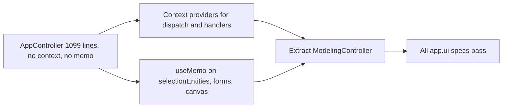

## item_558_appcontroller_decomposition_context_providers_and_derived_state_memoization - AppController decomposition: Context providers and derived state memoization
> From version: 1.4.4
> Schema version: 1.0
> Status: Done
> Understanding: 96%
> Confidence: 92%
> Progress: 100%
> Complexity: High
> Theme: Architecture quality / component structure
> Reminder: Update understanding/confidence/progress and linked task references when you edit this doc.

# Problem
`AppController.tsx` (1 099 lines) is a God Component: it aggregates 50+ hooks, derives 100+ values, and passes them as props through 4+ levels of the component tree. Derived state objects (`selectionEntities`, `forms`, `canvas`) are not memoized, causing unnecessary re-renders of all child screens on every state change. There are no Context providers, so any new handler or selector addition requires threading through every intermediate layer.

# Scope
- In:
  - add React Context providers for at minimum: store dispatch, connector handlers, wire handlers, and segment handlers; update at least one deeply nested consumer to use context instead of props;
  - wrap `selectionEntities`, `forms`, and `canvas` in `useMemo` with correct and minimal dependency arrays;
  - extract a `ModelingController` sub-component responsible for modeling-screen state assembly, leaving `AppController` as a thin orchestrator;
  - each increment must leave all `app.ui.*.spec.tsx` tests passing.
- Out:
  - extracting `AnalysisController` or `ValidationController` (deferred to a follow-up);
  - full elimination of all prop drilling (this item delivers the first safe increment only);
  - changes to the store or reducers.

# Acceptance criteria
- AC1: React Context providers exist for store dispatch and the connector, wire, and segment handler namespaces; at least one previously prop-drilled consumer is updated to use them.
- AC2: `selectionEntities`, `forms`, and `canvas` are wrapped in `useMemo` with dependency arrays that exclude unrelated state slices.
- AC3: A `ModelingController` component exists and owns the modeling-screen state assembly; `AppController` no longer assembles it directly.
- AC4: All existing `app.ui.*.spec.tsx` integration tests pass without modification after each increment.
- AC5: `AppController.tsx` line count is measurably reduced relative to the v1.4.4 baseline.

# AC Traceability
- AC1 → prop drilling reduction. Proof: context consumer updated, grep shows context usage in nested component.
- AC2 → re-render reduction. Proof: `useMemo` wrappers present with correct deps, reviewable in diff.
- AC3 → structural separation. Proof: `ModelingController.tsx` exists and is used by `AppController`.
- AC4 → non-regression. Proof: CI run of all `app.ui.*.spec.tsx` passes green.
- AC5 → size reduction. Proof: line count diff recorded in task report.
- request-AC6 -> This backlog slice. Evidence needed: `AppController.tsx` exposes Context providers for store dispatch and the main handler namespaces; at least one deeply nested consumer is updated to use them instead of props.
- request-AC7 -> This backlog slice. Evidence needed: Every domain reducer that mutates entity state calls `syncCurrentScopeToNetworkMap()` (or a type-enforced equivalent); the audit list is documented in the implementation.
- request-AC8 -> This backlog slice. Evidence needed: Unit tests exist for the five listed controller hooks and run in isolation without full UI setup.
- request-AC9 -> This backlog slice. Evidence needed: `persistence.migrations.spec.ts` exists and covers happy-path migration from each persisted schema version and corrupt-input handling at each step.
- request-AC10 -> This backlog slice. Evidence needed: All writes to `connectorCavityOccupancy` and `splicePortOccupancy` are guarded by `isValidSlotIndex()`; out-of-bounds writes are rejected without corrupting the map.
- request-AC11 -> This backlog slice. Evidence needed: Canvas viewport state is Redux-backed and undo/redo restores it alongside entity state unless the explicit opt-out preference is disabled.
- request-AC12 -> This backlog slice. Evidence needed: `ui.lastError` is typed as `AppError | null`; all existing raw-string error assignments are updated; the error display component renders the structured fields.

# Decision framing
- Product framing: Not needed
- Architecture framing: May warrant an ADR for the Context strategy if it diverges from existing patterns.

# Links
- Request: `logics/request/req_113_technical_debt_hardening_persistence_safety_performance_and_architecture_quality.md`
- Primary task(s): `logics/tasks/task_091_orchestration_delivery_execution_for_req_113_technical_debt_hardening.md`

# AI Context
- Summary: Reduce AppController from a God Component to a thin orchestrator by adding Context providers, memoizing derived state objects, and extracting ModelingController.
- Keywords: AppController, God Component, React Context, useMemo, prop drilling, ModelingController, re-render
- Use when: Refactoring AppController or reviewing the component composition strategy.
- Skip when: Working on store reducers, persistence, or features unrelated to the UI controller layer.

# Priority
- Impact: High.
- Urgency: Soon.

# Notes
- Derived from `logics/request/req_113_...` audit item C1.
- Depends on: none (can be delivered independently).
- Blocks: nothing currently, but unblocks future controller extractions.
- References:
  - `src/app/AppController.tsx`
  - `src/app/components/controller/ModelingController.tsx`
  - `src/app/components/controller/ModelingController.context.ts`
  - `src/app/hooks/` (controller hooks)
  - `src/tests/app.ui.*.spec.tsx`

# Validation
- `npm run -s lint`
- `npm run -s typecheck`
- `npm test -- --run src/tests/app.ui`
- `npm run -s build`
