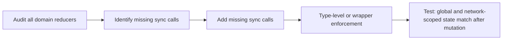

## item_559_audit_and_enforce_sync_invariant_between_global_and_network_scoped_state - Audit and enforce sync invariant between global and network-scoped state
> From version: 1.4.4
> Schema version: 1.0
> Status: Done
> Understanding: 96%
> Confidence: 94%
> Progress: 100%
> Complexity: Medium
> Theme: Architecture quality / state consistency
> Reminder: Update understanding/confidence/progress and linked task references when you edit this doc.

# Problem
`AppState` maintains entity collections both at the root level and inside `networkStates[NetworkId]`. A manual `syncCurrentScopeToNetworkMap()` call is required after every domain mutation to keep them coherent. Any reducer that forgets this call silently introduces stale state. There is no type-level or runtime enforcement of this invariant.

# Scope
- In:
  - audit all domain reducers in `src/store/reducer/` and document which ones call `syncCurrentScopeToNetworkMap()` and which ones do not;
  - add the missing sync calls for any reducer that is found to omit them;
  - introduce a wrapper function or type-level mechanism that makes it structurally harder to forget the sync call in future reducers;
  - add an explicit invariant comment block in `src/store/reducer.ts` describing the dual-state contract and the sync requirement;
  - add a test that verifies global-level and network-scoped entity state remain identical after a representative domain mutation.
- Out:
  - full consolidation of the dual-state into a single source of truth (deferred follow-up, too invasive for V1).

# Acceptance criteria
- AC1: All domain reducers that perform entity mutations call `syncCurrentScopeToNetworkMap()` or its enforced equivalent; the audit list is documented in a comment or companion doc.
- AC2: A wrapper function or lint rule is in place that makes it structurally harder to add a new domain reducer without including the sync call.
- AC3: An explicit invariant comment describes the dual-state contract and sync requirement in `reducer.ts` or a shared module.
- AC4: A test asserts that root-level entity state and `networkStates[activeNetworkId]` entity state are structurally identical after a representative mutation.

# AC Traceability
- AC1 → completeness. Proof: audit document or comment listing all reducers and their sync status.
- AC2 → enforcement. Proof: wrapper or ESLint rule visible in diff.
- AC3 → documentation. Proof: invariant comment block in `reducer.ts`.
- AC4 → runtime coherence. Proof: new test in `store.reducer.*.spec.ts`.
- request-AC5 -> This backlog slice. Evidence needed: `selectRoutingGraphIndex` does not call `buildRoutingGraphIndex()` more than once per render cycle when `segments` and `nodePositions` have not changed.
- request-AC6 -> This backlog slice. Evidence needed: `AppController.tsx` exposes Context providers for store dispatch and the main handler namespaces; at least one deeply nested consumer is updated to use them instead of props.
- request-AC7 -> This backlog slice. Evidence needed: Every domain reducer that mutates entity state calls `syncCurrentScopeToNetworkMap()` (or a type-enforced equivalent); the audit list is documented in the implementation.
- request-AC8 -> This backlog slice. Evidence needed: Unit tests exist for the five listed controller hooks and run in isolation without full UI setup.
- request-AC9 -> This backlog slice. Evidence needed: `persistence.migrations.spec.ts` exists and covers happy-path migration from each persisted schema version and corrupt-input handling at each step.
- request-AC10 -> This backlog slice. Evidence needed: All writes to `connectorCavityOccupancy` and `splicePortOccupancy` are guarded by `isValidSlotIndex()`; out-of-bounds writes are rejected without corrupting the map.
- request-AC11 -> This backlog slice. Evidence needed: Canvas viewport state is Redux-backed and undo/redo restores it alongside entity state unless the explicit opt-out preference is disabled.
- request-AC12 -> This backlog slice. Evidence needed: `ui.lastError` is typed as `AppError | null`; all existing raw-string error assignments are updated; the error display component renders the structured fields.

# Decision framing
- Product framing: Not needed
- Architecture framing: A follow-up ADR may be warranted for the long-term consolidation strategy.

# Links
- Request: `logics/request/req_113_technical_debt_hardening_persistence_safety_performance_and_architecture_quality.md`
- Primary task(s): `logics/tasks/task_091_orchestration_delivery_execution_for_req_113_technical_debt_hardening.md`

# AI Context
- Summary: Audit all domain reducers for missing syncCurrentScopeToNetworkMap calls, fix gaps, and add a structural enforcement mechanism to prevent future omissions.
- Keywords: syncCurrentScopeToNetworkMap, dual state, network-scoped state, reducer, invariant, state consistency
- Use when: Adding a new domain reducer or reviewing store mutation paths.
- Skip when: Working on read-only selectors, UI components, or features unrelated to the store mutation layer.

# Priority
- Impact: High.
- Urgency: Soon.

# Notes
- Derived from `logics/request/req_113_...` audit item C2.
- Depends on: none.
- References:
  - `src/store/reducer.ts`
  - `src/store/reducer/` (all domain reducers)
  - `src/store/types.ts`
  - `src/tests/store.reducer.sync-invariant.spec.ts`

# Validation
- `npm run -s lint`
- `npm run -s typecheck`
- `npm test -- --run src/tests/store.reducer`
- `npm run -s build`
