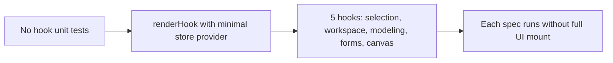

## item_560_unit_tests_for_controller_hooks_in_isolation - Unit tests for controller hooks in isolation
> From version: 1.4.4
> Schema version: 1.0
> Status: Done
> Understanding: 96%
> Confidence: 95%
> Progress: 100%
> Complexity: Medium
> Theme: Test quality / hook coverage
> Reminder: Update understanding/confidence/progress and linked task references when you edit this doc.

# Problem
The 50+ controller hooks in `src/app/hooks/controller/` are tested only through full UI integration tests (`app.ui.*.spec.tsx`). There are no isolated unit tests for individual hooks. This makes it hard to pinpoint regressions when a hook behavior changes, and slow to iterate because every hook change requires running the full UI suite to get feedback.

# Scope
- In:
  - create dedicated unit test files for the five highest-risk controller hooks using `renderHook` with a minimal store provider:
    - `useAppControllerSelectionHandlersDomainAssembly`
    - `useAppControllerWorkspaceHandlersDomainAssembly`
    - `useAppControllerModelingHandlersAssembly`
    - `useEntityFormsState`
    - `useCanvasState`
  - each spec must run in isolation without requiring a full UI mount;
  - each spec must cover at least the primary output shape (returned values and key handler signatures) and one representative state-change scenario.
- Out:
  - exhaustive coverage of all 50+ hooks (this item targets the five highest-risk ones);
  - changes to the hook implementations themselves.

# Acceptance criteria
- AC1: Dedicated unit test files exist for the five listed hooks and are discoverable by the test runner without requiring full UI setup.
- AC2: Each spec uses `renderHook` with a minimal store provider and does not mount the full `AppController` or any screen component.
- AC3: Each spec asserts the primary returned value shape and at least one representative state-change scenario.
- AC4: All five specs pass in CI alongside the existing test suite.

# AC Traceability
- AC1 → file existence. Proof: five new `.spec.ts` files present in `src/tests/`.
- AC2 → isolation. Proof: no `AppController` import or screen mount in the new specs.
- AC3 → scenario coverage. Proof: each spec contains at least two `it` blocks per hook.
- AC4 → CI green. Proof: `npm run -s test:ci` passes including new specs.

# Decision framing
- Product framing: Not needed
- Architecture framing: Not needed

# Links
- Request: `logics/request/req_113_technical_debt_hardening_persistence_safety_performance_and_architecture_quality.md`
- Primary task(s): `logics/tasks/task_091_orchestration_delivery_execution_for_req_113_technical_debt_hardening.md`

# AI Context
- Summary: Add isolated renderHook unit tests for the five highest-risk controller hooks so regressions can be caught without running the full UI integration suite.
- Keywords: renderHook, controller hooks, unit tests, isolation, useEntityFormsState, useCanvasState, modeling handlers
- Use when: Adding or reviewing controller hook behavior.
- Skip when: Working on store reducers, persistence, or full UI integration tests.

# Priority
- Impact: Medium-High.
- Urgency: Soon.

# Notes
- Derived from `logics/request/req_113_...` audit item D1.
- Depends on: none.
- References:
  - `src/app/hooks/controller/`
  - `src/tests/` (new spec files to be created)
- Delivery notes:
  - added isolated `renderHook()` specs for `useAppControllerSelectionHandlersDomainAssembly`, `useAppControllerWorkspaceHandlersDomainAssembly`, `useAppControllerModelingHandlersAssembly`, `useEntityFormsState`, and `useCanvasState`;
  - each hook now has a default-contract assertion plus one representative state-change assertion without mounting `AppController` or any screen component.

# Validation
- `npm run -s lint`
- `npm run -s typecheck`
- `npm test -- --run src/tests/hook.unit`
- `npm run -s build`
