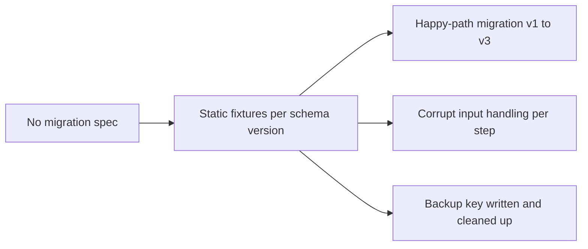

## item_561_dedicated_migration_spec_with_version_fixtures_and_corrupt_input_coverage - Dedicated migration spec with version fixtures and corrupt input coverage
> From version: 1.4.4
> Schema version: 1.0
> Status: Draft
> Understanding: 95%
> Confidence: 92%
> Progress: 0%
> Complexity: Medium
> Theme: Test quality / migration coverage
> Reminder: Update understanding/confidence/progress and linked task references when you edit this doc.

# Problem
`src/adapters/persistence/migrations.ts` is a 26 KB critical file that runs on every boot for existing users upgrading between schema versions. It has no dedicated test file. The existing `persistence.localStorage.spec.ts` covers only the current-version happy path. A regression in the migration logic could silently corrupt or discard data for all users on the first boot after an upgrade.

# Scope
- In:
  - create `src/tests/persistence.migrations.spec.ts`;
  - include static JSON fixtures representing each persisted schema version (v1, v2, v3) as they existed at the time of migration;
  - test the happy-path migration from each older version to the current version and assert that user-authored fields are preserved;
  - test that corrupt or structurally invalid input at each migration step is caught and handled without crashing (per `item_553` and `item_554`);
  - test that the backup key is written before migration and cleaned up after success (per `item_554`).
- Out:
  - adding new migration versions (not in scope here);
  - testing the UI recovery flow (that is covered in `item_553`).

# Acceptance criteria
- AC1: `src/tests/persistence.migrations.spec.ts` exists and is discovered by the test runner.
- AC2: The spec includes static fixtures for each supported schema version older than the current one.
- AC3: Happy-path tests assert that all user-authored network fields are preserved after migration from each older version.
- AC4: Corrupt-input tests assert that each migration step catches invalid data without crashing and delegates to the error surface established in `item_553`/`item_554`.
- AC5: A backup lifecycle test asserts the backup key is present during migration and absent after successful completion.

# AC Traceability
- AC1 → file existence. Proof: spec file present in `src/tests/`.
- AC2 → fixture coverage. Proof: inline fixtures for v1, v2, v3 visible in spec.
- AC3 → data preservation. Proof: assertions on network name, entity counts, and custom fields after migration.
- AC4 → error resilience. Proof: test injects malformed data and asserts no unhandled exception.
- AC5 → backup contract. Proof: test checks localStorage key existence at migration start and end.

# Decision framing
- Product framing: Not needed
- Architecture framing: Not needed

# Links
- Request: `logics/request/req_113_technical_debt_hardening_persistence_safety_performance_and_architecture_quality.md`
- Primary task(s): `logics/tasks/task_091_orchestration_delivery_execution_for_req_113_technical_debt_hardening.md`

# AI Context
- Summary: Create a dedicated migration spec with static fixtures for each schema version, covering happy-path preservation, corrupt-input handling, and backup key lifecycle.
- Keywords: migrations, spec, fixtures, schema version, data preservation, corrupt input, backup key
- Use when: Reviewing or extending the migration system.
- Skip when: Working on product features unrelated to persistence migrations.

# Priority
- Impact: High.
- Urgency: Soon.

# Notes
- Derived from `logics/request/req_113_...` audit item D2.
- Depends on: `item_553` (safe parse wrapper), `item_554` (backup/rollback) — these should be delivered first so the spec can validate the full recovery contract.
- References:
  - `src/adapters/persistence/migrations.ts`
  - `src/tests/persistence.migrations.spec.ts` (to be created)
  - `src/tests/persistence.localStorage.spec.ts`

# Validation
- `npm run -s lint`
- `npm run -s typecheck`
- `npm test -- --run src/tests/persistence.migrations.spec.ts`
- `npm run -s build`
