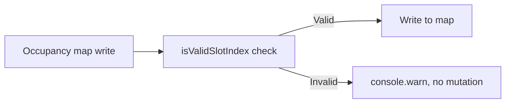

## item_562_universal_occupancy_index_validation_before_map_writes - Universal occupancy index validation before occupancy map writes
> From version: 1.4.4
> Schema version: 1.0
> Status: Done
> Understanding: 97%
> Confidence: 96%
> Progress: 100%
> Complexity: Low-Medium
> Theme: Robustness / state integrity
> Reminder: Update understanding/confidence/progress and linked task references when you edit this doc.

# Problem
`connectorCavityOccupancy` and `splicePortOccupancy` in the store accept arbitrary numeric indices without bounds checking. The helper `isValidSlotIndex()` exists in `src/store/reducer/shared.ts` but is not called consistently before every write. An out-of-bounds write silently corrupts the occupancy map, which can cause incorrect occupancy display and wire-endpoint integrity failures.

# Scope
- In:
  - identify all reducer branches in `src/store/reducer/` that write to `connectorCavityOccupancy` or `splicePortOccupancy`;
  - ensure every such write is preceded by an `isValidSlotIndex()` check;
  - reject (with a `console.warn` and no state mutation) any write that fails the check;
  - add a test asserting that out-of-bounds cavity and port index writes are silently rejected and leave the map unchanged.
- Out:
  - changing the data type of occupancy indices (type change is a separate, larger refactor);
  - UI feedback for out-of-bounds occupancy errors (not user-facing in V1).

# Acceptance criteria
- AC1: All occupancy map writes in the reducer layer are preceded by `isValidSlotIndex()`; no unchecked write paths remain.
- AC2: A write with an out-of-bounds index is rejected without modifying the occupancy map.
- AC3: A `console.warn` is emitted on rejection (not an error throw) so the app remains functional.
- AC4: A test asserts that writing an out-of-bounds cavity index leaves `connectorCavityOccupancy` unchanged.
- AC5: A test asserts that writing an out-of-bounds port index leaves `splicePortOccupancy` unchanged.

# AC Traceability
- AC1 → guard completeness. Proof: grep confirms `isValidSlotIndex` precedes every occupancy write.
- AC2 → map integrity. Proof: test checks map state before and after invalid write.
- AC3 → non-throwing. Proof: test confirms no exception is thrown for invalid index.
- AC4–AC5 → specific coverage. Proof: two new test cases in store reducer specs.

# Decision framing
- Product framing: Not needed
- Architecture framing: Not needed

# Links
- Request: `logics/request/req_113_technical_debt_hardening_persistence_safety_performance_and_architecture_quality.md`
- Primary task(s): `logics/tasks/task_091_orchestration_delivery_execution_for_req_113_technical_debt_hardening.md`

# AI Context
- Summary: Guard every occupancy map write with the existing isValidSlotIndex helper and silently reject out-of-bounds indices without corrupting the map.
- Keywords: occupancy, connectorCavityOccupancy, splicePortOccupancy, isValidSlotIndex, bounds check, reducer
- Use when: Writing or reviewing connector or splice reducer logic that touches occupancy maps.
- Skip when: Working on read paths or features unrelated to occupancy state.

# Priority
- Impact: Medium-High.
- Urgency: Soon.

# Notes
- Derived from `logics/request/req_113_...` audit item D3.
- Depends on: none.
- References:
  - `src/store/reducer/shared.ts`
  - `src/store/reducer/connectorReducer.ts`
  - `src/store/reducer/spliceReducer.ts`
  - `src/store/reducer/wireReducer.ts`
  - `src/tests/store.reducer.connectors.spec.ts`
  - `src/tests/store.reducer.splices.spec.ts`
- Delivery notes:
  - direct connector/splice occupancy writes now `console.warn()` and return the untouched state when the requested index is out of range;
  - wire occupancy helper paths now re-check endpoint bounds before release/write so corrupted endpoints cannot mutate occupancy maps silently;
  - added `src/tests/store.reducer.occupancy.spec.ts` covering bounded connector and splice rejection paths.

# Validation
- `npm run -s lint`
- `npm run -s typecheck`
- `npm test -- --run src/tests/store.reducer.connectors.spec.ts src/tests/store.reducer.splices.spec.ts`
- `npm run -s build`
