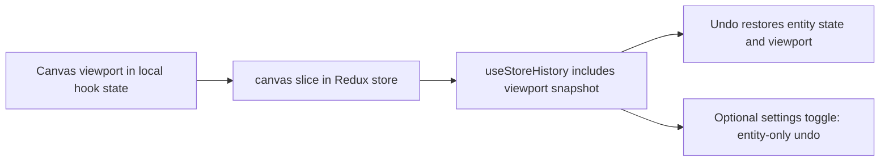

## item_563_canvas_viewport_state_in_store_and_undo_redo_history_integration - Canvas viewport state in store and undo/redo history integration
> From version: 1.4.4
> Schema version: 1.0
> Status: Draft
> Understanding: 88%
> Confidence: 82%
> Progress: 0%
> Complexity: Medium-High
> Theme: Robustness / undo-redo coherence
> Reminder: Update understanding/confidence/progress and linked task references when you edit this doc.

# Problem
Canvas viewport state (scale, offset, snap settings) lives in local React hook state, not in the Redux store. The `useStoreHistory` undo/redo mechanism only covers store mutations, so undoing an entity edit does not restore the canvas position the user was at when they made the edit. This creates a disorienting UX where the canvas stays zoomed into a location that no longer matches the restored entity state.

# Scope
- In:
  - move canvas viewport state (scale, offset, and snap-to-grid toggle at minimum) from local hook state into the Redux store under a `canvas` slice;
  - extend `useStoreHistory` to include canvas viewport snapshots in its history entries, so undo/redo restores both entity state and viewport together;
  - add an optional settings toggle to disable viewport restoration on undo (for users who prefer entity-only undo);
  - add a test asserting that undo restores the canvas viewport alongside the entity state.
- Out:
  - canvas animation or transition effects during undo/redo;
  - persisting canvas state across sessions (can be added later; this item focuses on undo/redo coherence).

# Acceptance criteria
- AC1: Canvas viewport scale and offset are stored in the Redux store and not in local hook state alone.
- AC2: `useStoreHistory` history entries include a canvas viewport snapshot.
- AC3: Performing undo after a canvas-visible entity edit restores both the entity state and the canvas viewport to their pre-edit values.
- AC4: A settings toggle exists that allows the user to opt out of viewport restoration on undo.
- AC5: Existing undo/redo tests pass without modification; new tests cover the viewport restoration behavior.

# AC Traceability
- AC1 → state location. Proof: `canvas` slice visible in `AppState` type definition.
- AC2 → history entry shape. Proof: `useStoreHistory` snapshot type includes viewport fields.
- AC3 → coherent undo. Proof: new test performs entity edit with viewport pan, undoes, and asserts both are restored.
- AC4 → user control. Proof: settings toggle renders and controls viewport restoration behavior.
- AC5 → non-regression. Proof: existing undo/redo specs pass green.

# Decision framing
- Product framing: The settings toggle (AC4) may be considered a product decision; expose it only in the advanced settings section to avoid cluttering the main settings.
- Architecture framing: Moving canvas state to the store changes the data flow for all canvas hooks; impacts need to be traced.

# Links
- Request: `logics/request/req_113_technical_debt_hardening_persistence_safety_performance_and_architecture_quality.md`
- Primary task(s): `logics/tasks/task_091_orchestration_delivery_execution_for_req_113_technical_debt_hardening.md`

# AI Context
- Summary: Move canvas viewport state into the Redux store and include it in useStoreHistory so undo/redo restores both entity state and canvas position coherently.
- Keywords: canvas viewport, undo/redo, useStoreHistory, Redux store, scale, offset, snap, history
- Use when: Implementing or reviewing canvas state management or the undo/redo history contract.
- Skip when: Working on persistence, pathfinding, or features unrelated to the canvas or undo mechanism.

# Priority
- Impact: Medium.
- Urgency: Deferred (after persistence and performance fixes).

# Notes
- Derived from `logics/request/req_113_...` audit item D4.
- Depends on: none, but should be delivered after persistence and performance items to reduce risk.
- References:
  - `src/store/types.ts`
  - `src/app/hooks/useStoreHistory.ts`
  - `src/app/hooks/` (canvas-related hooks)
  - `src/app/AppController.tsx`

# Validation
- `npm run -s lint`
- `npm run -s typecheck`
- `npm test -- --run src/tests/store.reducer src/tests/app.ui`
- `npm run -s build`
