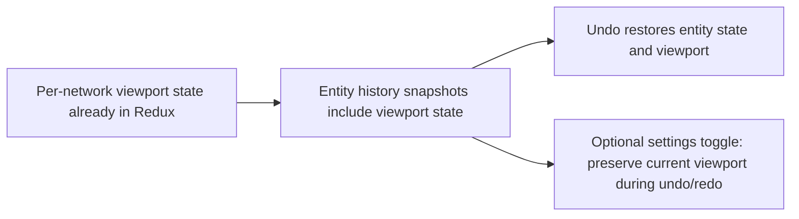

## item_563_canvas_viewport_state_in_store_and_undo_redo_history_integration - Canvas viewport state in store and undo/redo history integration
> From version: 1.4.4
> Schema version: 1.0
> Status: Done
> Understanding: 98%
> Confidence: 96%
> Progress: 100%
> Complexity: Medium-High
> Theme: Robustness / undo-redo coherence
> Reminder: Update understanding/confidence/progress and linked task references when you edit this doc.

# Problem
The product already persists per-network summary viewport state in Redux, but the undo/redo contract was implicit and had no user control. Users who prefer entity-only undo needed a way to preserve the current viewport while undoing an entity mutation, and the existing behavior needed regression proof for both modes.

# Scope
- In:
  - keep using per-network `networkSummaryViewState` in Redux as the canonical persisted viewport source for undo/redo snapshots;
  - extend `useStoreHistory` with an undo/redo target-state transform so viewport restoration can be preserved or bypassed without breaking entity history;
  - add an optional settings toggle to disable viewport restoration on undo (for users who prefer entity-only undo);
  - add tests asserting both restore-enabled and restore-disabled viewport behavior around undo/redo.
- Out:
  - canvas animation or transition effects during undo/redo;
  - persisting canvas state across sessions (can be added later; this item focuses on undo/redo coherence).

# Acceptance criteria
- AC1: Per-network canvas viewport scale and offset remain stored in Redux and act as the source of truth for history-aware restores.
- AC2: Undo/redo operates on snapshots that already include the persisted per-network viewport state.
- AC3: Performing undo after a canvas-visible entity edit restores both the entity state and the canvas viewport to their pre-edit values.
- AC4: A settings toggle exists that allows the user to opt out of viewport restoration on undo.
- AC5: Existing undo/redo tests pass without modification; new tests cover the viewport restoration behavior.

# AC Traceability
- AC1 → state location. Proof: `networkStates[networkId].networkSummaryViewState` remains populated and reused by restore flows.
- AC2 → history contract. Proof: undo/redo now optionally transforms the target state instead of relying on a separate viewport-only history stack.
- AC3 → coherent undo. Proof: new UI regression deletes a visible wire after panning, pans again, then undo/redo restores the captured viewport.
- AC4 → user control. Proof: settings toggle renders, persists, and keeps the current viewport stable during undo/redo when disabled.
- AC5 → non-regression. Proof: existing undo/redo specs pass green.

# Decision framing
- Product framing: The settings toggle (AC4) belongs in the shortcuts/undo section because it changes undo semantics rather than rendering defaults.
- Architecture framing: No new `canvas` slice was introduced; the implementation intentionally reuses the existing per-network summary view state instead of splitting sources of truth further.

# Links
- Request: `logics/request/req_113_technical_debt_hardening_persistence_safety_performance_and_architecture_quality.md`
- Primary task(s): `logics/tasks/task_091_orchestration_delivery_execution_for_req_113_technical_debt_hardening.md`

# AI Context
- Summary: Reuse the existing per-network Redux viewport state for undo/redo, and add a user-controlled opt-out that preserves the current viewport during undo/redo.
- Keywords: canvas viewport, undo/redo, useStoreHistory, Redux store, scale, offset, snap, history
- Use when: Implementing or reviewing canvas state management or the undo/redo history contract.
- Skip when: Working on persistence, pathfinding, or features unrelated to the canvas or undo mechanism.

# Priority
- Impact: Medium.
- Urgency: Deferred (after persistence and performance fixes).

# Notes
- Derived from `logics/request/req_113_...` audit item D4.
- Depends on: none, but should be delivered after persistence and performance items to reduce risk.
- References:
  - `src/store/networking.ts`
  - `src/app/hooks/useStoreHistory.ts`
  - `src/app/components/workspace/SettingsWorkspaceContent.tsx`
  - `src/app/AppController.tsx`

# Validation
- `npm run -s lint`
- `npm run -s typecheck`
- `npm test -- --run src/tests/app.ui.network-summary-workflow-polish.spec.tsx src/tests/app.ui.settings.spec.tsx src/tests/app.ui.undo-redo-global.spec.tsx`
- `npm run -s build`
