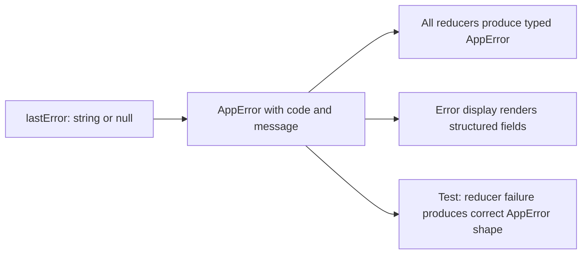

## item_564_structured_app_error_type_replacing_monolithic_last_error_string - Structured AppError type replacing monolithic lastError string
> From version: 1.4.4
> Schema version: 1.0
> Status: Done
> Understanding: 97%
> Confidence: 95%
> Progress: 100%
> Complexity: Low-Medium
> Theme: Robustness / error handling
> Reminder: Update understanding/confidence/progress and linked task references when you edit this doc.

# Problem
`ui.lastError` is typed as `string | null`. Error messages are hardcoded raw strings scattered across multiple reducers with no consistent format, no error code, and no recoverable context. This makes it impossible to distinguish error types programmatically, log structured diagnostics, or provide context-aware user feedback beyond a generic banner string.

# Scope
- In:
  - introduce `AppError = { code: string; message: string; context?: Record<string, unknown> }` in `src/store/types.ts`;
  - replace `ui.lastError: string | null` with `ui.lastError: AppError | null`;
  - update all reducer branches that currently assign a raw string to `lastError` to produce a typed `AppError` with a meaningful `code`;
  - update the UI component that renders `lastError` to display the structured fields (render `message` for the user; `code` may be shown in a collapsed details section or developer tooltip);
  - add a test asserting that a representative reducer action produces a correctly shaped `AppError` on failure.
- Out:
  - error telemetry or remote logging (not in scope);
  - replacing the global error banner UI entirely (only the data shape changes).

# Acceptance criteria
- AC1: `AppError = { code: string; message: string; context?: Record<string, unknown> }` is defined in `src/store/types.ts` and `ui.lastError` is typed as `AppError | null`.
- AC2: No reducer branch assigns a raw string to `lastError`; all assignments produce a typed `AppError`.
- AC3: The error display component renders at minimum the `message` field for the user.
- AC4: A test asserts that a representative reducer failure action produces an `AppError` with the expected `code` and `message` fields.
- AC5: Typecheck passes with no new type errors after the change.

# AC Traceability
- AC1 → type definition. Proof: `AppError` type and updated `lastError` field visible in `types.ts`.
- AC2 → call-site hygiene. Proof: grep confirms no raw string assignment to `lastError` in any reducer.
- AC3 → UI rendering. Proof: error display component renders `error.message` not `error as string`.
- AC4 → shape correctness. Proof: new test case in a store reducer spec.
- AC5 → type safety. Proof: `npm run -s typecheck` passes green.
- request-AC6 -> This backlog slice. Evidence needed: `AppController.tsx` exposes Context providers for store dispatch and the main handler namespaces; at least one deeply nested consumer is updated to use them instead of props.
- request-AC7 -> This backlog slice. Evidence needed: Every domain reducer that mutates entity state calls `syncCurrentScopeToNetworkMap()` (or a type-enforced equivalent); the audit list is documented in the implementation.
- request-AC8 -> This backlog slice. Evidence needed: Unit tests exist for the five listed controller hooks and run in isolation without full UI setup.
- request-AC9 -> This backlog slice. Evidence needed: `persistence.migrations.spec.ts` exists and covers happy-path migration from each persisted schema version and corrupt-input handling at each step.
- request-AC10 -> This backlog slice. Evidence needed: All writes to `connectorCavityOccupancy` and `splicePortOccupancy` are guarded by `isValidSlotIndex()`; out-of-bounds writes are rejected without corrupting the map.
- request-AC11 -> This backlog slice. Evidence needed: Canvas viewport state is Redux-backed and undo/redo restores it alongside entity state unless the explicit opt-out preference is disabled.
- request-AC12 -> This backlog slice. Evidence needed: `ui.lastError` is typed as `AppError | null`; all existing raw-string error assignments are updated; the error display component renders the structured fields.

# Decision framing
- Product framing: Not needed
- Architecture framing: Not needed

# Links
- Request: `logics/request/req_113_technical_debt_hardening_persistence_safety_performance_and_architecture_quality.md`
- Primary task(s): `logics/tasks/task_091_orchestration_delivery_execution_for_req_113_technical_debt_hardening.md`

# AI Context
- Summary: Replace the raw-string lastError field with a typed AppError struct so reducers produce structured, code-tagged errors and the UI can render them meaningfully.
- Keywords: AppError, lastError, error code, structured error, reducer, error handling, types
- Use when: Adding or reviewing error-producing reducer branches or the error display UI component.
- Skip when: Working on features that do not touch the store error surface.

# Priority
- Impact: Medium.
- Urgency: Deferred (lower risk than persistence and performance items).

# Notes
- Derived from `logics/request/req_113_...` audit item D5.
- Depends on: none.
- References:
  - `src/store/types.ts`
  - `src/store/reducer/` (all domain reducers)
  - `src/app/` (error display component)
- Delivery notes:
  - introduced `AppError` plus shared normalization/comparison helpers in `src/store/types.ts`;
  - `withError()` and `ui/setError` now always store typed `AppError` objects while preserving existing user-facing messages;
  - persistence feedback, CSV import flows, rename flows, migration recovery, and the header error banner now consume `lastError.message`, while the UI also exposes `lastError.code`;
  - reducer coverage now explicitly asserts `WIRE_ENDPOINT_A_IS_ALREADY_OCCUPIED` as a representative structured error code.

# Validation
- `npm run -s lint`
- `npm run -s typecheck`
- `npm test -- --run src/tests/store.reducer`
- `npm run -s build`
