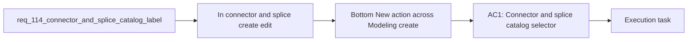

## item_566_bottom_new_action_across_modeling_create_forms_with_silent_draft_reset - Bottom New action across Modeling create forms with silent draft reset
> From version: 1.4.4
> Schema version: 1.0
> Status: Done
> Understanding: 96% (the requested scope is clear: improve connector/splice catalog option readability and reduce repetitive scrolling during chained create flows)
> Confidence: 98% (current UI patterns and nearby requests define the interaction boundaries clearly, and the remaining bottom-action behavior is now locked to silent reset semantics within Modeling forms only)
> Progress: 100%
> Complexity: Medium
> Theme: Modeling form ergonomics / catalog readability / repetitive-entry speed
> Reminder: Update status/understanding/confidence/progress and linked task references when you edit this doc.

# Problem
- In connector and splice create/edit forms, the `Catalog item (manufacturer reference)` selector is harder to scan than necessary because the visible option label emphasizes the manufacturer reference and count but not the catalog item name.
- When catalog references are short, cryptic, or visually similar, users need the human-readable catalog name in the same option label to identify the correct part faster.
- During repetitive creation sessions, the current bottom action row forces users to scroll back to the top or to the list-side `New` action after each create, even though they are already working inside the create form.
- Users want a local `New` action next to `Create` and `Cancel` across Modeling create forms so they can immediately reset the form for the next item without losing momentum.
- `req_051` introduced the catalog-first connector/splice workflow and made the catalog selector a core part of creation flows. `req_111` then standardized alphabetical ordering for dynamic modeling dropdowns, but it intentionally did not change the visible label format itself. As a result, the connector/splice catalog dropdowns are currently ordered well but can still be slow to interpret when several catalog items share similar manufacturer references or when the reference is less recognizable than the item name.
- Separately, `req_109` introduced scroll-to-form behavior for explicit `New` and `Edit` actions so list-driven form opening is easier to follow. That improved entry into the create flow, but it did not remove the repeated round-trip cost once the user is already at the bottom of a create form and wants to chain several creations in sequence. The bottom action row currently offers `Create` and `Cancel`, which means the user must still leave the local action context to start the next item.

# Scope
- In:
- Out:

# Acceptance criteria
- AC1: Connector and splice catalog selectors display labels that include the manufacturer reference and the catalog item name when a name is available.
- AC2: Catalog items without a usable name fall back to a safe label format that keeps current selection semantics intact.
- AC3: The connector/splice catalog dropdown ordering remains deterministic and non-regressed after the visible label format change.
- AC4: All Modeling create forms expose a bottom `New` action alongside the existing create/cancel controls while the form is in create mode.
- AC5: Clicking bottom `New` resets or reopens the same entity create form in a fresh create state without requiring the user to scroll back to the list-panel `New` action.
- AC6: Existing create-mode prefills and defaults remain intact after the bottom `New` action is used.
- AC7: Edit-mode flows remain non-regressed and do not unintentionally gain create-only behavior.
- AC8: Regression tests cover representative connector/splice catalog label rendering and representative chained create-flow paths for the Modeling bottom `New` action coverage.

# AC Traceability
- AC1 -> Scope: Connector and splice catalog selectors display labels that include the manufacturer reference and the catalog item name when a name is available.. Proof: Covered by the linked implementation task, targeted validation, and closure evidence.
- AC2 -> Scope: Catalog items without a usable name fall back to a safe label format that keeps current selection semantics intact.. Proof: Covered by the linked implementation task, targeted validation, and closure evidence.
- AC3 -> Scope: The connector/splice catalog dropdown ordering remains deterministic and non-regressed after the visible label format change.. Proof: Covered by the linked implementation task, targeted validation, and closure evidence.
- AC4 -> Scope: All Modeling create forms expose a bottom `New` action alongside the existing create/cancel controls while the form is in create mode.. Proof: Covered by the linked implementation task, targeted validation, and closure evidence.
- AC5 -> Scope: Clicking bottom `New` resets or reopens the same entity create form in a fresh create state without requiring the user to scroll back to the list-panel `New` action.. Proof: Covered by the linked implementation task, targeted validation, and closure evidence.
- AC6 -> Scope: Existing create-mode prefills and defaults remain intact after the bottom `New` action is used.. Proof: Covered by the linked implementation task, targeted validation, and closure evidence.
- AC7 -> Scope: Edit-mode flows remain non-regressed and do not unintentionally gain create-only behavior.. Proof: Covered by the linked implementation task, targeted validation, and closure evidence.
- AC8 -> Scope: Regression tests cover representative connector/splice catalog label rendering and representative chained create-flow paths for the Modeling bottom `New` action coverage.. Proof: Covered by the linked implementation task, targeted validation, and closure evidence.

# Decision framing
- Product framing: Consider
- Product signals: user segmentation
- Product follow-up: Review whether a product brief is needed before scope becomes harder to change.
- Architecture framing: Required
- Architecture signals: data model and persistence, contracts and integration
- Architecture follow-up: Create or link an architecture decision before irreversible implementation work starts.

# Links
- Product brief(s): `logics/product/prod_000_modeling_productivity_and_repeated_action_ergonomics.md`
- Architecture decision(s): `logics/architecture/adr_003_modeling_create_flow_reset_and_canvas_group_movement_interaction_contracts.md`
- Request: `req_114_connector_and_splice_catalog_labels_show_names_and_create_forms_support_chained_new_action`
- Primary task(s): `logics/tasks/task_092_super_orchestration_delivery_execution_for_req_114_to_req_117_with_validation_gates_and_staged_checkpoints.md`

# AI Context
- Summary: Improve connector/splice creation ergonomics by showing catalog names in catalog selector labels and adding a bottom chained New...
- Keywords: modeling, connector, splice, catalog, manufacturer reference, name, create form, new action, ergonomics
- Use when: Use when implementing or validating connector/splice catalog label readability and repeated create-flow speed improvements.
- Skip when: Skip when the work only changes delete flows, keyboard shortcuts, or unrelated non-modeling UI.

# References
- `logics/request/req_051_catalog_screen_with_catalog_item_crud_navigation_integration_and_required_manufacturer_reference_connection_count.md`
- `logics/request/req_109_new_and_edit_actions_scroll_to_corresponding_form_panel.md`
- `logics/request/req_111_alphabetically_sorted_dropdown_menus_in_modeling_screens.md`
- `src/app/components/workspace/ModelingConnectorFormPanel.tsx`
- `src/app/components/workspace/ModelingSpliceFormPanel.tsx`
- `src/app/components/workspace/ModelingNodeFormPanel.tsx`
- `src/app/components/workspace/ModelingSegmentFormPanel.tsx`
- `src/app/components/workspace/ModelingWireFormPanel.tsx`
- `src/app/components/workspace/ModelingCatalogFormPanel.tsx`
- `src/app/lib/modelingSelectOptions.ts`
- `src/tests/app.ui.modeling-dropdown-ordering.spec.tsx`
- `src/tests/app.ui.creation-flow-ergonomics.spec.tsx`
- `logics/skills/logics-ui-steering/SKILL.md`

# Priority
- Impact:
- Urgency:

# Notes
- Derived from request `req_114_connector_and_splice_catalog_labels_show_names_and_create_forms_support_chained_new_action`.
- Source file: `logics/request/req_114_connector_and_splice_catalog_labels_show_names_and_create_forms_support_chained_new_action.md`.
- Request context seeded into this backlog item from `logics/request/req_114_connector_and_splice_catalog_labels_show_names_and_create_forms_support_chained_new_action.md`.
