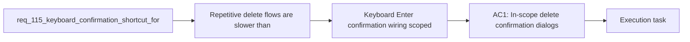

## item_569_keyboard_enter_confirmation_wiring_scoped_to_destructive_delete_dialogs_only - Keyboard Enter confirmation wiring scoped to destructive delete dialogs only
> From version: 1.4.4
> Schema version: 1.0
> Status: Ready
> Understanding: 97% (the user intent is specific: when a delete confirmation opens, pressing Enter should confirm faster without broadening the rule to unrelated confirmation dialogs)
> Confidence: 97% (the main product tradeoff is explicit and localized, and the remaining keyboard-scope details are now locked to the current delete-dialog shape with focus preserved on cancel)
> Progress: 0%
> Complexity: Medium
> Theme: Destructive-action ergonomics / keyboard flow / confirmation safety
> Reminder: Update status/understanding/confidence/progress and linked task references when you edit this doc.

# Problem
- Repetitive delete flows are slower than necessary because the current confirmation dialog requires mouse interaction or extra keyboard navigation before the destructive action can be confirmed.
- Users want a faster keyboard path: open delete confirmation, then press `Enter` to confirm.
- The current dialog behavior is intentionally safety-first: focus lands on `Cancel`, and the dialog only handles `Escape` and focus trapping explicitly.
- Any faster keyboard confirmation behavior must therefore define its safety policy clearly instead of changing destructive confirmation semantics implicitly.
- `req_074` established that delete actions must go through the shared styled confirmation modal before mutation. `req_112` later expanded delete UX with blocked-delete explanation dialogs and safe cascade-delete confirmations. Today, delete and cascade flows are already centralized enough that keyboard-confirm behavior can be treated as a focused follow-up request rather than a full modal redesign.
- The current dialog implementation shows the main tradeoff directly:

# Scope
- In:
- Out:

# Acceptance criteria
- AC1: In-scope delete confirmation dialogs support confirming the destructive action with `Enter`.
- AC2: The same `Enter` behavior also works for in-scope cascade-delete confirmation dialogs.
- AC3: Blocked-delete explanation dialogs remain non-destructive and do not accidentally adopt the destructive `Enter` rule.
- AC4: `Escape`, explicit `Cancel`, and focus restoration behavior remain non-regressed.
- AC5: The key event that opened the dialog cannot immediately auto-confirm the destructive action.
- AC6: Non-delete confirmation dialogs remain unchanged in V1.
- AC7: Regression tests cover both direct delete and cascade delete keyboard-confirm paths.

# AC Traceability
- AC1 -> Scope: In-scope delete confirmation dialogs support confirming the destructive action with `Enter`.. Proof: Covered by the linked implementation task, targeted validation, and closure evidence.
- AC2 -> Scope: The same `Enter` behavior also works for in-scope cascade-delete confirmation dialogs.. Proof: Covered by the linked implementation task, targeted validation, and closure evidence.
- AC3 -> Scope: Blocked-delete explanation dialogs remain non-destructive and do not accidentally adopt the destructive `Enter` rule.. Proof: Covered by the linked implementation task, targeted validation, and closure evidence.
- AC4 -> Scope: `Escape`, explicit `Cancel`, and focus restoration behavior remain non-regressed.. Proof: Covered by the linked implementation task, targeted validation, and closure evidence.
- AC5 -> Scope: The key event that opened the dialog cannot immediately auto-confirm the destructive action.. Proof: Covered by the linked implementation task, targeted validation, and closure evidence.
- AC6 -> Scope: Non-delete confirmation dialogs remain unchanged in V1.. Proof: Covered by the linked implementation task, targeted validation, and closure evidence.
- AC7 -> Scope: Regression tests cover both direct delete and cascade delete keyboard-confirm paths.. Proof: Covered by the linked implementation task, targeted validation, and closure evidence.

# Decision framing
- Product framing: Required
- Product signals: conversion journey, navigation and discoverability
- Product follow-up: Create or link a product brief before implementation moves deeper into delivery.
- Architecture framing: Required
- Architecture signals: data model and persistence, contracts and integration, runtime and boundaries, state and sync
- Architecture follow-up: Create or link an architecture decision before irreversible implementation work starts.

# Links
- Product brief(s): `logics/product/prod_000_modeling_productivity_and_repeated_action_ergonomics.md`
- Architecture decision(s): `logics/architecture/adr_002_destructive_interaction_contracts_for_keyboard_confirmation_and_modeling_batch_delete.md`
- Request: `req_115_keyboard_confirmation_shortcut_for_delete_modals_with_explicit_safety_policy`
- Primary task(s): `logics/tasks/task_092_super_orchestration_delivery_execution_for_req_114_to_req_117_with_validation_gates_and_staged_checkpoints.md`

# AI Context
- Summary: Add a fast Enter confirmation path for delete and cascade-delete dialogs while keeping the safety policy explicit and...
- Keywords: delete, confirm dialog, keyboard, enter, cascade delete, destructive action, focus, shortcut
- Use when: Use when implementing or validating keyboard confirmation behavior for delete modals.
- Skip when: Skip when changing non-delete confirms or blocked-delete explanation dialogs.

# References
- `logics/request/req_074_all_delete_actions_require_styled_confirmation_modal.md`
- `logics/request/req_112_explicit_blocked_delete_feedback_and_dependency_aware_cascade_delete_confirmation.md`
- `src/app/components/dialogs/ConfirmDialog.tsx`
- `src/app/hooks/controller/useConfirmDialogController.ts`
- `src/app/AppController.tsx`
- `src/tests/app.ui.delete-confirmations.spec.tsx`
- `logics/skills/logics-ui-steering/SKILL.md`

# Priority
- Impact:
- Urgency:

# Notes
- Derived from request `req_115_keyboard_confirmation_shortcut_for_delete_modals_with_explicit_safety_policy`.
- Source file: `logics/request/req_115_keyboard_confirmation_shortcut_for_delete_modals_with_explicit_safety_policy.md`.
- Request context seeded into this backlog item from `logics/request/req_115_keyboard_confirmation_shortcut_for_delete_modals_with_explicit_safety_policy.md`.
