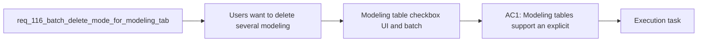

## item_572_modeling_table_checkbox_ui_and_batch_context_panel_wiring - Modeling table checkbox UI and batch context panel wiring
> From version: 1.4.4
> Schema version: 1.0
> Status: Done
> Understanding: 97% (the requested user value is clear: delete several modeling items in one operation, but only through an explicit multi-selection mode that does not break existing row-to-edit behavior)
> Confidence: 98% (the main delete-impact policy is explicit, the batch-mode UX now clearly separates multi-selection context from single-item editing, and the remaining list-state behaviors are now locked)
> Progress: 100%
> Complexity: High
> Theme: Modeling list ergonomics / batch destructive actions / dependency-aware deletion
> Reminder: Update status/understanding/confidence/progress and linked task references when you edit this doc.

# Problem
- Users want to delete several modeling items in one pass instead of repeating the same open-select-delete-confirm loop for each row.
- Current modeling tables are built around single-row selection:
- clicking a row selects it and opens edit behavior;
- the action row exposes `New`, `Edit`, and `Delete` for one focused row at a time.
- Delete behavior is no longer uniform:
- some entities are directly deletable;
- some connector/splice cases are safely cascade-deletable;
- other cases are blocked and explained through dependency-aware dialogs.
- Because delete outcomes can differ item by item, multi-delete must define what happens when the selected set mixes direct, cascade-capable, and blocked items.
- `req_074` ensured all delete flows are explicitly confirmed. `req_112` then added blocked-delete explanation dialogs and conservative safe cascade-delete support for bounded connector/splice cases. These requests improved safety and clarity for single-item delete flows, but they did not address repetitive cleanup workflows where the operator wants to remove several rows at once.
- At the UI layer, the current modeling tables are still single-selection-first:

# Scope
- In:
- Out:

# Acceptance criteria
- AC1: Modeling tables support an explicit multi-selection mode with row checkboxes without breaking default single-row edit behavior outside that mode.
- AC2: Users can select multiple rows within the active modeling table and trigger one batch delete action for that selected set.
- AC3: While batch mode is active, the single-item edit/form panel for the active table is replaced or suspended by a batch-context panel and no longer behaves like an active single-item editor.
- AC4: Batch delete performs a preflight analysis against existing delete-impact rules before any mutation.
- AC5: If any selected rows are blocked or unsafe, the app shows an explicit blocked batch summary and performs no partial deletion in V1.
- AC6: If all selected rows are directly deletable or safely cascade-capable, the app shows one explicit batch confirmation summary before mutation.
- AC7: A successful batch delete is recorded as one logical undoable operation.
- AC8: Existing single-row delete, blocked-delete explanation, and safe cascade-delete behaviors remain non-regressed.
- AC9: Regression tests cover at least one blocked mixed-impact batch case, one successful safe batch case, and the batch-context-panel behavior.
- AC10: The batch table header exposes a select-all checkbox for currently visible rows, and exiting batch mode clears the transient batch selection state.

# AC Traceability
- AC1 -> Scope: Modeling tables support an explicit multi-selection mode with row checkboxes without breaking default single-row edit behavior outside that mode.. Proof: Covered by the linked implementation task, targeted validation, and closure evidence.
- AC2 -> Scope: Users can select multiple rows within the active modeling table and trigger one batch delete action for that selected set.. Proof: Covered by the linked implementation task, targeted validation, and closure evidence.
- AC3 -> Scope: While batch mode is active, the single-item edit/form panel for the active table is replaced or suspended by a batch-context panel and no longer behaves like an active single-item editor.. Proof: Covered by the linked implementation task, targeted validation, and closure evidence.
- AC4 -> Scope: Batch delete performs a preflight analysis against existing delete-impact rules before any mutation.. Proof: Covered by the linked implementation task, targeted validation, and closure evidence.
- AC5 -> Scope: If any selected rows are blocked or unsafe, the app shows an explicit blocked batch summary and performs no partial deletion in V1.. Proof: Covered by the linked implementation task, targeted validation, and closure evidence.
- AC6 -> Scope: If all selected rows are directly deletable or safely cascade-capable, the app shows one explicit batch confirmation summary before mutation.. Proof: Covered by the linked implementation task, targeted validation, and closure evidence.
- AC7 -> Scope: A successful batch delete is recorded as one logical undoable operation.. Proof: Covered by the linked implementation task, targeted validation, and closure evidence.
- AC8 -> Scope: Existing single-row delete, blocked-delete explanation, and safe cascade-delete behaviors remain non-regressed.. Proof: Covered by the linked implementation task, targeted validation, and closure evidence.
- AC9 -> Scope: Regression tests cover at least one blocked mixed-impact batch case, one successful safe batch case, and the batch-context-panel behavior.. Proof: Covered by the linked implementation task, targeted validation, and closure evidence.
- AC10 -> Scope: The batch table header exposes a select-all checkbox for currently visible rows, and exiting batch mode clears the transient batch selection state.. Proof: Covered by the linked implementation task, targeted validation, and closure evidence.

# Decision framing
- Product framing: Consider
- Product signals: conversion journey
- Product follow-up: Review whether a product brief is needed before scope becomes harder to change.
- Architecture framing: Required
- Architecture signals: data model and persistence, contracts and integration
- Architecture follow-up: Create or link an architecture decision before irreversible implementation work starts.

# Links
- Product brief(s): `logics/product/prod_000_modeling_productivity_and_repeated_action_ergonomics.md`
- Architecture decision(s): `logics/architecture/adr_002_destructive_interaction_contracts_for_keyboard_confirmation_and_modeling_batch_delete.md`
- Request: `req_116_batch_delete_mode_for_modeling_tables_with_explicit_multi_selection_and_mixed_impact_handling`
- Primary task(s): `logics/tasks/task_092_super_orchestration_delivery_execution_for_req_114_to_req_117_with_validation_gates_and_staged_checkpoints.md`

# AI Context
- Summary: Add an explicit batch-selection mode to modeling tables so users can delete several rows at once while preserving...
- Keywords: batch delete, multi select, checkbox, modeling table, connectors, splices, nodes, segments, wires, cascade delete
- Use when: Use when implementing or validating explicit multi-selection and batch delete behavior in modeling tables.
- Skip when: Skip when changing only single-row delete flows or non-modeling screens.

# References
- `logics/request/req_074_all_delete_actions_require_styled_confirmation_modal.md`
- `logics/request/req_112_explicit_blocked_delete_feedback_and_dependency_aware_cascade_delete_confirmation.md`
- `src/app/components/workspace/ModelingPrimaryTables.tsx`
- `src/app/components/workspace/ModelingSecondaryTables.tsx`
- `src/store/deleteImpact.ts`
- `src/app/AppController.tsx`
- `src/tests/app.ui.delete-confirmations.spec.tsx`
- `src/tests/app.ui.list-ergonomics.spec.tsx`
- `logics/skills/logics-ui-steering/SKILL.md`

# Priority
- Impact:
- Urgency:

# Notes
- Derived from request `req_116_batch_delete_mode_for_modeling_tables_with_explicit_multi_selection_and_mixed_impact_handling`.
- Source file: `logics/request/req_116_batch_delete_mode_for_modeling_tables_with_explicit_multi_selection_and_mixed_impact_handling.md`.
- Request context seeded into this backlog item from `logics/request/req_116_batch_delete_mode_for_modeling_tables_with_explicit_multi_selection_and_mixed_impact_handling.md`.
